# Agent Swarm Flow: From Ideation to Implementation

This document maps the complete agent orchestration system for the EG-DESK project through concrete workflow scenarios, showing exactly who does what at each step.

## System Overview

```
User Request
     │
     ▼
Main Thread (analyzes & routes)
     │
     ├─ Simple? → Execute directly
     ├─ Framework question? → Direct to framework analyzer agent
     ├─ New agent? → Invoke claude-agent-sdk-analyzer-agent
     │
     └─ Development task? → PM-driven workflow:
            │
            ▼
         PM Agent (Strategic Guide)
            ├─ Discovers tech stack (Glob technology-stack.md)
            ├─ Vision alignment check
            ├─ Technology stack selection (from discovered stack)
            ├─ Implementation status check (already implemented?)
            ├─ Code location (eg-desk_taehwa/ or packages/)
            ├─ Implementation phasing
            ├─ Creates PRD (if approved)
            └─ Returns strategic guide to Main Thread
                 │
                 ▼
         Main Thread (Executor)
            ├─ Creates plan based on PM's guide
            ├─ Queries framework agents (per PM's direction)
            ├─ (Optional) Returns to PM for plan review
            ├─ Synthesizes PM guide + framework patterns
            └─ Spawns coding-agent(s):
                 • Direction (what to implement)
                 • File list (CREATE/MODIFY/DELETE/REFERENCE)
                 • coding-agent reads files for details
            │
            ▼
         Main Thread builds, tests, commits

Roles: PM guides strategy → Main Thread executes → coding-agent implements
```

## Critical Architecture Principle: Metaphysical Separation

**Main Thread** operates at a **meta-level** when orchestrating - it coordinates agents but delegates domain-specific file reading to specialized agents.

### File Reading Hierarchy:

```
┌─────────────────────────────────────────────────┐
│ Meta Level (Orchestration)                      │
│                                                  │
│ Main Thread:                                    │
│  • Routes requests                              │
│  • Identifies agents (from system prompt)       │
│  • Creates mission prompts (orchestration)      │
│  • Invokes agents                               │
│  • Synthesizes results                          │
│  • Builds/tests/commits (Bash only)             │
│  • NEVER writes application code                │
│  • Preserves context (delegates heavy reading)  │
│                                                  │
│ Can read for orchestration:                     │
│  • .claude/prompts/ (orchestration guidelines)  │
│  • .claude/agents/ (OPTIONAL - only for details)│
│                                                  │
│ Cannot read when orchestrating:                 │
│  • vision docs, codebase (delegate to agents)   │
└─────────────────────────────────────────────────┘
         │
         │ (delegates to)
         ▼
┌─────────────────────────────────────────────────┐
│ Domain Level (Analysis & Expertise)             │
│                                                  │
│ PM Agent: reads vision docs                     │
│ Framework Agents: read codebase/docs            │
│ SDK Analyzer: reads SDK docs                    │
│ coding-agent: WRITES code (only entity)         │
│                                                  │
│ Each agent reads/writes ONLY its domain         │
└─────────────────────────────────────────────────┘
```

## Workflow Scenarios

### Scenario 1: Simple Question (No Agents)

**User Request:**
```
"What files are in the packages/ai-chat directory?"
```

**Step-by-Step Flow:**

| Step | Entity | Action | Tools Used | Output |
|------|--------|--------|------------|--------|
| 1 | User | Asks question | None | Request sent |
| 2 | Main Thread | Analyzes: Simple file listing | None | Routes to direct execution |
| 3 | Main Thread | Lists files | `Glob("packages/ai-chat/**/*")` | File list |
| 4 | Main Thread | Returns answer to user | None | User sees file list |

**Total Agents Invoked:** 0

**Who Wrote Code:** Nobody (read-only operation)

**Duration:** Immediate (single step)

---

### Scenario 2: Framework Question (Direct Agent)

**User Request:**
```
"How does Theia's dependency injection work?"
```

**Step-by-Step Flow:**

| Step | Entity | Action | Tools Used | Output |
|------|--------|--------|------------|--------|
| 1 | User | Asks framework question | None | Request sent |
| 2 | Main Thread | Analyzes: Theia framework question | None | Routes to theia-analyzer-agent |
| 3 | Main Thread | Invokes agent | `Task(agent: "theia-analyzer-agent", prompt: "Analyze Theia's DI system in packages/core/")` | Agent starts |
| 4 | theia-analyzer-agent | Reads DI implementation | `Read("packages/core/src/common/di.ts")`<br>`Grep("@injectable")` | Finds patterns |
| 5 | theia-analyzer-agent | Analyzes examples | `Glob("**/*-frontend-module.ts")`<br>`Read(example files)` | Understands usage |
| 6 | theia-analyzer-agent | Returns report | None | Detailed explanation with file refs |
| 7 | Main Thread | Presents to user | None | User sees explanation |

**Total Agents Invoked:** 1 (theia-analyzer-agent)

**Who Wrote Code:** Nobody (analysis only)

**Duration:** Single agent invocation

**Key Point:** Main Thread directly invoked the framework agent without going through swarm manager (efficiency optimization for single-domain questions).

---

### Scenario 3a: Strategic Decision with Vision Conflict (User Accepts Alternative)

**User Request:**
```
"Should we add a floating AI assistant that follows the mouse cursor?"
```

**Why this scenario:** User proposes feature that conflicts with vision - PM provides insight + alternative, user accepts alternative

**Step-by-Step Flow:**

| Step | Entity | Action | Tools Used | Output |
|------|--------|--------|------------|--------|
| 1 | User | Proposes feature idea | None | Request sent |
| 2 | Main Thread | Analyzes: EG-DESK feature, needs PM strategic guide | None | Follows orchestration guidelines |
| 3 | Main Thread | Invokes PM agent | `Task(agent: "egdesk-pm-agent", prompt: "User wants floating AI assistant that follows mouse cursor. Provide strategic guide.")` | PM agent starts |
| 4 | egdesk-pm-agent | Discovers vision docs | `Glob("ideas&external_references/eg-desk ideas/**/*.md")` | Finds UX and whitepaper docs |
| 5 | egdesk-pm-agent | Analyzes vision docs | `Read("EG-DESK_Whitepaper.md")`<br>`Read("EG-DESK_Spatial_Canvas_UX_Solutions.md")`<br>`Grep("spatial", "proximity", "floating")` | Finds: Previous decision against floating UI |
| 6 | egdesk-pm-agent | Evaluates alignment | None (analysis) | Decision: REJECT original, SUGGEST alternative |
| 7 | egdesk-pm-agent | Returns strategic guide with insight | None | **Summary**: Floating cursor-following AI conflicts with spatial canvas principles.<br>**Decision**: REJECT original idea<br>**Insight**: "In EG-DESK_Spatial_Canvas_UX_Solutions.md, we decided against floating/following UI because it breaks spatial affordances. Users lose sense of place when elements follow cursor."<br>**Alternative**: Proximity-based AI activation - AI appears NEAR relevant canvas objects, not following cursor<br>**Why alternative is better**: Maintains spatial relationships while providing contextual AI<br>**Vision-Aligned**: ✅ Proximity-based aligns with spatial canvas principles |
| **PHASE 1: USER DECISION** |
| 8 | Main Thread | **Presents rejection + alternative to user** | None | "PM rejected floating AI (conflicts with spatial canvas). Suggests proximity-based AI instead.<br>**Options:**<br>A) Accept alternative (proximity-based AI)<br>B) Insist on floating AI (requires vision change)<br>C) Cancel feature" |
| 9 | User | **Accepts alternative** | None (human decision) | "Makes sense. Let's do proximity-based AI instead." |
| **PHASE 2: PROCEED WITH ALTERNATIVE** |
| 10 | Main Thread | Invokes PM for alternative feature guide | `Task(agent: "egdesk-pm-agent", prompt: "User accepted proximity-based AI alternative. Provide implementation guide for proximity-based AI activation.")` | PM agent starts |
| 11 | egdesk-pm-agent | Creates PRD for alternative | `Write("ideas&external_references/eg-desk ideas/features/proximity-based-ai-prd.md", "[PRD content]")` | PRD created for vision-aligned feature |
| 12 | egdesk-pm-agent | Returns implementation guide | None | **Decision**: APPROVE<br>**Feature**: Proximity-based AI activation<br>**Framework**: Theia + Infinite Canvas<br>**Location**: eg-desk_taehwa/ai/<br>**Next Steps**: Follow Pattern 2 for implementation |
| 13 | Main Thread | Proceeds to implementation | (Follow Pattern 2: PM-Driven Development) | Implementation begins |

**Total Agents Invoked:** 2 (PM rejection + PM guide for alternative)

**Who Wrote Code:** coding-agent (via Pattern 2)

**Duration:** Two PM turns + implementation

**Critical Observations:**
- **PM provides insight, not just rejection**: Explains why conflict exists with evidence from vision docs
- **Institutional memory**: "We previously decided X in document Y because Z"
- **Alternative suggestion**: Vision-aligned approach that solves same user need
- **USER DECISION POINT** (Step 8-9): User chooses between alternative, insisting on original, or canceling
- **User understands vision**: Not just "no", but "no because... and here's better way"
- **Smooth transition**: User accepts alternative → PM provides implementation guide → Proceeds normally
- **Context Preservation**: Main Thread didn't read vision docs - PM synthesized everything

**Key Point:** PM rejection includes **constructive alternative** - not blocking user, redirecting to vision-aligned solution.

---

### Scenario 3b: User Insists on Original Despite Vision Conflict

**User Request:**
```
(Continuation from Scenario 3a, Step 8)
Main Thread: "PM rejected floating AI (conflicts with spatial canvas). Suggests proximity-based AI instead. Options?"
User: "I understand the vision, but I still want floating AI. I think the vision should evolve - floating UI is more intuitive."
```

**Why this scenario:** User challenges vision with strong rationale - shows vision evolution process

**Step-by-Step Flow:**

| Step | Entity | Action | Tools Used | Output |
|------|--------|--------|------------|--------|
| **PHASE 0: SAME AS SCENARIO 3a (Steps 1-7)** |
| 1-7 | Various | User proposes → PM analyzes → PM rejects with alternative | (See Scenario 3a) | PM rejected floating AI, suggested proximity-based |
| **PHASE 1: USER INSISTS ON ORIGINAL** |
| 8 | Main Thread | Presents rejection + alternative to user | None | "PM rejected floating AI. Suggests proximity-based. **Options?**" |
| 9 | User | **Insists on original with rationale** | None (human decision) | "I understand vision, but floating AI is more intuitive. Vision should evolve. Here's why: [user rationale]" |
| **PHASE 2: PM RE-EVALUATES WITH USER RATIONALE** |
| 10 | Main Thread | Returns to PM with user's argument | `Task(agent: "egdesk-pm-agent", prompt: "User reviewed vision conflict. Insists on floating AI despite spatial canvas principles. User rationale: 'Floating UI more intuitive for contextual AI'.<br><br>Reassess: Should vision evolve? Or does alternative better serve user's goal?")` | PM agent starts (re-evaluation) |
| 11 | egdesk-pm-agent | Re-reads vision docs | `Read("EG-DESK_Spatial_Canvas_UX_Solutions.md")` | Spatial affordance principles |
| 12 | egdesk-pm-agent | Analyzes user's rationale | None (analysis) | User prioritizes "intuitiveness" over "spatial affordances". Valid but different priority. |
| 13 | egdesk-pm-agent | **Makes final assessment** | None (strategic decision) | **Options**:<br>A) Maintain vision (spatial > intuitiveness) - Suggest proximity-based remains better<br>B) Evolve vision (if user's rationale strong) - Flag vision change for user to document<br>C) Hybrid approach (floating in certain contexts, spatial in others) |
| 14 | egdesk-pm-agent | Returns re-evaluation | None | **Assessment**: User's rationale valid but vision prioritizes spatial affordances for different reason (long-term workspace coherence vs short-term intuitiveness)<br>**PM Stance**: Recommend maintaining current vision (spatial affordances > floating UX)<br>**User Decision Required**: This is strategic vision choice, not technical. User must decide:<br>  - Maintain vision (use proximity-based)<br>  - OR evolve vision (document rationale, update EG-DESK_Spatial_Canvas_UX_Solutions.md, proceed with floating AI) |
| **PHASE 3: USER MAKES STRATEGIC DECISION** |
| 15 | Main Thread | Presents vision choice to user | None | "PM reassessed. User's rationale valid, but vision prioritizes spatial affordances. **Your decision:**<br>A) Maintain vision - use proximity-based AI<br>B) Evolve vision - proceed with floating AI (requires vision doc update)" |
| 16 | User | **Makes strategic decision** | None (human authority) | OPTIONS:<br>A) "OK, let's stick with vision - proximity-based is fine"<br>B) "I want to evolve vision - floating AI is worth it" |

**Branch A: User maintains vision** → Proceed with proximity-based AI (follow Scenario 3a from Step 10)

**Branch B: User evolves vision:**

| Step | Entity | Action | Tools Used | Output |
|------|--------|--------|------------|--------|
| 17 | Main Thread | Invokes PM to update vision | `Task(agent: "egdesk-pm-agent", prompt: "User decided to evolve vision. Proceed with floating AI. Update EG-DESK_Spatial_Canvas_UX_Solutions.md to document this decision and rationale.")` | PM agent starts (vision update) |
| 18 | egdesk-pm-agent | **Updates vision document** | `Edit("EG-DESK_Spatial_Canvas_UX_Solutions.md", add: "### Vision Evolution: Floating AI (2025-10-17)\nUser decision: Floating AI prioritized over strict spatial affordances for contextual assistance. Rationale: [user's argument]. Tradeoff accepted: Some spatial disorientation acceptable for improved intuitiveness.")` | Vision doc updated |
| 19 | egdesk-pm-agent | Creates PRD for floating AI | `Write("ideas&external_references/eg-desk ideas/features/floating-ai-assistant-prd.md", "[PRD]")` | PRD created |
| 20 | egdesk-pm-agent | Returns implementation guide | None | **Decision**: APPROVE (vision evolved per user decision)<br>**Vision Updated**: EG-DESK_Spatial_Canvas_UX_Solutions.md documents evolution<br>**Framework**: Theia + Infinite Canvas<br>**Location**: eg-desk_taehwa/ai/<br>**Next Steps**: Follow Pattern 2 for implementation |
| 21 | Main Thread | Proceeds to implementation | (Follow Pattern 2) | Implementation of floating AI |

**Total Agents Invoked:** 3 (PM rejection → PM re-evaluation → PM vision update + guide)

**Who Wrote Code:** coding-agent (via Pattern 2, Branch B only)

**Duration:** Three PM turns + implementation (if vision evolved)

**Critical Observations:**
- **User can challenge vision** with strong rationale
- **PM doesn't dictate** - PM provides assessment, user decides
- **Vision can evolve** - user has authority to change strategic direction
- **PM documents evolution** - updates vision docs with user's rationale
- **Tradeoffs documented** - "Why we evolved vision, what we're accepting"
- **Institutional memory preserved** - future developers know why vision changed
- **USER DECISION POINT** (Step 15-16): User chooses between maintaining vision or evolving it

**When user might insist:**
- Strong user rationale based on UX research
- Market feedback contradicts vision
- Strategic pivot needed
- User expertise in domain

**Key Point:** Vision is **not immutable** - PM enforces it, but user can evolve it with documented rationale.

---

### Scenario 3 Flow Diagram (Mermaid)

```mermaid
flowchart TD
    Start([User: Add floating AI assistant?])

    Start --> MT1[Main Thread: Route to PM]
    MT1 --> PM1[PM: Analyze Vision Alignment]

    PM1 --> PMDiscover["PM: Glob vision docs<br/>Read Whitepaper + UX docs<br/>Grep 'floating', 'spatial'"]
    PMDiscover --> PMFind["PM Found:<br/>Previous decision AGAINST floating UI<br/>Reason: Breaks spatial affordances"]

    PMFind --> PMAlt["PM: Generate Alternative<br/>Proximity-based AI<br/>(vision-aligned solution)"]

    PMAlt --> PM1Return["PM Returns: REJECT original<br/>+ Insight (why conflict)<br/>+ Alternative (proximity-based)<br/>+ Rationale (maintains spatial)"]

    PM1Return --> MT2[Main Thread: Present to User]
    MT2 --> UserDec1{User Decision:<br/>Accept alternative?}

    UserDec1 -->|A: Accept Alt| PM2Guide[PM: Guide for Alternative]
    UserDec1 -->|B: Insist Original| PM2Reeval[PM: Re-evaluate with User Rationale]
    UserDec1 -->|C: Cancel| End1([Stop: Feature canceled])

    PM2Guide --> PM2PRD["PM: Create PRD<br/>proximity-based-ai-prd.md"]
    PM2PRD --> PM2Return[PM: Implementation Guide]
    PM2Return --> MT3A[Main Thread: Proceed to Implementation]
    MT3A --> End2([Follow Pattern 2: Implementation])

    PM2Reeval --> PM2Assess["PM: Assess User Rationale<br/>Valid priority shift?<br/>Vision evolution justified?"]

    PM2Assess --> PM2Options["PM Returns:<br/>User rationale valid but...<br/>Options:<br/>A) Maintain vision<br/>B) Evolve vision (user decides)"]

    PM2Options --> MT3B[Main Thread: Present Choice]
    MT3B --> UserDec2{User Strategic Decision:<br/>Maintain or Evolve vision?}

    UserDec2 -->|A: Maintain| PM2Guide
    UserDec2 -->|B: Evolve| PM3Update[PM: Update Vision Docs]

    PM3Update --> PM3Edit["PM: Edit UX Solutions doc<br/>Document vision evolution<br/>User rationale + tradeoffs"]
    PM3Edit --> PM3PRD["PM: Create PRD<br/>floating-ai-assistant-prd.md"]
    PM3PRD --> PM3Return[PM: Implementation Guide<br/>for floating AI]
    PM3Return --> MT4[Main Thread: Proceed to Implementation]
    MT4 --> End3([Follow Pattern 2: Implementation])

    style Start fill:#e1f5ff
    style UserDec1 fill:#ffe1e1,stroke:#ff0000,stroke-width:3px
    style UserDec2 fill:#ffe1e1,stroke:#ff0000,stroke-width:3px
    style PM1 fill:#fff4e1
    style PM2Guide fill:#fff4e1
    style PM2Reeval fill:#fff4e1
    style PM3Update fill:#fff4e1
    style MT2 fill:#e1ffe1
    style MT3A fill:#e1ffe1
    style MT3B fill:#e1ffe1
    style MT4 fill:#e1ffe1
    style End1 fill:#f0f0f0
    style End2 fill:#e1ffe1
    style End3 fill:#e1ffe1
```



**Flow Paths:**
- **Path A (Accept Alternative)**: User accepts PM's vision-aligned alternative → Implementation
- **Path B (Insist Original)**: User insists → PM re-evaluates → User chooses maintain/evolve
  - **Path B1 (Maintain Vision)**: Same as Path A
  - **Path B2 (Evolve Vision)**: PM updates vision docs → Implementation of original idea

**Decision Gates:**
1. **User Decision 1**: Accept alternative? Insist on original? Cancel?
2. **User Decision 2** (if insisted): Maintain vision? Or evolve vision?

**Key Insight:**
- Vision conflicts don't block users
- PM provides constructive alternative
- User has authority to evolve vision (with documented rationale)

---

### Scenario 4: Development with PM Strategic Guide

**User Request:**
```
"Add a custom terminal theme that changes based on time of day"
```

**Step-by-Step Flow:**

| Step | Entity | Action | Tools Used | Output |
|------|--------|--------|------------|--------|
| **PHASE 0: PM STRATEGIC GUIDE** |
| 1 | User | Requests feature | None | Request sent |
| 2 | Main Thread | Analyzes: Development task, needs strategic direction | None | Routes to PM for initial guide |
| 3 | Main Thread | Invokes PM agent | `Task(agent: "egdesk-pm-agent", prompt: "User wants time-based terminal theme. Provide strategic guide.")` | PM agent starts |
| 4 | egdesk-pm-agent | Dynamic discovery | `Glob("ideas&external_references/eg-desk ideas/**/*.md")`<br>`Glob("packages/*/package.json")`<br>`Grep("theme", "terminal")` | Finds vision docs + existing theme code |
| 5 | egdesk-pm-agent | Analyzes vision + structure | `Read("EG-DESK_Whitepaper.md")`<br>`Read("packages/terminal/package.json")`<br>`Read("packages/terminal/src/browser/terminal-theme-service.ts")` | Extracts principles + discovers structure |
| 6 | egdesk-pm-agent | Creates PRD | `Write("ideas&external_references/eg-desk ideas/features/time-based-terminal-theme-prd.md", "[PRD content]")` | PRD file created |
| 7 | egdesk-pm-agent | Returns strategic guide | None | **Decision**: APPROVE<br>**Framework**: Theia (terminal theming is Theia domain)<br>**Location**: `packages/terminal/src/browser/`<br>**Approach**: Phase 1 - analyze theme system, Phase 2 - design service, Phase 3 - implement<br>**Considerations**: Manual override needed, preference persistence<br>**PRD Created**: time-based-terminal-theme-prd.md |
| **PHASE 1: FRAMEWORK INVESTIGATION PLANNING** |
| 8 | Main Thread | Plans framework investigation based on PM guide | None (planning) | Investigation plan: Query theia-analyzer for theme patterns, DI registration patterns |
| **PHASE 2: FRAMEWORK INVESTIGATION (EXECUTION)** |
| 9 | Main Thread | Queries framework agent (per PM's guide) | `Task(agent: "theia-analyzer-agent", prompt: "Analyze terminal theme system at packages/terminal/src/browser/terminal-theme-service.ts for registration and DI patterns")` | Agent starts |
| 10 | theia-analyzer-agent | Analyzes theme system | `Read("packages/terminal/src/browser/terminal-theme-service.ts")`<br>`Read("packages/terminal/src/browser/terminal-frontend-module.ts")`<br>`Grep("@injectable")` | Finds patterns |
| 11 | theia-analyzer-agent | Returns analysis | None | **Files Analyzed**: terminal-theme-service.ts:45, terminal-frontend-module.ts:32<br>**Pattern**: ThemeService.register() with DI binding<br>**File List**: CREATE time-based-theme-switcher.ts, MODIFY terminal-frontend-module.ts:36, REFERENCE workspace-service.ts:89 for @injectable() |
| **PHASE 3: IMPLEMENTATION PLANNING** |
| 12 | Main Thread | Creates implementation plan (synthesizes PM guide + framework patterns) | None (internal) | Implementation plan:<br>**Direction**: Create TimeBasedThemeSwitcher following Theia DI pattern<br>**File List**: CREATE time-based-theme-switcher.ts, MODIFY terminal-frontend-module.ts:36, terminal-contribution.ts:89, REFERENCE workspace-service.ts:89 for @injectable() pattern |
| **PHASE 4: IMPLEMENTATION EXECUTION (via coding-agent)** |
| 13 | Main Thread | Delegates to coding-agent | `Task(agent: "coding-agent", prompt: "Implement time-based terminal theme switcher. Direction: [what to implement]. Files: [file list]. [You will read files for details]")` | Coding agent starts |
| 14 | coding-agent | Reads files and implements | `Read(...)` + `Write(...)` + `Edit(...)` | Implementation complete |
| 15 | coding-agent | Returns report | None | "Implementation complete: 1 CREATE, 2 MODIFY" |
| **PHASE 4.5: UX FLOW VALIDATION (Optional)** |
| 16a | Main Thread | (Optional) Decides to validate UX flow | None | Complex feature, worth validating |
| 16b | Main Thread | Invokes ux-flow-simulator | `Task(agent: "ux-flow-simulator-agent", prompt: "Trace execution flow: User opens terminal → theme should switch based on time. Files: [list]. Predict runtime behavior.")` | Agent starts |
| 16c | ux-flow-simulator-agent | Traces code execution paths | `Read(files)` + traces logic | Finds: No race conditions, expected behavior correct |
| 16d | ux-flow-simulator-agent | Returns validation report | None | "✅ Flow validated: No issues predicted" |
| **PHASE 5: BUILD & COMMIT** |
| 17 | Main Thread | Builds, tests, commits | `Bash("npm run build && git add . && git commit")` | Committed |

**Total Agents Invoked:** 3-4 (PM strategic guide → framework analyzer → coding-agent → optional: ux-flow-simulator)

**Who Wrote Code:** coding-agent (step 14)

**Duration:** Multi-phase (PM guide → investigation planning → framework investigation → implementation planning → implementation execution)

**Critical Observations:**
- **PM provides complete strategic direction** (Phase 0): Framework, location, approach, considerations
- **PM creates PRD**: Documents approved feature
- **Main Thread plans investigation** (Phase 1): Identifies what framework patterns to research
- **Framework agent investigates** (Phase 2): Provides technical patterns (not strategic direction)
- **Main Thread creates implementation plan** (Phase 3): Synthesizes PM guide + framework patterns
- **coding-agent executes implementation** (Phase 4): Follows synthesized plan
- **(Optional) ux-flow-simulator validates logic** (Phase 4.5): Before build (Main Thread's discretion)
- **Main Thread builds/tests/commits** (Phase 5): Retains control of deployment

**Note**: ALL file changes go through coding-agent for consistency and context preservation.

**When to use ux-flow-simulator (optional):**
- ✅ Complex user interaction flows
- ✅ State management with potential race conditions
- ✅ Async operations or event handling
- ✅ Critical features (security, data integrity)
- ✅ Multi-step workflows
- ❌ Simple CRUD operations
- ❌ Pure UI styling changes
- ❌ Documentation updates

---

### Scenario 4 Flow Diagram (Mermaid)

```mermaid
flowchart TD
    Start([User: Add time-based terminal theme])

    Start --> MT1[Main Thread: Route to PM]
    MT1 --> PM1[PM: Strategic Guide]

    PM1 --> PMDiscover["PM: Dynamic Discovery<br/>Glob vision docs + tech stack<br/>Grep existing features"]
    PMDiscover --> PMAnalyze["PM Analysis:<br/>✅ Vision aligned<br/>✅ Theia framework<br/>✅ No duplicates"]

    PMAnalyze --> PMPRD["PM: Create PRD<br/>time-based-terminal-theme-prd.md"]
    PMPRD --> PM1Return["PM Returns: APPROVE<br/>+ Framework: Theia<br/>+ Location: packages/terminal/<br/>+ Phasing: 3 phases<br/>+ Considerations"]

    PM1Return --> MT2["Main Thread: Plan Investigation<br/>Query theia-analyzer for patterns"]

    MT2 --> FW1[theia-analyzer:<br/>Analyze theme system]
    FW1 --> FW1Read["Read terminal-theme-service.ts<br/>Grep DI patterns"]
    FW1Read --> FW1Return["Return: Patterns found<br/>+ File list (CREATE/MODIFY/REF)"]

    FW1Return --> MT3["Main Thread: Create Implementation Plan<br/>Synthesize PM guide + patterns"]

    MT3 --> MT4["Main Thread: Spawn coding-agent<br/>Direction + File list"]

    MT4 --> Coding1[coding-agent: Read files]
    Coding1 --> Coding2[coding-agent: Implement<br/>CREATE time-based-switcher.ts<br/>MODIFY frontend-module.ts<br/>MODIFY contribution.ts]

    Coding2 --> Coding3[coding-agent: Return Report]

    Coding3 --> MTDecideUX{Main Thread:<br/>Validate UX flow?}

    MTDecideUX -->|Complex flow| UXSim[ux-flow-simulator:<br/>Trace execution]
    MTDecideUX -->|Simple| MT5

    UXSim --> UXCheck{Issues found?}
    UXCheck -->|Yes| CodingFix[coding-agent: Fix issues]
    CodingFix --> UXSim
    UXCheck -->|No| MT5

    MT5[Main Thread: Build & Test]
    MT5 --> MT6[Main Thread: Commit]

    MT6 --> End([Complete: Feature committed])

    style Start fill:#e1f5ff
    style MTDecideUX fill:#ffe1e1,stroke:#ff0000,stroke-width:2px
    style UXCheck fill:#ffe1e1,stroke:#ff0000,stroke-width:2px
    style PM1 fill:#fff4e1
    style FW1 fill:#f0e1ff
    style UXSim fill:#f0e1ff
    style Coding1 fill:#ffe1f0
    style Coding2 fill:#ffe1f0
    style CodingFix fill:#ffe1f0
    style MT3 fill:#e1ffe1
    style MT5 fill:#e1ffe1
    style End fill:#e1ffe1
```



**Phases:**
- **Phase 0** (Yellow): PM Strategic Guide
- **Phase 1** (Green): Main Thread plans investigation
- **Phase 2** (Purple): Framework agent investigates
- **Phase 3** (Green): Main Thread creates implementation plan
- **Phase 4** (Pink): coding-agent executes
- **Phase 4.5** (Optional, Purple): UX flow validation
- **Phase 5** (Green): Build & commit

**Optional Validation Loop:**
- Main Thread decides: Complex flow? → Validate
- If issues found → coding-agent fixes → Re-validate
- If no issues → Proceed to build

---

### Scenario 4b: Development with PM Guide + Coding Agent Delegation

**User Request:**
```
"Add a custom terminal theme that changes based on time of day"
```

**Why use coding-agent:** Large implementation (3+ files), Main Thread context needs to stay clean for continued orchestration

**Step-by-Step Flow:**

| Step | Entity | Action | Tools Used | Output |
|------|--------|--------|------------|--------|
| **PHASE 0-2: SAME AS SCENARIO 4 (Steps 1-11)** |
| 1-11 | Various | PM provides strategic guide → Main Thread creates plan → Framework agent investigates | (See Scenario 4) | Strategic guide + Framework patterns collected |
| **PHASE 3: IMPLEMENTATION (Delegated to Coding Agent)** |
| 12 | Main Thread | Synthesizes PM guide + framework findings | None (internal) | Direction: Create TimeBasedThemeSwitcher<br>File List: CREATE time-based-theme-switcher.ts, MODIFY terminal-frontend-module.ts:36, terminal-contribution.ts:89, REFERENCE workspace-service.ts:89 |
| 13 | Main Thread | Delegates to coding agent | `Task(agent: "coding-agent", prompt: "Implement time-based terminal theme switcher.<br><br>Direction: Create TimeBasedThemeSwitcher service following Theia DI pattern with automatic time-based switching + manual override + preference persistence.<br><br>Files:<br>CREATE: packages/terminal/src/browser/time-based-theme-switcher.ts<br>MODIFY: packages/terminal/src/browser/terminal-frontend-module.ts:36 (add DI binding)<br>MODIFY: packages/terminal/src/browser/terminal-contribution.ts:89 (inject service)<br>REFERENCE: packages/workspace/src/browser/workspace-service.ts:89 (follow @injectable() pattern)<br><br>[You will read files for implementation details]")` | Coding agent starts |
| 14 | coding-agent | Reads pattern reference | `Read("packages/workspace/src/browser/workspace-service.ts")` | Understands DI pattern |
| 15 | coding-agent | Creates service file | `Write("packages/terminal/src/browser/time-based-theme-switcher.ts", "[code following pattern]")` | New file created |
| 16 | coding-agent | Reads module file | `Read("packages/terminal/src/browser/terminal-frontend-module.ts")` | Current structure |
| 17 | coding-agent | Registers in DI | `Edit(old: "export default", new: "bind(TimeBasedThemeSwitcher)...")` | DI binding added |
| 18 | coding-agent | Reads contribution file | `Read("packages/terminal/src/browser/terminal-contribution.ts")` | Current structure |
| 19 | coding-agent | Integrates service | `Edit(old: "export class", new: "@inject(TimeBasedThemeSwitcher)...")` | Integration complete |
| 20 | coding-agent | Returns report | None | **Implementation Complete**: 1 CREATE, 2 MODIFY following workspace-service.ts pattern |
| **PHASE 4: VERIFICATION (Main Thread)** |
| 21 | Main Thread | Builds package | `Bash("npm run build")` | Build succeeds |
| 22 | Main Thread | Stages and commits | `Bash("git add packages/terminal && git commit -m 'feat(terminal): add time-based theme switcher'")` | Committed |
| 23 | Main Thread | Reports to user | None | "Feature implemented and committed" |

**Total Agents Invoked:** 3 (PM strategic guide → framework analyzer → coding-agent)

**Who Wrote Code:** coding-agent (steps 15-19)

**Duration:** Multi-phase with coding delegation

**Critical Observations:**
- **PM's strategic guide** drove entire workflow (framework choice, location, approach)
- **Main Thread synthesized** PM guide + framework patterns into precise coding-agent instructions
- **coding-agent received**:
  - Clear direction (what to implement)
  - File list with actions (CREATE/MODIFY/REFERENCE)
  - Pattern references (which files to learn from)
  - Implementation details left to coding-agent (reads files as needed)
- **Main Thread's context** stayed clean - coding-agent handled all file reading/editing
- **Main Thread** retained control of build/test/commit

**When to use this pattern:**
- Large implementations (3+ files)
- Main Thread needs to stay available for orchestration
- Multiple features being developed in parallel
- Context preservation is critical

---

### Scenario 4c: Development with Conflict Detection (EG-DESK Custom Code)

**User Request:**
```
"Bind Ctrl+K to the new QuickSearch feature"
```

**Why this scenario:** EG-DESK custom feature that needs conflict checking against existing keybindings

**Step-by-Step Flow:**

| Step | Entity | Action | Tools Used | Output |
|------|--------|--------|------------|--------|
| **PHASE 0-2: SAME AS SCENARIO 4b (Steps 1-11)** |
| 1-11 | Various | PM provides strategic guide → Main Thread creates plan → Framework agent investigates | (See Scenario 4) | Strategic guide + Framework patterns collected |
| **PHASE 3: CONFLICT DETECTION & IMPLEMENTATION** |
| 12 | Main Thread | Synthesizes + adds conflict check instruction | None (internal) | Direction: Bind Ctrl+K to QuickSearch<br>File List: CREATE search-contribution.ts in eg-desk_taehwa/search/<br>**"Check CODEBASE_STRUCTURE.md for conflicts first"** |
| 13 | Main Thread | Delegates to coding-agent | `Task(agent: "coding-agent", prompt: "Bind Ctrl+K to QuickSearch.<br><br>Direction: Create keybinding contribution for QuickSearch feature.<br><br>Files:<br>CREATE: eg-desk_taehwa/search/search-contribution.ts<br><br>BEFORE implementing: Check CODEBASE_STRUCTURE.md for Ctrl+K conflicts")` | Coding agent starts |
| 14 | coding-agent | Discovers EG-DESK codebase | `Glob("eg-desk*/**/*.ts")` | Finds: eg-desk_taehwa/ |
| 15 | coding-agent | Discovers structure document | `Glob("eg-desk*/CODEBASE_STRUCTURE.md")` | Finds: eg-desk_taehwa/CODEBASE_STRUCTURE.md |
| 16 | coding-agent | Reads structure document | `Read("eg-desk_taehwa/CODEBASE_STRUCTURE.md")` | Current keybindings registry |
| 17 | coding-agent | **Checks for conflicts** | Grep "Ctrl+K" in structure doc | **CONFLICT FOUND**: Ctrl+K already bound to DifferentFeature at search-old.ts:45 |
| 18 | coding-agent | **STOPS implementation** | None | **Does NOT create any files** |
| 19 | coding-agent | Returns conflict report | None | **❌ CONFLICT DETECTED**<br>**Type**: Keybinding conflict<br>**Requested**: Ctrl+K for QuickSearch<br>**Existing**: Ctrl+K for DifferentFeature (eg-desk_taehwa/search/search-old.ts:45)<br>**Severity**: BLOCKER<br>**Alternatives**: Ctrl+Shift+K, Ctrl+Alt+K, Ctrl+J<br>**User decision required** |
| **PHASE 4: USER DECISION** |
| 20 | Main Thread | Presents conflict to user | None | "Conflict: Ctrl+K already used for DifferentFeature.<br>Options:<br>A) Use Ctrl+Shift+K<br>B) Use Ctrl+Alt+K<br>C) Override DifferentFeature<br>D) Choose different key" |
| 21 | User | Makes decision | None (human input) | "Use Ctrl+Shift+K" |
| **PHASE 5: RETRY WITH RESOLUTION** |
| 22 | Main Thread | Retries with resolved key | `Task(agent: "coding-agent", prompt: "Bind Ctrl+Shift+K to QuickSearch (Ctrl+K was conflicted).<br><br>Files:<br>CREATE: eg-desk_taehwa/search/search-contribution.ts")` | Coding agent starts (retry) |
| 23 | coding-agent | Checks for conflicts (Ctrl+Shift+K) | Read + Grep CODEBASE_STRUCTURE.md | ✅ No conflicts - Ctrl+Shift+K available |
| 24 | coding-agent | Implements code | `Write("eg-desk_taehwa/search/search-contribution.ts")` | File created with Ctrl+Shift+K binding |
| 25 | coding-agent | **Updates structure document** | `Edit("eg-desk_taehwa/CODEBASE_STRUCTURE.md")` | Added: "Ctrl+Shift+K: QuickSearch (search-contribution.ts:67)"<br>Added timeline entry: "2025-10-15: QuickSearch keybinding" |
| 26 | coding-agent | Returns success report | None | **✅ Implementation Complete**<br>**Conflict Check**: Passed (Ctrl+Shift+K available)<br>**Files Created**: search-contribution.ts<br>**Structure Updated**: Added keybinding + timeline entry |
| **PHASE 6: VERIFICATION** |
| 27 | Main Thread | Builds and commits | `Bash("npm run build && git add eg-desk_taehwa && git commit")` | Committed |
| 28 | Main Thread | Reports to user | None | "QuickSearch bound to Ctrl+Shift+K, implemented and committed" |

**Total Agents Invoked:** 3 (PM strategic guide → framework analyzer → coding-agent twice)

**Who Wrote Code:** coding-agent (after conflict resolution)

**Duration:** Multi-phase with conflict detection and user decision

**Critical Observations:**
- **coding-agent discovered EG-DESK codebase dynamically** (Glob eg-desk*/**/*.ts)
- **Conflict detected BEFORE implementation** (prevented duplicate keybinding)
- **coding-agent STOPPED immediately** when conflict found (no auto-resolve)
- **User made final decision** on which alternative to use
- **Structure document automatically updated** after successful implementation
- **Always up-to-date registry** prevents future conflicts

**When to use this pattern:**
- Implementing EG-DESK custom features (not Theia framework modifications)
- Adding keybindings, services, commands, or any named entities
- Need to prevent naming/binding conflicts
- Want automatic structure tracking

**Key Difference from 4b:**
- 4b: Theia framework code (packages/*) - no conflict checking needed
- 4c: EG-DESK custom code (eg-desk_taehwa/*) - conflict checking required via CODEBASE_STRUCTURE.md

---

### Scenario 5: Agent Creation Request

**User Request:**
```
"We need an agent that analyzes Konva.js integration patterns"
```

**Step-by-Step Flow:**

| Step | Entity | Action | Tools Used | Output |
|------|--------|--------|------------|--------|
| 1 | User | Requests new agent | None | Request sent |
| 2 | Main Thread | Analyzes: Agent creation task | None | Routes to claude-agent-sdk-analyzer-agent |
| 3 | Main Thread | Invokes claude-agent | `Task(agent: "claude-agent-sdk-analyzer-agent", prompt: "Create an agent that analyzes Konva.js integration patterns in the codebase")` | Agent starts |
| 4 | claude-agent | Reads best practices | `Read("ideas&external_references/claude-agent-sdk/subagent-best-practices.md")` | Learns agent design patterns |
| 5 | claude-agent | Examines existing analyzer agents | `Glob(".claude/agents/*-analyzer-agent.md")`<br>`Read(".claude/agents/theia-analyzer-agent.md")`<br>`Read(".claude/agents/infinite-canvas-analyzer-agent.md")` | Extracts proven patterns |
| 6 | claude-agent | Designs agent architecture | None (analysis) | YAML frontmatter + instruction structure planned |
| 7 | claude-agent | Creates agent file | `Write(".claude/agents/konva-analyzer-agent.md", "[complete agent spec following best practices]")` | Agent file created |
| 8 | claude-agent | Returns report (standard format) | None | **Summary**: Created konva-analyzer-agent following framework analyzer patterns.<br>**Specifications**: Tools: Bash, Read, Glob, Grep, WebSearch; Model: inherit<br>**Best Practices Applied**: Evidence-based analysis, contextual tool restriction, standard reporting format<br>**File Created**: `.claude/agents/konva-analyzer-agent.md`<br>**Next Steps**: Session restart may be needed to use new agent |
| 9 | Main Thread | Presents to user | None | "Agent created. Restart session to use konva-analyzer-agent." |

**Total Agents Invoked:** 1 (claude-agent-sdk-analyzer-agent)

**Who Wrote Code:** claude-agent-sdk-analyzer-agent (created agent file)

**Duration:** Single agent invocation

**Key Points:**
- **Main Thread** delegates agent creation to specialized claude-agent
- **claude-agent** reads best practices, examines existing agents, designs and creates new agent file
- **claude-agent's dual purpose**:
  1. Create new subagents (primary)
  2. Provide SDK implementation guidance (secondary)
- **Evidence-based design**: claude-agent always reads `subagent-best-practices.md` before creating agents

---

### Scenario 6: Simple File Edit (coding-agent)

**User Request:**
```
"Fix the typo in the README - change 'intsall' to 'install'"
```

**Step-by-Step Flow:**

| Step | Entity | Action | Tools Used | Output |
|------|--------|--------|------------|--------|
| 1 | User | Reports typo | None | Request sent |
| 2 | Main Thread | Analyzes: Simple edit | None | Routes to coding-agent |
| 3 | Main Thread | Delegates to coding-agent | `Task(agent: "coding-agent", prompt: "Fix typo in README.md: change 'intsall' to 'install'. Files: MODIFY README.md")` | Coding agent starts |
| 4 | coding-agent | Reads README | `Read("README.md")` | Finds typo |
| 5 | coding-agent | Fixes typo | `Edit("README.md", old: "intsall", new: "install")` | File corrected |
| 6 | coding-agent | Returns report | None | "Fixed typo in README.md" |
| 7 | Main Thread | Commits | `Bash("git add README.md && git commit -m 'docs: fix typo'")` | Committed |
| 8 | Main Thread | Reports to user | None | "Fixed and committed" |

**Total Agents Invoked:** 1 (coding-agent)

**Who Wrote Code:** coding-agent (step 5)

**Duration:** Single agent invocation + commit

**Key Point:** ALL file changes go through coding-agent for consistency. Main Thread NEVER edits application files directly.

---

### Scenario 7a: New Technology Research & Evaluation (Happy Path)

**User Request:**
```
"캔버스에 3D visualization을 추가하고 싶어. 어떤 framework가 좋을까?"
```

**Why this scenario:** User needs capability not in current stack - requires PM to diagnose limitations, plan research, Main Thread to investigate options, PM to evaluate and recommend. Shows complete flow WITH user decision points.

**Step-by-Step Flow:**

| Step | Entity | Action | Tools Used | Output |
|------|--------|--------|------------|--------|
| **PHASE 0: LIMITATION DIAGNOSIS & RESEARCH PLANNING** |
| 1 | User | Requests new capability | None | "Add 3D visualization to canvas" |
| 2 | Main Thread | Analyzes: New capability request, may need new tech | None | Routes to PM for gap assessment |
| 3 | Main Thread | Invokes PM agent | `Task(agent: "egdesk-pm-agent", prompt: "User wants 3D visualization on canvas. Assess if current stack supports this or if new technology research needed.")` | PM agent starts |
| 4 | egdesk-pm-agent | **Discovers tech stack** | `Glob("ideas*/**/eg-desk*ideas*/*tech*.md")`<br>`Read("technology-stack.md")` | Current stack: Theia, Electron, Infinite Canvas (research), Konva.js (research), Claude API |
| 5 | egdesk-pm-agent | **Analyzes current capabilities** | None (analysis of tech stack doc) | Konva.js = 2D canvas library, Infinite Canvas = viewport transform system |
| 6 | egdesk-pm-agent | **Diagnoses limitation** | None (analysis) | **Gap Found**: User needs true 3D rendering (lighting, shadows, depth). Konva.js limited to 2D shapes. Pseudo-3D (perspective tricks) insufficient for complex 3D scenes. |
| 7 | egdesk-pm-agent | Discovers vision docs | `Glob("ideas*/**/eg-desk*ideas*/**/*.md")`<br>`Read("EG-DESK_Whitepaper.md")` | Vision: Spatial canvas principles support 3D visualization |
| 8 | egdesk-pm-agent | **Creates research plan** | None (planning) | **Research Plan**: Investigate 3 options: Three.js, Babylon.js, Custom WebGL. Criteria: bundle size (<500KB), integration complexity, performance (1000+ objects @60fps), Infinite Canvas compatibility |
| 9 | egdesk-pm-agent | Returns research planning report | None | **Decision**: RESEARCH_NEEDED<br>**Current Stack Limitation**: Konva.js is 2D-only, cannot render true 3D with lighting/shadows<br>**Why Research Needed**: User needs 3D object manipulation with realistic rendering<br>**Evaluation Criteria**: Bundle size, integration complexity, performance, compatibility<br>**Investigation Scope**: 3 parallel investigations (Three.js, Babylon.js, Custom WebGL)<br>**Expected Outcome**: Main Thread will return with research findings for PM evaluation |
| **PHASE 1: USER DECISION (PROCEED WITH RESEARCH?)** |
| 10 | Main Thread | **Presents research plan to user** | None | "PM diagnosed: Konva.js cannot do true 3D. Recommends investigating Three.js, Babylon.js, Custom WebGL.<br>Criteria: bundle <500KB, integration complexity, performance.<br>**Proceed with research?**" |
| 11 | User | **Approves research** | None (human decision) | "Yes, proceed with investigation" |
| **PHASE 2: PARALLEL RESEARCH EXECUTION** |
| 12 | Main Thread | Plans parallel investigations | None (planning) | 3 investigations, all independent, run simultaneously |
| 13 | Main Thread | Executes 3 parallel investigations | **Single message with 3 Tasks**:<br>`Task(agent: "general-purpose", prompt: "Research Three.js: bundle size, 3D capabilities, Infinite Canvas integration approach, performance. Organize findings.")`<br>`Task(agent: "general-purpose", prompt: "Research Babylon.js: bundle size, 3D capabilities, Infinite Canvas integration approach, performance. Organize findings.")`<br>`Task(agent: "general-purpose", prompt: "Research Custom WebGL: feasibility, dev time, maintenance burden. Organize findings.")` | 3 agents start simultaneously |
| 14a | general-purpose (1) | Researches Three.js | `WebSearch("Three.js bundle size")`<br>`WebSearch("Three.js Infinite Canvas integration")`<br>`WebFetch(threejs.org docs)` | Three.js findings |
| 14b | general-purpose (2) | Researches Babylon.js | `WebSearch("Babylon.js bundle size")`<br>`WebSearch("Babylon.js canvas integration")`<br>`WebFetch(babylonjs.com docs)` | Babylon.js findings |
| 14c | general-purpose (3) | Researches Custom WebGL | `WebSearch("WebGL canvas integration")`<br>`WebSearch("WebGL performance benchmarks")` | Custom WebGL feasibility |
| 15a | general-purpose (1) | Returns findings | None | Three.js: ~600KB bundle, mature ecosystem, good docs |
| 15b | general-purpose (2) | Returns findings | None | Babylon.js: ~1.2MB bundle, game-focused, complex API |
| 15c | general-purpose (3) | Returns findings | None | Custom WebGL: Feasible but 2-3 months dev time + maintenance |
| **PHASE 3: RESEARCH ORGANIZATION** |
| 16 | Main Thread | Organizes findings into documents | `Write("ideas&external_references/threejs-research.md", "[Three.js findings]")`<br>`Write("ideas&external_references/babylonjs-research.md", "[Babylon.js findings]")`<br>`Write("ideas&external_references/custom-webgl-research.md", "[Custom WebGL findings]")` | 3 research docs created |
| **PHASE 4: TECHNICAL ANALYSIS** |
| 17 | Main Thread | Queries analyzer for integration assessment | `Task(agent: "infinite-canvas-analyzer-agent", prompt: "Read threejs-research.md and babylonjs-research.md. Assess integration complexity with Infinite Canvas viewport transforms.")` | Agent starts |
| 18 | infinite-canvas-analyzer-agent | Analyzes integration | `Read("ideas&external_references/threejs-research.md")`<br>`Read("ideas&external_references/babylonjs-research.md")`<br>`Read("ideas&external_references/infinite-canvas/[integration code]")` | Integration analysis |
| 19 | infinite-canvas-analyzer-agent | Returns technical assessment | None | **Three.js**: Medium complexity - camera sync with IC viewport<br>**Babylon.js**: High complexity - scene graph conflicts with IC transform system |
| **PHASE 5: PM EVALUATION** |
| 20 | Main Thread | Returns to PM with research | `Task(agent: "egdesk-pm-agent", prompt: "Previously you requested research on 3D rendering with criteria [bundle, integration, performance].<br><br>I've organized findings in ideas&external_references/:<br>- threejs-research.md: 600KB, mature<br>- babylonjs-research.md: 1.2MB, complex<br>- custom-webgl-research.md: feasible but 3 months<br><br>Analyzer reported:<br>- Three.js: medium integration complexity<br>- Babylon.js: high complexity<br><br>Evaluate and recommend.")` | PM agent starts (evaluation turn) |
| 21 | egdesk-pm-agent | Reads research documents | `Read("ideas&external_references/threejs-research.md")`<br>`Read("ideas&external_references/babylonjs-research.md")`<br>`Read("ideas&external_references/custom-webgl-research.md")` | All findings collected |
| 22 | egdesk-pm-agent | **Evaluates against criteria** | None (analysis) | **Three.js**: Bundle size acceptable (600KB vs 500KB target = minor overage), integration medium, best balance<br>**Babylon.js**: Bundle too large (1.2MB), integration complex<br>**Custom WebGL**: Too much dev time |
| 23 | egdesk-pm-agent | **Assesses vision alignment** | None (analysis) | Three.js best fits: lightweight enough, proven for spatial UIs, good TypeScript support |
| 24 | egdesk-pm-agent | Returns evaluation report (WITHOUT updating stack yet) | None | **Recommended**: Three.js<br>**Rationale**: Best balance of bundle size, integration complexity, and capability. 600KB acceptable for 3D rendering value.<br>**Scoring**: Three.js (4.2/5), Babylon.js (3.1/5), Custom (2.5/5)<br>**Why not Babylon.js**: Bundle 2x too large<br>**Why not Custom**: 3 months dev time not justified<br>**Vision Alignment**: Supports spatial canvas with 3D depth<br>**Integration Strategy**: Phase 1 - POC, Phase 2 - IC integration, Phase 3 - production |
| **PHASE 6: USER DECISION (ACCEPT RECOMMENDATION?)** |
| 25 | Main Thread | **Presents PM recommendation to user** | None | "Research complete. PM evaluated 3 options:<br>- Three.js: 4.2/5 (recommended)<br>- Babylon.js: 3.1/5 (bundle too large)<br>- Custom WebGL: 2.5/5 (too much dev time)<br><br>PM recommends Three.js. **Proceed with Three.js?**" |
| 26 | User | **Approves recommendation** | None (human decision) | "Yes, proceed with Three.js" |
| **PHASE 7: TECHNOLOGY ADOPTION** |
| 27 | Main Thread | Requests PM to finalize adoption | `Task(agent: "egdesk-pm-agent", prompt: "User approved Three.js. Update technology-stack.md and create integration PRD.")` | PM agent starts (finalization) |
| 28 | egdesk-pm-agent | **Updates technology-stack.md** | `Edit("ideas&external_references/eg-desk ideas/technology-stack.md", add: "### Three.js\n- Category: 3D Rendering\n- Status: Approved for Integration\n- Capabilities: 3D object rendering, lighting, shadows\n- Bundle: ~600KB\n- Integration: Layers with Infinite Canvas")` | Stack updated |
| 29 | egdesk-pm-agent | **Creates integration PRD** | `Write("ideas&external_references/eg-desk ideas/features/3d-visualization-with-threejs-prd.md", "[PRD with research summary + decision rationale + integration phases]")` | PRD created |
| 30 | egdesk-pm-agent | Returns finalization report | None | **Technology Stack Updated**: Three.js added (Approved for Integration)<br>**PRD Created**: 3d-visualization-with-threejs-prd.md<br>**Next Steps**: Query framework agents for integration patterns |
| **PHASE 8: IMPLEMENTATION PLANNING** |
| 31 | Main Thread | Reports to user | None | "Three.js added to stack. Ready to begin integration planning." |
| 32 | Main Thread | Queries framework agents for integration | `Task(agent: "theia-analyzer-agent", prompt: "Analyze webview integration for Three.js canvas in Theia")`<br>`Task(agent: "electron-analyzer-agent", prompt: "Electron security for Three.js in renderer process")` | 2 agents start (parallel) |
| 33 | Framework agents | Analyze integration patterns | `Read(...)` + `Grep(...)` | Integration guidance |
| 34 | Main Thread | Synthesizes + spawns coding-agent | `Task(agent: "coding-agent", prompt: "Implement Three.js integration. Direction: [PM guide]. Files: [from analyzer agents]")` | Implementation begins |

**Total Agents Invoked:** 8 (PM planning → 3 research agents parallel → 1 analyzer → PM evaluation → PM finalization → 2 framework agents parallel → coding-agent)

**Who Wrote Code:** coding-agent (step 34)

**Duration:** Multi-phase with 2 user decision points (diagnosis → **user approves research** → parallel research → organization → analysis → evaluation → **user approves recommendation** → adoption → implementation)

**Critical Observations:**
- **PM diagnosed current stack limitation** (Konva.js cannot do true 3D)
- **PM articulated WHY research needed** (not just "we need X", but "current tech Y has limitation Z")
- **PM created detailed research plan** with evaluation criteria (bundle size, integration, performance)
- **PM designed for parallel execution** (3 independent investigations)
- **USER DECISION POINT 1** (Step 10-11): User approves proceeding with research
- **Main Thread executed 3 parallel investigations** (faster than sequential)
- **Main Thread organized findings** in ideas&external_references/ (institutional memory)
- **Main Thread returned to PM** with research results
- **PM evaluated based on actual research** (not assumptions)
- **PM recommended Three.js** with detailed rationale (scoring against criteria)
- **USER DECISION POINT 2** (Step 25-26): User approves PM's recommendation
- **PM updated technology-stack.md AFTER user approval** (stack evolution)
- **Research documents preserved** (why Three.js chosen over alternatives documented)

**When to use this pattern:**
- User needs capability not in current stack
- Current stack has limitations for requirement
- Multiple technology options exist
- Need comparative analysis before decision
- Technology stack evolution

**Key Points:**
1. **PM doesn't choose framework** - PM diagnoses gap + plans research
2. **User approves research plan** before investigation starts
3. **Main Thread does actual investigation** - WebSearch, organize findings (parallel)
4. **PM evaluates results** - vision-aligned recommendation with scoring
5. **User approves recommendation** before technology adoption
6. **Institutional memory** - research docs preserved in ideas&external_references/
7. **Technology stack evolves** - PM updates stack doc after user approval

---

### Scenario 7b: User Rejects PM Recommendation (Chooses Different Option)

**User Request:**
```
(Continuation from Scenario 7a, Step 25)
Main Thread: "PM recommends Three.js. Proceed with Three.js?"
User: "No, I prefer Babylon.js - I need the advanced features even if bundle is larger"
```

**Why this scenario:** User overrides PM recommendation based on different priorities - shows iterative decision-making

**Step-by-Step Flow:**

| Step | Entity | Action | Tools Used | Output |
|------|--------|--------|------------|--------|
| **PHASE 0-5: SAME AS SCENARIO 7a (Steps 1-24)** |
| 1-24 | Various | PM diagnoses → User approves research → Parallel investigation → PM evaluates | (See Scenario 7a) | PM recommended: Three.js (4.2/5) |
| **PHASE 6: USER REJECTS RECOMMENDATION** |
| 25 | Main Thread | Presents PM recommendation to user | None | "PM recommends Three.js. **Proceed with Three.js?**" |
| 26 | User | **Rejects recommendation, chooses alternative** | None (human decision) | "No, use Babylon.js - advanced features worth the bundle size tradeoff" |
| **PHASE 7: PM RE-EVALUATION WITH USER OVERRIDE** |
| 27 | Main Thread | Returns to PM with user decision | `Task(agent: "egdesk-pm-agent", prompt: "User reviewed PM recommendation of Three.js but chooses Babylon.js instead. User rationale: 'Advanced features worth bundle size tradeoff'.<br><br>Reassess: Does Babylon.js align with vision given user's priority shift? Update integration strategy accordingly.")` | PM agent starts (re-evaluation) |
| 28 | egdesk-pm-agent | Reads Babylon.js research | `Read("ideas&external_references/babylonjs-research.md")` | Babylon.js details |
| 29 | egdesk-pm-agent | Re-evaluates with user priority | None (analysis) | User prioritizes features over bundle. Babylon.js has advanced lighting, physics, VR support. Vision alignment: ✅ if user accepts bundle impact |
| 30 | egdesk-pm-agent | **Updates technology-stack.md with Babylon.js** | `Edit("ideas&external_references/eg-desk ideas/technology-stack.md", add: "### Babylon.js\n- Category: 3D Rendering\n- Status: Approved (user priority: features > bundle)\n- Capabilities: Advanced 3D, physics, VR\n- Bundle: ~1.2MB (accepted tradeoff)")` | Stack updated with Babylon.js |
| 31 | egdesk-pm-agent | **Creates integration PRD** | `Write("ideas&external_references/eg-desk ideas/features/3d-visualization-with-babylonjs-prd.md", "[PRD: User chose Babylon.js, rationale documented, integration strategy adjusted for larger bundle]")` | PRD created |
| 32 | egdesk-pm-agent | Returns updated guide | None | **Technology Adopted**: Babylon.js (per user decision)<br>**User Rationale Documented**: Advanced features prioritized over bundle size<br>**PM Assessment**: Vision-aligned given user's priority<br>**Adjusted Considerations**: Lazy-loading for bundle mitigation, bundle splitting strategy<br>**Integration Strategy**: Phase 1 - POC with bundle analysis, Phase 2 - bundle optimization, Phase 3 - IC integration |
| **PHASE 8: IMPLEMENTATION PLANNING** |
| 33 | Main Thread | Reports to user | None | "Babylon.js added to stack per your decision. Proceeding with integration planning." |
| 34 | Main Thread | Queries framework agents for Babylon.js integration | `Task(agent: "theia-analyzer-agent", prompt: "Analyze webview integration for Babylon.js in Theia")`<br>`Task(agent: "electron-analyzer-agent", prompt: "Electron bundle optimization for Babylon.js (1.2MB)")` | 2 agents start |
| 35 | Framework agents | Analyze integration + bundle optimization | `Read(...)` + `Grep(...)` | Integration guidance + bundle mitigation strategies |
| 36 | Main Thread | Synthesizes + spawns coding-agent | `Task(agent: "coding-agent", prompt: "Implement Babylon.js integration with bundle optimization. Direction: [PM guide]. Files: [from analyzer agents]")` | Implementation begins |

**Total Agents Invoked:** 8 (Same as 7a, but PM re-evaluates with user override)

**Who Wrote Code:** coding-agent (step 36)

**Duration:** Multi-phase with user override (same as 7a + re-evaluation turn)

**Critical Observations:**
- **User has final decision authority** - can override PM recommendation
- **PM adapts to user priorities** - re-evaluates with different weighting
- **User rationale documented** - "Why Babylon.js chosen despite PM recommending Three.js"
- **Integration strategy adjusted** - PM accounts for bundle size mitigation needs
- **Institutional memory preserved** - PRD documents user's decision rationale
- **Vision alignment re-assessed** - PM confirms alignment given user's priority shift

**When user might override PM:**
- Different priorities (features > bundle size)
- Team expertise (familiar with Babylon.js)
- Strategic reasons (future VR support needed)
- Risk tolerance (willing to accept tradeoffs)

**Key Point:** PM guides, but **user decides**. PM adapts strategy to user's choice.

---

### Scenario 7c: User Modifies Research Criteria (Iterative Investigation)

**User Request:**
```
(After Scenario 7a Step 10)
Main Thread: "PM recommends investigating Three.js, Babylon.js, Custom WebGL. Criteria: bundle <500KB. Proceed?"
User: "Add Pixi.js to investigation. And change bundle criterion - I don't care about bundle size, performance is critical."
```

**Why this scenario:** User modifies research scope before investigation starts - shows iterative planning

**Step-by-Step Flow:**

| Step | Entity | Action | Tools Used | Output |
|------|--------|--------|------------|--------|
| **PHASE 0: SAME AS SCENARIO 7a (Steps 1-9)** |
| 1-9 | Various | PM diagnoses limitation and creates research plan | (See Scenario 7a) | PM returns: Investigate Three.js, Babylon.js, Custom WebGL with bundle <500KB criteria |
| **PHASE 1: USER MODIFIES RESEARCH PLAN** |
| 10 | Main Thread | Presents research plan to user | None | "PM recommends investigating 3 options with bundle <500KB criterion. **Proceed?**" |
| 11 | User | **Requests modifications** | None (human input) | "Add Pixi.js to investigation. Change criterion: ignore bundle size, prioritize performance (render speed)" |
| **PHASE 2: PM ADJUSTS RESEARCH PLAN** |
| 12 | Main Thread | Returns to PM with user modifications | `Task(agent: "egdesk-pm-agent", prompt: "User reviewed research plan. Requests modifications:<br>1. Add Pixi.js as Option D<br>2. Change evaluation criteria: deprioritize bundle size, prioritize rendering performance<br><br>Adjust research plan accordingly.")` | PM agent starts (plan adjustment) |
| 13 | egdesk-pm-agent | Analyzes Pixi.js relevance | `WebSearch("Pixi.js 3D capabilities")` | Pixi.js = primarily 2D WebGL renderer, limited 3D support |
| 14 | egdesk-pm-agent | Adjusts research plan | None (planning) | **Research Plan Updated**: 4 options (added Pixi.js), **Criteria Adjusted**: Performance (1000 obj @60fps) = CRITICAL, Bundle size = DEPRIORITIZED, Integration complexity, Infinite Canvas compatibility |
| 15 | egdesk-pm-agent | Returns adjusted research plan | None | **Investigation Updated**: Added Pixi.js (Option D)<br>**Evaluation Criteria Adjusted**: Performance now critical weight, bundle deprioritized<br>**New Investigation Questions**: Focus on render speed benchmarks, less on bundle size<br>**Parallel Execution**: 4 investigations (Three.js, Babylon.js, Custom WebGL, Pixi.js) |
| **PHASE 3: USER CONFIRMS ADJUSTED PLAN** |
| 16 | Main Thread | Presents adjusted plan | None | "PM adjusted plan: 4 options (added Pixi.js), performance prioritized. **Proceed?**" |
| 17 | User | Approves adjusted plan | None (human decision) | "Yes, proceed" |
| **PHASE 4: PARALLEL RESEARCH EXECUTION (4 OPTIONS)** |
| 18 | Main Thread | Executes 4 parallel investigations | **Single message with 4 Tasks**:<br>`Task(agent: "general-purpose", "Research Three.js performance...")`<br>`Task(agent: "general-purpose", "Research Babylon.js performance...")`<br>`Task(agent: "general-purpose", "Research Custom WebGL performance...")`<br>`Task(agent: "general-purpose", "Research Pixi.js 3D capabilities...")` | 4 agents start simultaneously |
| 19a-d | general-purpose (1-4) | Research 4 options | `WebSearch(...)` + `WebFetch(...)` | Findings for each option |
| 20a-d | general-purpose (1-4) | Return findings | None | Research results with performance focus |
| **PHASE 5-8: SAME AS SCENARIO 7a (Research organization → Analysis → PM evaluation → User approval → Adoption → Implementation)** |
| 21-38 | Various | Organize → Analyze → PM evaluates (new criteria) → User approves → PM finalizes → Implementation | (See Scenario 7a with adjusted criteria) | Complete with user's modified criteria |

**Total Agents Invoked:** 9 (PM planning → PM adjust plan → 4 research agents → 1 analyzer → PM evaluation → PM finalization → 2 framework agents → coding-agent)

**Who Wrote Code:** coding-agent (final step)

**Duration:** Multi-phase with iterative planning (user modifies criteria before research)

**Critical Observations:**
- **User can modify research plan** before investigation starts
- **PM adapts to user priorities** - adjusts evaluation criteria, adds/removes options
- **Pixi.js added to investigation** per user request
- **Evaluation criteria re-weighted** - performance critical, bundle deprioritized
- **4 parallel investigations** instead of 3 (user-requested scope expansion)
- **PM re-evaluates with new criteria** - different scoring, potentially different recommendation
- **Iterative planning** - PM → User feedback → PM adjusts → User approves → Execute

**When user might modify plan:**
- Add more options to investigate
- Change evaluation criteria priorities
- Remove options from investigation
- Specify different technical constraints

**Key Point:** Research plan is **collaborative** - PM proposes, user refines, PM adjusts, user approves.

---

### Scenario 7 Flow Diagram (Mermaid)

```mermaid
flowchart TD
    Start([User: Add 3D visualization])

    Start --> MT1[Main Thread: Route to PM]
    MT1 --> PM1[PM: Diagnose Stack Limitation]

    PM1 --> PMDiscover{{"PM: Glob tech stack<br/>Read technology-stack.md"}}
    PMDiscover --> PMAnalyze["PM Analysis:<br/>Konva.js = 2D only<br/>User needs true 3D<br/>GAP FOUND"]

    PMAnalyze --> PMPlan["PM: Create Research Plan<br/>- Options: Three.js, Babylon.js, WebGL<br/>- Criteria: bundle, perf, integration<br/>- Design: Parallel execution"]

    PMPlan --> PM1Return["PM Returns: RESEARCH_NEEDED<br/>+ Limitation diagnosis<br/>+ Evaluation criteria<br/>+ Investigation scope"]

    PM1Return --> MT2[Main Thread: Present to User]
    MT2 --> UserDec1{User Decision 1:<br/>Proceed with research?}

    UserDec1 -->|A: Approve| MT3[Main Thread: Execute Parallel Research]
    UserDec1 -->|B: Modify| PM2Adjust[PM: Adjust Plan]
    UserDec1 -->|C: Reject| End1([Stop: Use current stack])

    PM2Adjust --> MT2b[Main Thread: Present Adjusted Plan]
    MT2b --> UserDec1b{User: Approve<br/>adjusted plan?}
    UserDec1b -->|Yes| MT3
    UserDec1b -->|No| End1

    MT3 --> Parallel["Single Message, 3 Tasks (Parallel)"]

    Parallel --> Agent1["general-purpose #1:<br/>Research Three.js"]
    Parallel --> Agent2["general-purpose #2:<br/>Research Babylon.js"]
    Parallel --> Agent3["general-purpose #3:<br/>Research Custom WebGL"]

    Agent1 --> Agent1Web["WebSearch + WebFetch<br/>Three.js docs"]
    Agent2 --> Agent2Web["WebSearch + WebFetch<br/>Babylon.js docs"]
    Agent3 --> Agent3Web["WebSearch + WebFetch<br/>WebGL resources"]

    Agent1Web --> MT4[Main Thread: Collect Results]
    Agent2Web --> MT4
    Agent3Web --> MT4

    MT4 --> MTOrg["Main Thread: Organize Findings<br/>Write to ideas&external_references/<br/>- threejs-research.md<br/>- babylonjs-research.md<br/>- custom-webgl-research.md"]

    MTOrg --> MTAnalyzer[Main Thread: Query Analyzer]
    MTAnalyzer --> Analyzer["infinite-canvas-analyzer:<br/>Assess integration complexity"]

    Analyzer --> AnalyzerRead["Read research docs<br/>Analyze IC integration"]
    AnalyzerRead --> AnalyzerReturn["Return: Three.js = Medium<br/>Babylon.js = High complexity"]

    AnalyzerReturn --> MT5[Main Thread: Return to PM]
    MT5 --> PM3["PM: Evaluate Research Results"]

    PM3 --> PM3Read["PM: Read all research docs<br/>threejs-research.md<br/>babylonjs-research.md<br/>custom-webgl-research.md"]

    PM3Read --> PM3Score["PM: Score Against Criteria<br/>Three.js: 4.2/5<br/>Babylon.js: 3.1/5<br/>Custom WebGL: 2.5/5"]

    PM3Score --> PM3Return["PM Returns: Recommend Three.js<br/>(WITHOUT updating stack yet)<br/>+ Detailed rationale<br/>+ Scoring breakdown"]

    PM3Return --> MT6[Main Thread: Present Recommendation]
    MT6 --> UserDec2{User Decision 2:<br/>Accept Three.js?}

    UserDec2 -->|A: Approve| PM4Final[PM: Finalize Adoption]
    UserDec2 -->|B: Choose Babylon.js| PM4Alt[PM: Re-evaluate with Babylon.js]
    UserDec2 -->|C: More Research| MT3
    UserDec2 -->|D: Reject All| End2([Stop: No new tech])

    PM4Alt --> PM4AltUpdate["PM: Update with Babylon.js<br/>Document user rationale<br/>Adjust integration strategy"]
    PM4AltUpdate --> PM4Final

    PM4Final --> PMUpdate["PM: Update technology-stack.md<br/>Create Integration PRD"]

    PMUpdate --> MT7[Main Thread: Report to User]
    MT7 --> MT8[Main Thread: Query Framework Agents]

    MT8 --> FW1["theia-analyzer:<br/>Webview integration"]
    MT8 --> FW2["electron-analyzer:<br/>Security patterns"]

    FW1 --> MT9[Main Thread: Synthesize]
    FW2 --> MT9

    MT9 --> Coding["coding-agent:<br/>Implement Integration"]

    Coding --> End3([Complete: 3D Viz Integrated])

    style Start fill:#e1f5ff
    style UserDec1 fill:#ffe1e1,stroke:#ff0000,stroke-width:3px
    style UserDec2 fill:#ffe1e1,stroke:#ff0000,stroke-width:3px
    style PM1 fill:#fff4e1
    style PM2Adjust fill:#fff4e1
    style PM3 fill:#fff4e1
    style PM4Final fill:#fff4e1
    style MT3 fill:#e1ffe1
    style Parallel fill:#e1f0ff
    style Agent1 fill:#f0e1ff
    style Agent2 fill:#f0e1ff
    style Agent3 fill:#f0e1ff
    style Analyzer fill:#f0e1ff
    style FW1 fill:#f0e1ff
    style FW2 fill:#f0e1ff
    style Coding fill:#ffe1f0
    style End1 fill:#f0f0f0
    style End2 fill:#f0f0f0
    style End3 fill:#e1ffe1
```



**Legend:**
- 🔵 Blue: User actions / Start
- 🔴 Red border: **User Decision Points** (critical gates)
- 🟡 Yellow: PM agent actions
- 🟢 Green: Main Thread orchestration
- 🟣 Purple: Research/Analyzer agents
- 🔴 Pink: coding-agent (implementation)
- ⚪ Gray: End states

**Key Decision Gates:**
1. **User Decision 1** (After PM diagnosis): Proceed with research? Modify? Stop?
2. **User Decision 2** (After PM evaluation): Accept recommendation? Choose different? More research?

**Parallel Execution Shown:**
- Single message spawns 3 research agents simultaneously
- Faster runtime (3x speedup vs sequential)

---

## Comparison Matrix: When to Use What

| Request Type | Route | Agents Used | Who Codes | Conflict Check? | Example |
|--------------|-------|-------------|-----------|----------------|---------|
| **Simple Question** | Direct execution | 0 | Nobody | N/A | "List files", "Show git status" |
| **File Edit** | Main Thread → coding-agent | 1 | coding-agent | N/A | "Fix typo", "Update version" |
| **Framework Question** | Direct to framework agent | 1 | Nobody | N/A | "How does Theia DI work?" |
| **Strategic Decision** | Main Thread orchestrates → PM agent | 1 | Nobody | N/A | "Should we add feature X?" |
| **Theia Framework Implementation** | Main Thread orchestrates → analyzers → coding-agent | 2-3 | coding-agent | ❌ No (Theia packages/) | "Modify Theia terminal service" |
| **EG-DESK Custom Feature** | Main Thread orchestrates → analyzers → coding-agent | 2-3 | coding-agent | ✅ Yes (CODEBASE_STRUCTURE.md) | "Add custom QuickSearch with Ctrl+K" |
| **Large Multi-Feature** | Main Thread orchestrates → analyzers + coding-agent(s) | 3-4+ | coding-agent(s) | ✅ If EG-DESK custom | "Implement custom dashboard system" |
| **New Technology Research** (happy path) | PM diagnoses → **User approves** → MT investigates (parallel) → PM evaluates → **User approves** → PM finalizes | 8+ | coding-agent (after approval) | N/A | "Add 3D visualization - which framework?" (Scenario 7a) |
| **New Technology Research** (user override) | Same as above but **user rejects PM recommendation** → PM re-evaluates with user choice | 8+ | coding-agent (after user choice) | N/A | User: "No, use Babylon.js instead" (Scenario 7b) |
| **New Technology Research** (iterative) | PM proposes plan → **User modifies criteria** → PM adjusts plan → **User approves** → MT investigates | 9+ | coding-agent (after approval) | N/A | User: "Add Pixi.js, change criteria" (Scenario 7c) |
| **Agent Creation** | Main Thread → claude-agent | 1 | claude-agent (agent file) | N/A | "Create Konva analyzer agent" |

---

## Decision Flow Diagram

```
User Request
     │
     ▼
┌────────────────────────────────────┐
│ Main Thread: Analyze Request       │
└────────┬───────────────────────────┘
         │
         ├─ Can I answer directly? ────────────────────> ANSWER
         │                                               (0 agents)
         │
         ├─ Single framework question? ───> Framework Agent ──> ANSWER
         │                                   (1 agent)
         │
         ├─ Development task? ────────────> PM-Driven Workflow:
         │                                        │
         │                                        ▼
         │                                  ┌──────────────────┐
         │                                  │ PM Agent         │
         │                                  │ Strategic Guide: │
         │                                  │ • Framework      │
         │                                  │ • Location       │
         │                                  │ • Phasing        │
         │                                  │ • Create PRD     │
         │                                  └────────┬─────────┘
         │                                           │
         │                                           ▼
         │                                  ┌──────────────────────┐
         │                                  │ Main Thread          │
         │                                  │ • Creates plan       │
         │                                  │ • Queries framework  │
         │                                  │   agents             │
         │                                  │ • (Optional) PM      │
         │                                  │   plan review        │
         │                                  │ • Synthesizes        │
         │                                  │ • Spawns coding-agent│
         │                                  └────────┬─────────────┘
         │                                           │
         │                                           ▼
         │                                  coding-agent implements
         │                                           │
         │                                           ▼
         │                                  Main Thread: build, test, commit
         │
         └─ New agent needed? ────────────> Invoke claude-agent-sdk-analyzer-agent
                                             (reads best practices, creates agent file)
                                             (1 agent)

Hierarchy: PM guides → Main Thread executes → coding-agent codes
All agent invocations: Main Thread executes Task() calls
Strategic direction: PM Agent provides
Technical patterns: Framework agents provide
```

---

## Key Execution Principles

### 1. Tool Ownership (Contextual Restriction)

**PRINCIPLE**: Tools are restricted **contextually through prompts**, not mechanically removed. Agents have tools but their role descriptions define HOW to use them.

| Entity | Tool Access | Usage Restriction (Contextual) |
|--------|-------------|--------------------------------|
| **Analyzer Agents** | Bash, Glob, Grep, Read, WebFetch, WebSearch | **Bash for READ-ONLY analysis** (inspect outputs, run tests to understand behavior). **NEVER for implementation** (commits, builds, installations). Role enforced via agent prompt. |
| **coding-agent** | Write, Edit, Read, Glob, Grep | **Code execution only**. NO Bash (no builds/tests/commits). |
| **Main Thread** | ALL tools | **Full access**: Orchestration, implementation, builds, commits, everything. |
| **Task tool** | Main Thread ONLY | Agent invocation exclusive to Main Thread. |

**Why Contextual Works**:
- Agents understand their role from prompts
- More flexible (agents can investigate runtime behavior)
- No artificial tool removal needed
- Trust agent instructions to enforce boundaries

### 2. When to Spawn Subagent (Context Preservation Strategy)

**PRINCIPLE**: Spawn subagent when task requires heavy domain-specific reading that would pollute Main Thread's context.

**Spawn subagent when:**
- ✅ Task requires extensive domain reading (vision docs, framework docs, large codebase sections)
- ✅ Need to synthesize knowledge from reference materials before action
- ✅ Domain analysis needed (Theia patterns, Electron security, EG-DESK vision alignment)
- ✅ Task is "learn this domain, then apply to implementation"
- ✅ Would burden Main Thread context with reference material not needed later

**Main Thread handles directly when:**
- ✅ Simple questions answerable from system knowledge
- ✅ File operations with clear instructions
- ✅ Orchestration tasks (creating mission prompts, invoking agents)
- ✅ Implementation with guidance already received from agents

**Effect of Context Preservation**:
```
WITHOUT subagent:
Main Thread reads 50 files → synthesizes patterns → implements
(Context polluted with all 50 files)

WITH subagent:
Main Thread → Task(agent: "analyzer") → Agent reads 50 files, synthesizes
→ Returns 3-paragraph summary
(Main Thread context: clean, only has summary)
```

**Specific: coding-agent for Large Implementations**
- ✅ Implementing 3+ files
- ✅ Large file edits (500+ lines total)
- ✅ Need to preserve Main Thread for continued orchestration
- ✅ Multiple features planned in single session

### 3. Prompt Creation Flow

```
Main Thread asks: "Help me implement X"
         ↓
agent-swarm-manager creates:
    ├─ "egdesk-pm-agent: Analyze if X aligns with vision..."
    ├─ "theia-analyzer-agent: Examine how Theia implements Y..."
    └─ "electron-analyzer-agent: Research Electron API for Z..."
         ↓
Main Thread executes:
    ├─ Task(agent: "egdesk-pm-agent", prompt: "[exact prompt above]")
    ├─ Task(agent: "theia-analyzer-agent", prompt: "[exact prompt above]")
    └─ Task(agent: "electron-analyzer-agent", prompt: "[exact prompt above]")
```

**Critical:** Main Thread writes the prompts (following orchestration guidelines) and invokes the agents.

### 4. Parallel vs Sequential

**Parallel (Single message, multiple Task calls):**
```typescript
// Main Thread sends ONE message:
Task(agent: "theia-analyzer-agent", prompt: "...")
Task(agent: "electron-analyzer-agent", prompt: "...")
Task(agent: "infinite-canvas-analyzer-agent", prompt: "...")

// All three execute simultaneously
```

**Sequential (Separate messages):**
```typescript
// Message 1:
Task(agent: "electron-analyzer-agent", prompt: "Find security requirements")

// Wait for response, then Message 2:
Task(agent: "theia-analyzer-agent", prompt: "Given the security reqs from previous agent, analyze Theia implementation")
```

**When to use which:**
- **Parallel**: Independent analyses (e.g., "How does each framework handle menus?")
- **Sequential**: Later agent needs earlier agent's findings (e.g., "Given security requirements, analyze implementation")

### 5. Conversational Re-query Pattern (Handling Incomplete Reports)

**PRINCIPLE**: Agents are stateless (single invocation, single response), but Main Thread maintains conversation state and can contextually re-query by including previous context.

**Scenario: Agent returns incomplete report**

```
Main Thread receives report:
✓ Summary: Present
✓ Findings: Present
✗ Files Analyzed: MISSING (REQUIRED!)

Main Thread re-queries contextually:
Task(agent: "theia-analyzer-agent",
     prompt: "You previously provided this analysis:

[ENTIRE PREVIOUS REPORT]

However, the 'Files Analyzed' section is missing, which is REQUIRED.
Please provide the complete list of files you analyzed with file:line references.
No need to re-analyze - just add the missing Files Analyzed section to your previous report.")
```

**Why this works:**
- Agent is stateless, BUT Main Thread provides full context
- Prompt is longer, but keeps conversation flexible
- Agent can extract file list from its previous analysis
- More natural than strict mechanical validation

**When to use:**
- Report missing required sections
- Need clarification on specific findings
- Want more detail on particular aspect
- Need file list broken down differently

**Example flow:**
```
Phase 1: Initial query
→ Agent returns: Good analysis, but Files Analyzed incomplete

Phase 2: Contextual re-query
→ Main Thread includes previous report + specific request
→ Agent completes the missing section

Phase 3: Continue conversation
→ Main Thread uses complete report for next phase
```

**File List Format Enforcement:**

When agents DO include file lists, ensure proper categorization:

```markdown
**File List for Implementation**:

1. **CREATE**:
   - `packages/terminal/src/browser/time-based-theme-switcher.ts` - New service

2. **MODIFY**:
   - `packages/terminal/src/browser/terminal-frontend-module.ts:36` - Add DI binding
   - `packages/terminal/src/browser/terminal-contribution.ts:89` - Inject service

3. **DELETE** (if applicable):
   - `packages/terminal/src/browser/deprecated-service.ts` - Remove old implementation

4. **REFERENCE** (for patterns, not to modify):
   - `packages/workspace/src/browser/workspace-service.ts:89` - Follow @injectable() pattern
```

This structure allows Main Thread to:
- Extract exact action list for coding-agent
- Know which files need creation vs modification
- Identify pattern references separately from implementation targets
- Provide precise instructions: "CREATE 1 file, MODIFY 2 files, following pattern from REFERENCE"

### 6. Multi-turn Communication with PM Agent

**PRINCIPLE**: Main Thread may return to PM Agent for additional guidance after initial strategic guide, especially for complex implementations requiring plan review, clarification, or progressive phasing.

**When to Return to PM**:

✅ **Return for**:
- **Plan Review**: Created execution plan, want PM validation before implementing
- **Clarification**: PM's guide ambiguous (desktop vs web? custom vs framework modification?)
- **Progressive Phases**: Phase N complete, need guidance for Phase N+1 based on findings
- **Decision Support**: Framework agents suggest multiple approaches, need vision-aligned choice
- **Conflict Resolution**: Found existing feature, unclear whether to enhance/replace/separate

❌ **Don't return for**:
- Simple implementation details (ask framework agents)
- Following PM's guide exactly as provided (just execute)
- Minor code adjustments (handle directly)
- Pure technical patterns (query framework agents)

**Multi-turn Pattern**:

```
Turn 1: Initial Strategic Guide
Main Thread → PM: "User wants [feature]. Provide strategic guide."
PM → Main Thread: Strategic guide (framework, location, phasing)

Turn 2: Plan Review (optional, if complex)
Main Thread → PM: "I created this plan based on your guide:
[PLAN]

Framework agents reported:
[FINDINGS]

Review against vision?"
PM → Main Thread: Plan assessment (PROCEED / REVISE / CONSULT USER)

Turn 3: Implementation
Main Thread executes (or revises plan based on PM feedback)
```

**Key Principle: Include Full Context**

Since PM Agent is stateless, Main Thread must include previous guidance:

```
Task(agent: "egdesk-pm-agent",
     prompt: "Previously you provided this strategic guide:

[QUOTE ENTIRE PREVIOUS GUIDE]

I've now completed Phase 1 and found:
- [Finding 1]
- [Finding 2]

Framework agents reported:
- [Key insight]

My plan for Phase 2: [PLAN]

Questions:
1. Does this align with vision given findings?
2. Should I adjust based on agent reports?

Provide guidance for Phase 2.")
```

**Multi-turn Patterns Supported**:

1. **Plan Review**: Validate execution plan against vision
2. **Clarification**: Resolve ambiguity in strategic guide
3. **Progressive Phases**: Get next-phase guidance after completing previous phase
4. **Decision Support**: Choose between multiple valid approaches
5. **Conflict Resolution**: Resolve tension between found implementations and new requirements
6. **Research Planning**: PM diagnoses stack limitation, provides research plan for Main Thread to execute
7. **Research Results Evaluation**: Main Thread returns with findings, PM evaluates and recommends

**Benefits**:
- Complex implementations get vision alignment at multiple checkpoints
- Reduces risk of implementing wrong approach
- Adapts strategy based on discoveries during execution
- User makes informed decisions at critical junctures

**Smart Judgment**:
- Trust Main Thread to decide when PM consultation adds value
- Don't over-consult (slows execution)
- Do consult strategically (prevents costly rework)

**Example: Plan Review Turn**

```
| Step | Entity | Action | Output |
|------|--------|--------|--------|
| 8a | Main Thread | Created plan, wants PM review | Plan: [3-phase implementation] |
| 8b | Main Thread | Returns to PM | Task(agent: "egdesk-pm-agent", prompt: "Previously you said [GUIDE]. I created this plan: [PLAN]. Framework agents found [FINDINGS]. Review?") |
| 8c | egdesk-pm-agent | Reviews plan | Assessment: "Add Phase 2.5 for preference persistence" |
| 8d | Main Thread | Revises plan | Updated plan with PM suggestions |
| 8e | Main Thread | Proceeds to framework investigation | Executes revised plan |
```

This pattern allows Main Thread to "course-correct" after gathering technical findings but before committing to implementation.

---

## Orchestration Guidelines Deep Dive

### How Main Thread Orchestrates

When handling complex development tasks, Main Thread follows orchestration guidelines from `@.claude/prompts/agent-orchestration.md`:

1. ✅ **Identifies agents** from system prompt knowledge (Task tool description lists all agents)
2. ✅ **Selects** appropriate agents based on capabilities from descriptions
3. ✅ **Analyzes task requirements** from user request
4. ✅ **(Optional) Reads agent details** if needs specific implementation examples from agent files
5. ✅ **Creates** detailed mission prompts for each agent
6. ✅ **Plans** execution phases (parallel/sequential)
7. ✅ **Identifies** decision points (분기점)
8. ✅ **Invokes** agents using Task tool
9. ✅ **Synthesizes** agent results
10. ✅ **Implements** solution (writes code)

### File Reading Scope (Critical)

**Main Thread CAN Read for Orchestration:**
- `.claude/prompts/agent-orchestration.md` - Orchestration guidelines
- `.claude/agents/*.md` - **OPTIONAL**: Only when needs detailed implementation examples from agent files (agent discovery already in system prompt)
- Meta-level orchestration files only

**Main Thread CANNOT Read When Orchestrating:**
- `ideas&external_references/eg-desk ideas/` - That's PM agent's domain (preserves Main Thread context)
- `packages/` - That's framework analyzer agents' domain (they synthesize and return conclusions)
- Any application or framework code (unless already guided by agents)
- Any vision or strategy documents (PM agent reads these)

**Principle**: Main Thread operates at the metaphysical level when orchestrating - it coordinates but delegates actual domain analysis to specialized agents to preserve context.

**Why Context Preservation Matters:**
- PM agent reads ALL vision docs → returns summary → Main Thread's context stays clean
- Framework agents read codebase → return patterns → Main Thread doesn't load 50 files
- Main Thread only gets synthesized conclusions, not raw reference materials

**Exception**: Main Thread CAN read domain files when directly implementing (after receiving agent guidance) or handling simple tasks that don't need orchestration.

### Example Plan Output

```markdown
## Task Analysis
User wants to add time-based terminal theming.

## Execution Plan

### Phase 1 (Parallel)
Agents: egdesk-pm-agent, theia-analyzer-agent

**Mission for egdesk-pm-agent:**
"Analyze EG-DESK_Whitepaper.md to validate: Does automatic
time-based theming align with ambient AI principles?"

**Mission for theia-analyzer-agent:**
"Analyze packages/terminal/src/browser/terminal-theme-service.ts
to understand theme registration and application patterns."

### Phase 2 (Sequential, after Phase 1)
Agent: theia-analyzer-agent

**Mission for theia-analyzer-agent:**
"Using the theme pattern found in Phase 1, analyze how to
create a TimeBasedThemeSwitcher service that integrates
with Theia's DI system."

### Execution Commands

**Phase 1** (Main Thread sends single message with both):
Task(agent: "egdesk-pm-agent", prompt: "[mission above]")
Task(agent: "theia-analyzer-agent", prompt: "[mission above]")

**Phase 2** (Main Thread sends after Phase 1 completes):
Task(agent: "theia-analyzer-agent", prompt: "[mission above with Phase 1 context]")
```

The Main Thread then executes this plan exactly as specified.

---

## Complete Agent Ecosystem

### Vision & Strategy
- **egdesk-pm-agent**: Strategic PM - provides implementation guidance (framework choice, code location, phasing), reviews Main Thread's plans, creates/updates PRDs and vision docs, maintains institutional memory, dynamically discovers project structure

### Framework Analysis
- **theia-analyzer-agent**: Theia codebase analysis
- **electron-analyzer-agent**: Electron documentation analysis
- **infinite-canvas-analyzer-agent**: Infinite Canvas codebase analysis
- **gemini-cli-analyzer-agent**: Gemini CLI codebase analysis

### Development Tools
- **claude-agent-sdk-analyzer-agent**: Subagent Architect - designs and creates new specialized agents by analyzing best practices, also provides Claude Code SDK implementation guidance
- **coding-agent**: Code execution specialist - implements code based on Main Thread's direction (what to fix/create + file list), reads files for details, keeps Main Thread's context clean
- **error-recovery-agent**: Analyzes build/test failures, traces root causes, provides specific recovery strategies with file:line references
- **ux-flow-simulator-agent**: Simulates user interaction flows, predicts runtime errors, identifies race conditions and UX issues before they reach production

### Orchestration
- **Main Thread**: Orchestrates agents following guidelines in `.claude/prompts/agent-orchestration.md`
  - Identifies available agents (from system prompt)
  - Creates mission prompts
  - Plans execution phases
  - Invokes agents
  - Synthesizes results
  - **Preserves context** by delegating heavy domain reading to specialized agents
  - **Can delegate coding to coding-agent** to preserve its context
  - Or implements directly for smaller changes

**All specialized agents:**
- ✅ Analyze codebases or documentation
- ✅ Return evidence-based guidance
- ✅ Provide file references and patterns
- ❌ NEVER write code
- ❌ NEVER execute commands
- ❌ NEVER commit changes

---

## Common Patterns

### Pattern 1: Quick Framework Question
```
User → Main Thread → theia-analyzer-agent → Answer
(Direct invocation - no orchestration needed)
```

### Pattern 2: Strategic Validation
```
User → Main Thread orchestrates → egdesk-pm-agent → Decision
(Main Thread discovers agent, creates prompt, invokes)
(No implementation if rejected)
```

### Pattern 3: Full Development Cycle
```
User → Main Thread orchestrates:
         ├─ Identifies agents (from system prompt)
         ├─ Creates mission prompts
         ├─ Plans phases
         └─ Executes:
               ├─ Phase 1: Parallel validation (PM + Framework agents)
               ├─ Phase 2: Sequential architecture (Framework agent)
               ├─ Synthesizes all guidance
               └─ Phase 3: coding-agent implements (Main Thread commits)
```

### Pattern 4: Agent Creation
```
User → Main Thread → claude-agent-sdk-analyzer-agent:
                      ├─ Reads best practices
                      ├─ Examines existing agents
                      ├─ Designs new agent
                      └─ Creates agent file
(1 agent - claude-agent handles complete agent creation)
```

### Pattern 5: Large Implementation (Context Preservation)
```
User → Main Thread orchestrates:
         ├─ Phase 1-N: Queries sub-agents, gathers insights
         │   (PM validation, framework patterns, architecture guidance)
         │
         ├─ Synthesizes insights:
         │   - What needs to be changed (direction)
         │   - Which files need modification (file list)
         │
         └─ Spawns coding-agent(s):
               ├─ Provides: direction + file list
               ├─ coding-agent reads files for implementation details
               ├─ coding-agent writes/edits code (in separate context)
               ├─ Returns status report
               └─ Main Thread builds, tests, commits

Benefit: Main Thread's context stays clean for continued orchestration
Details: coding-agent handles file reading and implementation specifics
```

### Pattern 6: Conflict Detection & Resolution (EG-DESK Custom Features)
```
User → Main Thread orchestrates:
         ├─ PM provides strategic guide (EG-DESK custom feature)
         ├─ Framework agents provide patterns
         │
         └─ Spawns coding-agent with conflict check instruction:
               │
               ├─ Step 1: Discover EG-DESK codebase (Glob eg-desk*/**/*.ts)
               ├─ Step 2: Find structure document (Glob eg-desk*/CODEBASE_STRUCTURE.md)
               ├─ Step 3: Read structure document
               ├─ Step 4: Check for conflicts (service names, keybindings, etc.)
               │
               ├─ IF CONFLICT DETECTED:
               │   ├─ STOP immediately (don't implement)
               │   ├─ Report to Main Thread:
               │   │   - What conflicts
               │   │   - Where existing
               │   │   - Alternatives suggested
               │   └─ Main Thread → User decision
               │       └─ User chooses alternative
               │           └─ Main Thread retries with resolution
               │
               └─ IF NO CONFLICT:
                   ├─ Implement code
                   ├─ Update CODEBASE_STRUCTURE.md
                   └─ Return success + structure updated

Benefit: Prevents duplicate implementations and naming conflicts
When to use: EG-DESK custom features (keybindings, services, commands)
When to skip: Theia framework modifications (packages/*), bug fixes
```

### Pattern 7: Optional UX Flow Validation (Pre-Build)
```
User → Main Thread orchestrates:
         ├─ PM provides strategic guide
         ├─ Framework agents provide patterns
         ├─ coding-agent implements
         │
         └─ (Optional) Main Thread validates flow:
               │
               ├─ Decision: Is this complex/critical?
               │   - Complex user flows? → Validate
               │   - Race conditions possible? → Validate
               │   - Critical feature? → Validate
               │   - Simple CRUD? → Skip
               │
               └─ IF VALIDATE:
                   ├─ Invoke ux-flow-simulator-agent:
                   │   - "Trace execution: [user action] → [expected result]"
                   │   - "Files: [implemented files]"
                   │   - "Check for: race conditions, runtime errors, UX issues"
                   │
                   ├─ ux-flow-simulator traces code execution
                   ├─ Predicts runtime behavior
                   ├─ Identifies potential issues BEFORE build
                   │
                   └─ Returns validation:
                       - ✅ No issues → Proceed to build
                       - ⚠️ Issues found → Fix via coding-agent → Re-validate

Benefit: Catch runtime errors, race conditions, UX issues before build/test
When to use: Complex flows, async operations, state management, critical features
When to skip: Simple changes, pure styling, documentation, obvious correctness
```

### Pattern 8: New Technology Research & Evaluation (Multi-Option Investigation with User Decisions)
```
User → Main Thread orchestrates:
         │
         ├─ Step 1: PM diagnoses limitation
         │   Main Thread → PM: "User wants [capability]. Current stack support?"
         │   PM analyzes: Current tech X has limitation Y for requirement Z
         │   PM returns: RESEARCH_NEEDED
         │     - Limitation diagnosis (WHY research needed)
         │     - Evaluation criteria (bundle, integration, performance)
         │     - Investigation scope (Option A, B, C)
         │     - Parallel execution design (all independent)
         │
         ├─ Step 2: USER DECISION POINT 1 (Proceed with research?)
         │   Main Thread → User: "PM diagnosed limitation. Research plan: [...]"
         │   User → OPTIONS:
         │     A) Approve plan → Continue to Step 3
         │     B) Modify plan → PM adjusts (add options, change criteria) → User approves → Step 3
         │     C) Reject research → Stop (use current stack workaround)
         │
         ├─ Step 3: Main Thread investigates (PARALLEL - if user approved)
         │   Single message, 3 Tasks:
         │   ├─ Task(agent: "general-purpose", "Research Three.js...")
         │   ├─ Task(agent: "general-purpose", "Research Babylon.js...")
         │   └─ Task(agent: "general-purpose", "Research Custom WebGL...")
         │   → All 3 run simultaneously (faster runtime)
         │
         ├─ Step 4: Main Thread organizes findings
         │   ├─ Write("ideas&external_references/threejs-research.md")
         │   ├─ Write("ideas&external_references/babylonjs-research.md")
         │   └─ Write("ideas&external_references/custom-webgl-research.md")
         │   → Institutional memory preserved
         │
         ├─ Step 5: Main Thread queries analyzers
         │   Task(agent: "infinite-canvas-analyzer-agent",
         │        "Read research docs, assess integration complexity")
         │   → Technical analysis of integration
         │
         ├─ Step 6: PM evaluates results
         │   Main Thread → PM: "Research complete. Files: [docs]. Analyzer: [findings]. Evaluate."
         │   PM reads research docs
         │   PM scores against criteria
         │   PM recommends: Option X (with detailed rationale)
         │   PM returns evaluation (WITHOUT updating stack yet - waits for user)
         │   → Vision-aligned recommendation
         │
         ├─ Step 7: USER DECISION POINT 2 (Accept recommendation?)
         │   Main Thread → User: "PM recommends [Option X]. Scoring: [X:4.2, Y:3.1, Z:2.5]"
         │   User → OPTIONS:
         │     A) Approve recommendation → PM finalizes (updates stack + PRD) → Implementation
         │     B) Choose different option → PM re-evaluates with user choice → PM finalizes → Implementation
         │     C) Request more research → Add options → Return to Step 3
         │     D) Reject all → Stop
         │
         └─ Step 8: PM finalizes adoption (if user approved)
             PM updates: technology-stack.md (with user-approved choice)
             PM creates: Integration PRD (documents decision rationale)
             → Ready for implementation (follow Pattern 2)

Benefit:
- Parallel research (3x faster than sequential)
- Evidence-based decision (not assumptions)
- **User control at 2 decision points** (research approval + recommendation approval)
- **Iterative refinement** (user can modify criteria, add options, choose alternatives)
- Institutional memory (research preserved with user decision rationale)
- Technology stack evolution (documented with WHY user chose X over Y)

When to use:
- User needs capability not in current stack
- Current stack has limitations
- Multiple technology options exist
- Need comparative analysis

User Decision Points:
1. **After PM diagnosis**: Proceed with research? Modify criteria? Stop?
2. **After PM evaluation**: Accept recommendation? Choose different? More research?

Variants:
- **Scenario 7a**: User approves both decision points (happy path)
- **Scenario 7b**: User rejects PM recommendation, chooses alternative
- **Scenario 7c**: User modifies research plan before investigation

Flow: PM diagnoses → **User approves** → MT investigates (parallel) → MT organizes → MT analyzes → PM evaluates → **User approves** → PM finalizes
```

---

## Anti-Patterns to Avoid

### ❌ Anti-Pattern 1: Over-Orchestration
```
BAD:
User asks: "What files are in packages/core?"
Main Thread → Orchestrates agents → Creates elaborate plan

GOOD:
User asks: "What files are in packages/core?"
Main Thread → Glob("packages/core/**/*") → Answer
(Direct execution - no agents needed)
```

### ❌ Anti-Pattern 2: Sequential When Parallel Possible
```
BAD:
Phase 1: theia-analyzer-agent analyzes menus
Phase 2: electron-analyzer-agent analyzes menus
(These are independent!)

GOOD:
Phase 1 (Parallel):
  - theia-analyzer-agent analyzes menus
  - electron-analyzer-agent analyzes menus
(Both run simultaneously)
```

### ❌ Anti-Pattern 3: Agent Writing Code
```
BAD:
Agent returns: "Here's the code: class Foo { ... }"

GOOD:
Agent returns: "Pattern at packages/core/src/common/foo.ts:45
shows @injectable() decorator with @inject() parameters.
Follow this pattern for your FooService."
```

### ❌ Anti-Pattern 4: Assumption-Based Guidance
```
BAD:
Agent: "Theia probably uses dependency injection like Angular"

GOOD:
Agent: "Analyzing packages/core/src/common/di.ts:
Theia uses InversifyJS for DI. Example at line 89
shows @injectable() decorator usage."
```

### ❌ Anti-Pattern 5: Main Thread Writing Code Directly
```
BAD:
User asks: "Fix typo in README"
Main Thread → Edit("README.md", ...) directly
(Breaks separation of concerns - Main Thread should NEVER edit application files)

GOOD:
User asks: "Fix typo in README"
Main Thread → coding-agent → Edit README
(Consistent delegation pattern)

Why always use coding-agent:
✅ Consistent separation of concerns
✅ Main Thread stays clean (orchestration only)
✅ Single responsibility: Main Thread orchestrates, coding-agent executes
✅ Context preservation for Main Thread

Main Thread responsibilities:
✅ Orchestrate (create plans, invoke agents)
✅ Build/test/commit (Bash commands)
✅ Synthesize agent reports
❌ NEVER Write/Edit application files
```

### ❌ Anti-Pattern 6: Hardcoding Paths
```
BAD:
PM agent: "Implement in packages/terminal/src/browser/"
coding-agent: Read("packages/terminal/src/browser/file.ts")
(Assumes fixed structure)

GOOD:
PM agent: Glob("eg-desk*/**/*.ts") → discovers eg-desk_taehwa/
PM agent: "Implement in eg-desk_taehwa/terminal/"
coding-agent: Glob("eg-desk*/CODEBASE_STRUCTURE.md") → discovers dynamically
(Structure-agnostic, flexible)

Why bad:
- Project structure may change
- EG-DESK custom code might move
- Hard to refactor
- Breaks when directory renamed
```

### ❌ Anti-Pattern 7: Not Checking Conflicts for EG-DESK Features
```
BAD:
User: "Bind Ctrl+K to QuickSearch"
coding-agent: Implements immediately without checking
→ Conflict: Ctrl+K already used elsewhere
→ Discovered only after deployment (user confusion)

GOOD:
User: "Bind Ctrl+K to QuickSearch"
coding-agent: Reads CODEBASE_STRUCTURE.md first
→ Finds Ctrl+K conflict
→ Reports to user with alternatives
→ User chooses Ctrl+Shift+K
→ Implements with correct key

Why bad:
- Duplicate keybindings confuse users
- Hard to debug "which feature does Ctrl+K trigger?"
- Wastes time fixing after implementation
- No registry of what's used
```

---

## Success Metrics

An effective agent swarm flow has:

- ✅ **Right Routing**: Simple questions answered directly, complex tasks orchestrated
- ✅ **Parallel Execution**: Independent analyses run simultaneously
- ✅ **Evidence-Based**: All recommendations backed by actual file analysis
- ✅ **Clear Boundaries**: Agents analyze, Main Thread implements
- ✅ **Strategic Alignment**: Vision validated before implementation
- ✅ **Decision Points**: User input requested when needed (분기점)
- ✅ **No Redundancy**: Each agent contributes unique value
- ✅ **Conflict Prevention**: EG-DESK custom features checked for naming conflicts before implementation
- ✅ **Dynamic Discovery**: No hardcoded paths, all locations discovered via Glob
- ✅ **Structure Tracking**: CODEBASE_STRUCTURE.md automatically maintained, always up-to-date

---

## Appendix: Roles and Responsibilities Reference

### Comprehensive Capability Matrix

| Entity | CAN Do | CANNOT Do | Tools Available |
|--------|--------|-----------|-----------------|
| **Main Conversation Thread** | • Analyze and route requests<br>• **Orchestrate agents** (following `@.claude/prompts/agent-orchestration.md`):<br>  - Identify agents (from system prompt - Task tool lists all)<br>  - Create mission prompts<br>  - Plan execution phases<br>  - Identify decision points (분기점)<br>  - Design parallel/sequential workflows<br>• Invoke agents (Task tool)<br>• Synthesize agent outputs<br>• **NEVER Write/Edit application files** (always delegate to coding-agent)<br>• Execute bash commands (build/test/commit)<br>• Run git operations<br>• Commit code<br>• Create PRs<br>• Install packages<br>• Run builds and tests<br>• Make implementation decisions<br>• **Preserve own context** by delegating heavy reading to agents | • **Write/Edit application code** (ALWAYS delegate to coding-agent)<br>• **When orchestrating**: Read domain files (vision docs, codebase) - delegate to agents to preserve context<br>• Delegate simple tasks unnecessarily<br>• Guess framework patterns without agent consultation<br>• Implement EG-DESK features without vision validation | Bash, Task, Read, Glob, Grep (NO Write/Edit for application code) |
| **Specialized Analyzer Agents**<br>(theia, electron, infinite-canvas, etc.) | • Analyze codebase/documentation<br>• Provide evidence-based guidance<br>• Explain framework patterns<br>• Troubleshoot issues<br>• Reference specific files/APIs<br>• Find proven patterns<br>• Return detailed reports<br>• **Use Bash for READ-ONLY analysis** (inspect outputs, run tests to understand behavior) | • Write ANY code<br>• **Use Bash for implementation** (commits, builds, installations) - contextually restricted<br>• Create files<br>• Edit files<br>• Commit changes<br>• Invoke other agents<br>• Implement features | Bash, Read, Glob, Grep, WebFetch, WebSearch (Bash for analysis only, contextually enforced) |
| **egdesk-pm-agent** | • **Strategic PM**: Provide implementation guide (technology stack, location, phasing)<br>• **Technology Stack Discovery**: Glob + Read technology-stack.md (NEVER hardcode tech list)<br>• **Technology Stack Selection**: Match requirements to discovered technology capabilities<br>• **Technology Gap Assessment**: Diagnose when current stack has limitations<br>• **Research Planning**: Create detailed, parallel investigation plans for new technologies<br>• **Evaluation Criteria Definition**: Specify criteria for Main Thread to evaluate tech options<br>• **Research Results Evaluation**: Assess Main Thread's findings, recommend vision-aligned choice<br>• **Technology Stack Management**: Update technology-stack.md when new tech added<br>• **Implementation Status Check**: Grep/Glob to verify feature not already implemented (prevent duplicates)<br>• **Plan Reviewer**: Validate Main Thread's plans, suggest improvements<br>• **Documentation Manager**: Create PRDs, update vision/ideas/tech-stack docs<br>• **Institutional Memory**: Recall previous decisions, record new ones<br>• **Insight Provider**: Explain vision conflicts, suggest alternatives<br>• **Dynamic Discovery**: Glob all docs dynamically (vision, tech stack, codebase structure)<br>• **Code Location**: Specify exact package/directory (eg-desk_taehwa/ vs packages/)<br>• **Preserve Main Thread's context**: Read vision/tech docs, synthesize strategic direction | • Write application code (only writes documentation: PRDs, vision docs, tech-stack.md, research docs in ideas&external_references/)<br>• Execute implementation commands (Bash for discovery only)<br>• Commit changes<br>• Invoke other agents<br>• Provide technical patterns (framework agents do this)<br>• **Hardcode technology stack** (always discover from technology-stack.md)<br>• **Do technology research directly** (PM plans research, Main Thread executes) | Bash, Read, Write, Edit, Glob, Grep, WebFetch, WebSearch (Bash for discovery only, Write/Edit for documentation) |
| **coding-agent** | • **Execute code writing/editing** based on Main Thread instructions<br>• Create new files following provided patterns<br>• Edit existing files precisely<br>• Follow framework patterns from analyzer guidance<br>• Handle multi-file implementations<br>• **Discover EG-DESK codebase dynamically** (Glob eg-desk*/**/*.ts)<br>• **Check for naming conflicts** before implementing EG-DESK features (CODEBASE_STRUCTURE.md)<br>• **STOP immediately** when conflict detected (report to Main Thread, user decides)<br>• **Update structure document** after successful implementation<br>• **Prevent duplicate implementations** (conflict prevention system)<br>• Return implementation status reports | • Make architectural decisions<br>• Choose implementation approaches<br>• **Auto-resolve conflicts** (must report, user decides)<br>• **Hardcode paths** (always discover dynamically)<br>• Execute bash commands<br>• Run builds/tests<br>• Commit changes<br>• Invoke other agents<br>• Analyze frameworks<br>• Validate vision | Write, Edit, Read, Glob, Grep (NO Bash) |
| **claude-agent-sdk-analyzer-agent** | • **Subagent Architect**: Design and create new specialized agents<br>• Read best practices from `subagent-best-practices.md`<br>• Examine existing agents to extract proven patterns<br>• Write agent definition files (`.claude/agents/*.md`)<br>• **SDK Integration Guidance**: Explain Claude Code SDK patterns<br>• Guide SDK feature implementation into forked apps<br>• Troubleshoot SDK usage issues | • Write application code (only writes agent files)<br>• Execute commands<br>• Commit changes<br>• Invoke other agents | Bash, Read, Write, Glob, Grep, WebFetch, WebSearch (Write for agent files only) |
| **User** | • Make final decisions at decision points<br>• Provide preferences<br>• Validate experimental results<br>• Approve/reject architectural plans<br>• Request clarifications<br>• Override any recommendation | (User has full authority) | None (human input) |

### Code Ownership Hierarchy

**Main Thread NEVER writes code** - ALWAYS delegates ALL file changes to coding-agent.

```
┌──────────────────────────────────────────────────────────┐
│   Main Thread (Orchestrator ONLY)                        │
│                                                           │
│   Exclusive capabilities:                                │
│   • Bash tool (execute commands, git, npm, build, test)  │
│   • Task tool (invoke agents)                            │
│   • Commit and PR creation                               │
│                                                           │
│   Orchestrates by following:                             │
│   • @.claude/prompts/agent-orchestration.md              │
│   • Identifies agents (from system prompt)               │
│   • Creates mission prompts                              │
│   • Plans execution phases                               │
│   • Preserves context (delegates heavy reading)          │
│                                                           │
│   Code delegation (ALWAYS):                              │
│   └─ ALL file changes → coding-agent                     │
│                                                           │
│   NEVER:                                                 │
│   • Write/Edit application files directly                │
│                                                           │
│   Receives guidance from:                                │
│   ├─ Framework analyzers (patterns)                      │
│   └─ egdesk-pm-agent (vision alignment)                 │
└───────────┬───────────────────────┬──────────────────────┘
            │                       │
    (guidance only)          (implementation ONLY)
            │                       │
┌───────────▼─────────┐    ┌────────▼───────────────┐
│ Framework Analyzers │    │ coding-agent           │
│ (Explain patterns)  │    │ (ONLY entity that      │
│ Returns guidance    │    │  writes code)          │
│ with file refs      │    │                        │
└─────────────────────┘    │ Receives:              │
                           │ • Detailed impl plan   │
┌─────────────────────┐    │ • Agent guidance       │
│ PM Agent            │    │ • Patterns to follow   │
│ (Validates vision)  │    │                        │
│ Returns             │    │ Executes:              │
│ APPROVE/REJECT      │    │ • Write new files      │
└─────────────────────┘    │ • Edit existing files  │
                           │ • Follow patterns      │
                           │                        │
                           │ Returns:               │
                           │ • Status report        │
                           └────────────────────────┘
```

**Key Points:**
1. **Main Thread**: NEVER writes code, ALWAYS delegates to coding-agent
2. **coding-agent**: ONLY entity that writes application code
3. **Analyzer agents**: Never touch code
4. **Only Main Thread**: Has Bash (build, test, commit)
5. **Clear separation**: Main Thread orchestrates, coding-agent executes

### Orchestration Hierarchy

**Main Thread orchestrates everything:**
- Creates mission prompts
- Invokes agents
- Synthesizes results
- Delegates implementation to coding-agent
- Builds, tests, commits

```
User: "Implement feature X"
         │
         ▼
Main Thread:
         ├─ Analyzes request (complex development task)
         ├─ Follows @.claude/prompts/agent-orchestration.md
         ├─ Identifies agents (from system prompt - Task tool lists all)
         ├─ Selects agents needed
         ├─ Creates detailed mission prompts:
         │  ├─ "egdesk-pm-agent: Validate feature X against vision docs..."
         │  ├─ "theia-analyzer-agent: Analyze packages/Y to find pattern Z..."
         │  └─ "electron-analyzer-agent: Research API for W security..."
         │
         ├─ Plans phases:
         │  - Phase 1 (Parallel): PM + Framework analyzers
         │  - Phase 2 (Sequential): Integration analysis
         │  - Phase 3: Implementation via coding-agent
         │
         ├─ Executes Phase 1 (single message, multiple Tasks):
         │  ├─ Task(agent: "egdesk-pm-agent", prompt: "[exact mission]")
         │  ├─ Task(agent: "theia-analyzer-agent", prompt: "[exact mission]")
         │  └─ Task(agent: "electron-analyzer-agent", prompt: "[exact mission]")
         │
         ├─ Waits for all Phase 1 agents to complete
         │
         ├─ Executes Phase 2 (after Phase 1):
         │  └─ Task(agent: "theia-analyzer-agent",
         │          prompt: "[mission with Phase 1 context]")
         │
         ├─ Synthesizes all guidance (PM guide + framework patterns)
         │
         ├─ Executes Phase 3: Delegates to coding-agent
         │  └─ Task(agent: "coding-agent",
         │          prompt: "Direction: [what to implement]
         │                   Files: [CREATE/MODIFY/DELETE/REFERENCE]
         │                   [You will read files for details]")
         │
         └─ After coding-agent completes:
            ├─ Bash(build, test, commit)
            └─ Reports to user
```

**Critical Points:**
1. **Main Thread**: Orchestrates, creates prompts, invokes agents, NEVER writes code
2. **Agents**: Analyze and return guidance only
3. **coding-agent**: ONLY entity that writes code
4. **User**: Makes decisions at decision points (분기점)

---

## Conclusion

This agent swarm system provides a scalable, efficient framework for developing EG-DESK through clear role separation:

**Main Thread (Communicator & Executor):**
- Routes user requests to appropriate agents
- **Communicates with PM and sub-agents**:
  - Presents user requests to PM for strategic guide
  - Queries framework agents based on PM's guide
  - Reports agent findings back to PM for plan review (if needed)
  - Presents PM's insights/alternatives to user
- **Creates execution plans** based on PM's strategic guidance
- **Synthesizes** PM guide + framework patterns into coding instructions
- **Controls all implementation**:
  - Delegates ALL file changes to coding-agent (direction + file list)
  - NEVER writes application code directly
  - Retains control of build/test/commit (exclusive Bash for implementation)

**egdesk-pm-agent (Strategic PM & Administrative Orchestrator):**
- **Discovers technology stack dynamically**: Reads technology-stack.md (NEVER hardcodes tech list)
- **Provides strategic guide**: Technology stack selection, code location, implementation phasing
- **Diagnoses stack limitations**: Identifies when current stack cannot meet requirements
- **Plans technology research**: Creates detailed, parallel investigation plans with evaluation criteria
- **Evaluates research results**: Assesses Main Thread's findings, recommends vision-aligned choice
- **Checks implementation status**: Prevents duplicate implementations (Grep EG-DESK + Theia code)
- **Reviews execution plans**: Validates completeness, suggests improvements
- **Manages documentation**: Creates PRDs, updates vision docs, updates technology-stack.md, preserves research docs
- **Maintains institutional memory**: Recalls decisions, records new ones
- **Provides insights**: Explains vision conflicts, suggests alternatives to user
- **Dynamically discovers structure**: Globs vision docs + tech stack + codebase to understand project state
- **Never writes application code** (only documentation)
- **Never does research directly** (plans research, Main Thread executes, PM evaluates)

**Specialized Analyzer Agents (Technical Experts):**
- Analyze codebases and documentation in their domains
- Provide technical patterns and file references
- Return evidence-based guidance with file lists (CREATE/MODIFY/DELETE/REFERENCE)
- Never write code or make strategic decisions

**coding-agent (Code Executor & Structure Manager):**
- Executes code writing/editing based on Main Thread's direction + file list
- Reads files for implementation details
- Follows patterns from framework analyzers
- **Discovers EG-DESK codebase dynamically** (never hardcodes paths)
- **Checks for conflicts before implementing** EG-DESK custom features
- **Stops immediately when conflict detected** (reports to Main Thread, user decides)
- **Updates CODEBASE_STRUCTURE.md automatically** after implementation
- **Prevents duplicate implementations** via conflict detection system
- Returns status reports
- **Preserves Main Thread's context** for continued communication

**Architectural Principles:**
1. **Strategic Level** (PM Agent): Guides what to build, where, and how - manages vision alignment
2. **Communication Level** (Main Thread): Facilitates between user, PM, and technical agents - executes plans
3. **Technical Level** (Analyzer Agents): Provides framework-specific patterns and guidance
4. **Execution Level** (coding-agent): Implements code following all guidance

**Result:** PM-driven strategic flow with Main Thread as facilitator and built-in conflict prevention:
- **PM discovers technology stack dynamically** (reads technology-stack.md, NEVER hardcoded)
- **PM diagnoses stack limitations** (identifies when new technology research needed)
- **PM plans technology research** (detailed criteria + parallel investigation design)
- **Main Thread executes parallel research** (3+ agents simultaneously for faster runtime)
- **Main Thread organizes findings** (preserves in ideas&external_references/ for institutional memory)
- **PM evaluates research results** (vision-aligned recommendation with scoring)
- **PM checks implementation status** (prevents duplicate implementations via Grep)
- PM provides strategic direction (technology stack selection, location, approach)
- PM updates technology-stack.md when new technologies added
- Main Thread creates plans and queries technical agents
- Framework agents provide implementation patterns
- **coding-agent checks for conflicts** (EG-DESK custom features only)
- **User makes decisions** when conflicts detected or new tech proposed
- coding-agent executes code (after conflict resolution)
- **coding-agent updates structure document** (automatic maintenance)
- Main Thread builds, tests, commits
- Clear separation: strategy (PM) → planning (Main Thread) → patterns (analyzers) → conflict check (coding-agent) → execution (coding-agent) → structure update (coding-agent)
- **Dynamic discovery**: All paths AND technology stack discovered via Glob, no hardcoding
- **Conflict prevention**: CODEBASE_STRUCTURE.md prevents duplicate implementations, PM prevents duplicate tech stack
- **Evolving tech stack**: Technology stack grows through research workflow (PM plans → Main Thread investigates → PM evaluates)
