# Agent Swarm Flow: Visual Guide (Self-Documenting Mermaid Diagrams)

This document provides **self-contained visual representations** where each Mermaid node includes complete information (tools used, actions, outputs). The diagrams are self-documenting - you don't need external explanations.

For the original table-based version, see [AGENT_SWARM_FLOW.md](./AGENT_SWARM_FLOW.md).

## Color Legend

- 🔵 **Light Blue**: User actions / Start
- 🔴 **Red border (thick)**: **User Decision Points** (critical gates)
- 🟡 **Yellow**: PM agent
- 🟢 **Green**: Main Thread
- 🟣 **Purple**: Analyzer/Research agents
- 🔴 **Pink**: coding-agent
- ⚪ **Gray**: End states

---

## Scenario 1: Simple Question (No Agents)

**User:** "What files are in the packages/ai-chat directory?"


---

## Scenario 2: Framework Question (Direct Agent)

**User:** "How does Theia's dependency injection work?"


---

## Scenario 3a: Vision Conflict → User Accepts Alternative

**User:** "Should we add a floating AI assistant that follows the mouse cursor?"

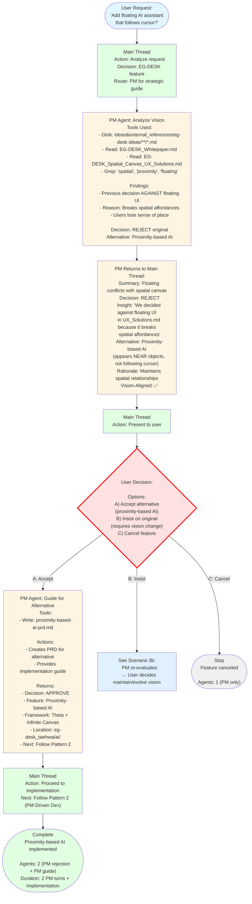

**Key Insight:** PM rejection is constructive - provides alternative + rationale

---

## Scenario 3b: User Insists on Original Despite Vision Conflict

**User:** "I understand vision, but floating AI is more intuitive. Vision should evolve."

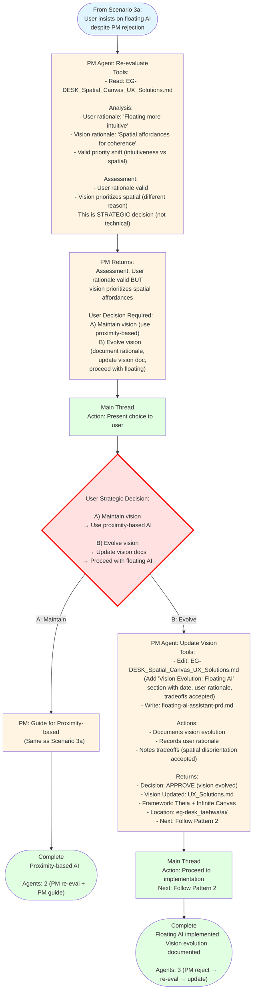

**Key:** Vision NOT immutable - user can evolve with documented rationale

---

## Scenario 4: Development with PM Strategic Guide

**User:** "Add a custom terminal theme that changes based on time of day"

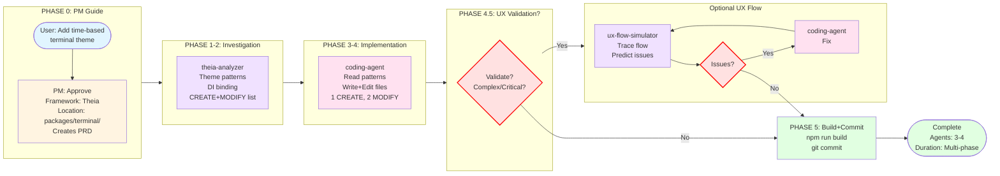

---

## Scenario 4c: Conflict Detection (EG-DESK Custom Code)

**User:** "Bind Ctrl+K to the new QuickSearch feature"


**Key:** Conflict prevention - coding-agent checks BEFORE implementing

---

## Scenario 5: Agent Creation

**User:** "We need an agent that analyzes Konva.js integration patterns"

```mermaid
flowchart TD
    User(["User Request:
    'Create Konva.js analyzer agent'"])

    --> MT1["Main Thread
    Action: Analyze request
    Decision: Agent creation task
    Route: claude-agent-sdk-analyzer"]

    --> Agent["claude-agent-sdk-analyzer-agent

    Step 1 - Read best practices:
    - Tool: Read subagent-best-practices.md
    - Learn: Agent design patterns

    Step 2 - Examine existing agents:
    - Tool: Glob .claude/agents/*-analyzer-agent.md
    - Read: theia-analyzer-agent.md
    - Read: infinite-canvas-analyzer-agent.md
    - Extract: Proven patterns

    Step 3 - Design architecture:
    - YAML frontmatter (name, tools, model)
    - Instruction structure

    Step 4 - Create agent file:
    - Tool: Write .claude/agents/konva-analyzer-agent.md
    - Content: Complete agent spec

    Returns:
    Summary: konva-analyzer-agent created
    Specifications:
    - Tools: Bash, Read, Glob, Grep, WebSearch
    - Model: inherit
    Best Practices Applied:
    - Evidence-based analysis
    - Contextual tool restriction
    - Standard reporting format
    File: .claude/agents/konva-analyzer-agent.md
    Note: Session restart may be needed"]

    --> MT2["Main Thread
    Action: Present to user
    Output: 'Agent created. Restart to use.'"]

    --> End(["Complete
    konva-analyzer-agent ready

    Agents: 1 (claude-agent-sdk-analyzer)
    Duration: Single invocation"])

    style User fill:#e1f5ff
    style MT1 fill:#e1ffe1
    style MT2 fill:#e1ffe1
    style Agent fill:#f0e1ff
    style End fill:#e1ffe1
```

---

## Scenario 6: Simple File Edit

**User:** "Fix the typo in the README - change 'intsall' to 'install'"


**Key:** Even 1-line typo fixes go through coding-agent (consistent separation)

---

## Scenario 7a: Technology Research (Happy Path with 2 User Decisions)

**User:** "캔버스에 3D visualization을 추가하고 싶어. 어떤 framework가 좋을까?"

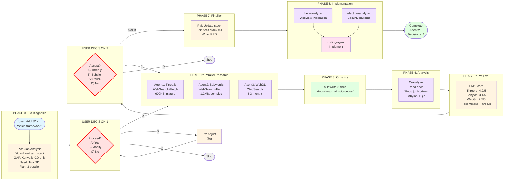

**Highlights:**
- **2 User Decision Points**: Approve research? / Accept recommendation?
- **Parallel execution**: 3 research agents + 2 framework agents (simultaneously)
- **PM waits for user approval** before updating technology-stack.md
- **Institutional memory**: Research docs preserved

---

## Scenario 7b: User Rejects PM Recommendation

(Embedded in Scenario 7a diagram - see UserDec2 → B: Choose Other option)

Flow continues with PM re-evaluating user's choice, documenting rationale, adjusting integration strategy.

---

## Scenario 7c: User Modifies Research Criteria

(Embedded in Scenario 7a diagram - see UserDec1 → B: Modify option)

PM adjusts research plan per user modifications (add options, change criteria), user confirms, then proceed.

---

## Common Patterns (Self-Documenting)

### Pattern 1: Quick Framework Question

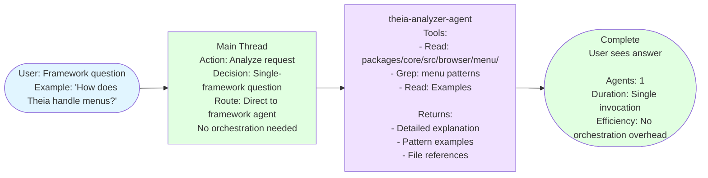

---

### Pattern 2: PM-Driven Development (Complete)


---

### Pattern 3: Full Development Cycle (Parallel Validation)

```mermaid
flowchart TD
    User(["User: Complex feature request
    Example: 'Add custom menu with OS integration'"])

    --> MT["Main Thread
    Action: Orchestrate multi-agent workflow
    Identifies:
    - PM (vision validation)
    - theia-analyzer (menu patterns)
    - electron-analyzer (OS integration)"]

    --> Phase1["PHASE 1: Parallel Validation

    Main Thread sends single message, 2 Tasks:

    Task 1: egdesk-pm-agent
    'Validate custom menu vs vision'

    Task 2: theia-analyzer-agent
    'Analyze Theia menu system'

    Both run simultaneously"]

    --> PM1["PM Agent
    Tools: Glob + Read vision docs
    Returns: APPROVE + considerations"]

    --> FW1["theia-analyzer
    Tools: Read menu code + Grep patterns
    Returns: Menu registration patterns"]

    Phase1 --> PM1
    Phase1 --> FW1

    PM1 --> MT2["Main Thread
    Synthesizes: PM approval + patterns"]
    FW1 --> MT2

    --> Phase2["PHASE 2: Sequential Architecture

    Main Thread (after Phase 1):
    Task: electron-analyzer
    'Given Theia menu pattern,
    analyze OS integration'"]

    --> FW2["electron-analyzer
    Tools: Read Electron menu API
    Returns: OS integration patterns"]

    --> MT3["Main Thread
    Synthesizes ALL guidance:
    - PM: Vision-aligned
    - Theia: Menu patterns
    - Electron: OS integration"]

    --> Coding["PHASE 3: coding-agent

    Implements based on all guidance
    Returns: Status report"]

    --> MT4["Main Thread
    Bash: build, test, commit"]

    --> End(["Complete

    Agents: 4 (PM + 2 FW parallel + 1 FW sequential + coding)
    Duration: Multi-phase with parallelization"])

    style User fill:#e1f5ff
    style PM1 fill:#fff4e1
    style FW1 fill:#f0e1ff
    style FW2 fill:#f0e1ff
    style Coding fill:#ffe1f0
    style MT fill:#e1ffe1
    style MT2 fill:#e1ffe1
    style MT3 fill:#e1ffe1
    style MT4 fill:#e1ffe1
    style End fill:#e1ffe1
```

---

### Pattern 4: Agent Creation

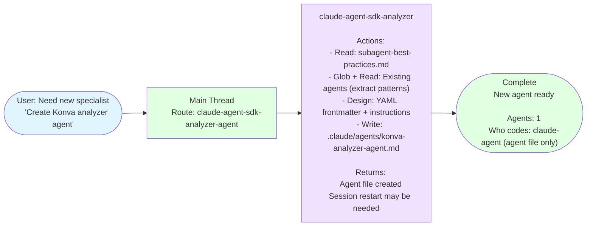

---

### Pattern 5: Large Implementation (Context Preservation)

```mermaid
flowchart TD
    User(["User: Large multi-file feature
    Example: 'Implement custom dashboard (10+ files)'"])

    --> MT1["Main Thread
    Decision: Large implementation
    Strategy: Delegate to coding-agent
    (preserve Main Thread context)"]

    --> Phases["Phase 1-N: Gather Insights

    Main Thread orchestrates:
    - PM: Vision validation
    - Framework agents: Patterns
    - Architecture guidance

    Main Thread's context stays clean
    (agents do heavy reading)"]

    --> MT2["Main Thread
    Synthesizes insights:

    What: Dashboard system
    Files: 10+ CREATE/MODIFY operations
    Patterns: From framework agents

    Format for coding-agent:
    - Direction (what to implement)
    - File list (detailed CREATE/MODIFY/REF)
    - Pattern references"]

    --> Coding["coding-agent (Separate Context)

    Actions:
    - Reads files for implementation details
    - Writes/Edits 10+ files
    - Follows patterns precisely
    - Returns: Status report

    Benefit: Main Thread context preserved
    Main Thread can continue orchestrating"]

    --> MT3["Main Thread
    After coding-agent returns:
    - Bash: npm run build
    - Bash: git commit

    Context still clean for next feature"]

    --> End(["Complete

    Benefit: Main Thread available for
    continued orchestration

    When to use:
    - 3+ files
    - Large edits (500+ lines)
    - Multiple features in session"])

    style User fill:#e1f5ff
    style MT1 fill:#e1ffe1
    style MT2 fill:#e1ffe1
    style MT3 fill:#e1ffe1
    style Coding fill:#ffe1f0
    style End fill:#e1ffe1
```

---

### Pattern 6: Conflict Detection & Resolution

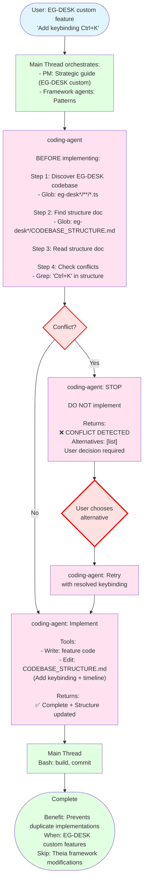

---

### Pattern 7: Optional UX Flow Validation (Pre-Build)

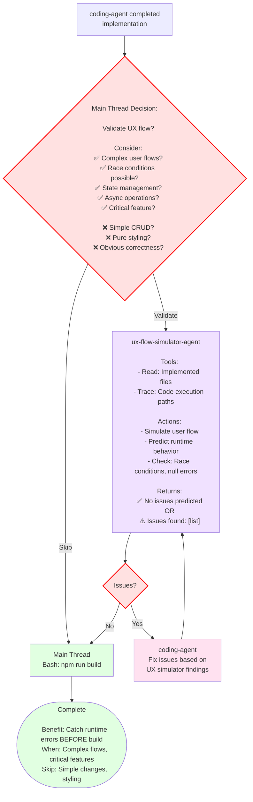

---

### Pattern 8: Technology Research (With User Control)


---

## Code Ownership Principle

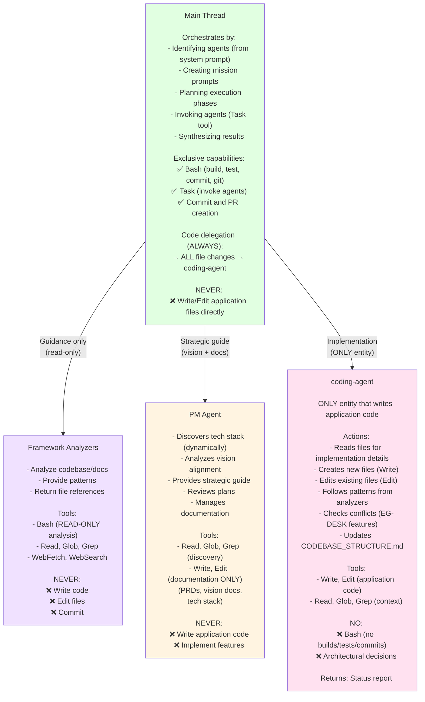

**Hierarchy:** PM guides → Main Thread orchestrates → Analyzers provide patterns → coding-agent implements

---

## Multi-turn Communication with PM


**7 Multi-turn Patterns:**
- 5 original + 2 NEW (Research Planning + Evaluation)
- PM is stateless - Main Thread includes full context each time

---

## Comparison Matrix (Request Routing)

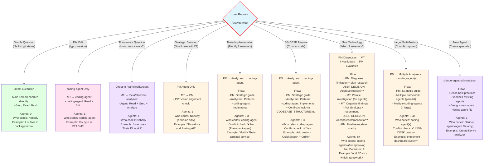

**Route Selection:** Analyze request type → Choose simplest effective approach

---

## Success Metrics Checklist

```mermaid
flowchart TD
    Success["Effective Agent Swarm Flow

    Has ALL these characteristics:"]

    Success --> M1["✅ Right Routing

    - Simple questions → Direct execution
    - Complex tasks → Orchestrated
    - No over-orchestration"]

    Success --> M2["✅ Parallel Execution

    - Independent analyses run simultaneously
    - Single message, multiple Tasks
    - 3x+ faster runtime"]

    Success --> M3["✅ Evidence-Based

    - All recommendations backed by file analysis
    - No assumptions
    - Read before recommend"]

    Success --> M4["✅ Clear Boundaries

    - Agents analyze (read-only)
    - coding-agent implements (writes code)
    - Main Thread orchestrates + builds
    - PM guides strategy"]

    Success --> M5["✅ Strategic Alignment

    - Vision validated before implementation
    - PM checks all EG-DESK features
    - Institutional memory maintained"]

    Success --> M6["✅ User Decision Points

    - Research approval required
    - Recommendation approval required
    - Vision evolution requires user authority
    - User can override PM"]

    Success --> M7["✅ No Redundancy

    - Each agent contributes unique value
    - No duplicate work
    - Clear role separation"]

    Success --> M8["✅ Conflict Prevention

    - coding-agent checks CODEBASE_STRUCTURE.md
    - BEFORE implementing EG-DESK features
    - Reports conflicts, user decides
    - Updates structure after implementation"]

    Success --> M9["✅ Dynamic Discovery

    - No hardcoded paths
    - Glob everything
    - Tech stack discovered from doc
    - Structure-agnostic"]

    Success --> M10["✅ Institutional Memory

    - Research docs preserved
    - Decision rationales documented
    - CODEBASE_STRUCTURE.md maintained
    - Technology stack tracked"]

    style Success fill:#e1ffe1
    style M1 fill:#e1f5ff
    style M2 fill:#e1f5ff
    style M3 fill:#e1f5ff
    style M4 fill:#e1f5ff
    style M5 fill:#e1f5ff
    style M6 fill:#ffe1e1,stroke:#ff0000,stroke-width:2px
    style M7 fill:#e1f5ff
    style M8 fill:#e1f5ff
    style M9 fill:#e1f5ff
    style M10 fill:#e1f5ff
```

---

## Agent Ecosystem Hierarchy

```mermaid
flowchart TD
    User(["User

    - Makes final decisions
    - Provides preferences
    - Approves/rejects plans
    - Can override any recommendation
    - Full authority"])

    --> MT["Main Thread (Orchestrator ONLY)

    Responsibilities:
    - Analyze and route requests
    - Identify agents (from system prompt)
    - Create mission prompts
    - Plan execution phases
    - Invoke agents (Task tool)
    - Synthesize agent outputs
    - Execute bash (build/test/commit)
    - Preserve context (delegate heavy reading)

    Tools: Bash, Task, Read, Glob, Grep
    NO: Write/Edit application code

    Delegation:
    ALL file changes → coding-agent"]

    MT -->|"Strategic<br/>guidance"| PM["PM Agent

    Responsibilities:
    - Discover tech stack (Glob + Read)
    - Analyze vision alignment
    - Diagnose stack limitations
    - Plan technology research
    - Evaluate research results
    - Check implementation status
    - Review execution plans
    - Manage documentation
    - Maintain institutional memory

    Tools: Bash (discovery), Read, Glob, Grep,
           Write/Edit (docs only), WebFetch/Search

    Writes: PRDs, vision docs, tech stack
    NEVER: Application code"]

    MT -->|"Technical<br/>patterns"| Analyzers["Framework Analyzer Agents
    (theia, electron, infinite-canvas, etc.)

    Responsibilities:
    - Analyze codebase/documentation
    - Provide evidence-based guidance
    - Explain framework patterns
    - Find proven patterns
    - Return file references

    Tools: Bash (READ-ONLY), Read, Glob, Grep,
           WebFetch, WebSearch

    Returns: Patterns + File lists
    (CREATE/MODIFY/DELETE/REFERENCE)

    NEVER: Write code, Edit files, Commit"]

    MT -->|"Code<br/>execution"| Coding["coding-agent

    ONLY entity that writes application code

    Responsibilities:
    - Execute code writing/editing
    - Read files for implementation details
    - Follow patterns from analyzers
    - Discover EG-DESK codebase (dynamically)
    - Check conflicts (CODEBASE_STRUCTURE.md)
    - STOP if conflict (report, user decides)
    - Update structure doc after implementation
    - Return status reports

    Tools: Write, Edit, Read, Glob, Grep
    NO: Bash (no builds/tests/commits)

    Receives: Direction + File list from MT
    Returns: Implementation report"]

    MT -->|"Agent<br/>creation"| SDK["claude-agent-sdk-analyzer

    Responsibilities:
    - Design new specialized agents
    - Read best practices
    - Examine existing agents
    - Write agent definition files
    - Provide SDK guidance

    Tools: Read, Write (agent files only),
           Glob, Grep, WebFetch/Search

    Writes: .claude/agents/*.md
    NEVER: Application code"]

    style User fill:#e1f5ff
    style MT fill:#e1ffe1
    style PM fill:#fff4e1
    style Analyzers fill:#f0e1ff
    style Coding fill:#ffe1f0
    style SDK fill:#f0e1ff
```

---

## Key Architectural Principles (Visual Summary)

```mermaid
flowchart LR
    P1["Principle 1:
    Metaphysical Separation

    Main Thread operates at META level:
    - Coordinates agents
    - Delegates domain reading
    - Preserves context

    Agents operate at DOMAIN level:
    - PM: Vision docs
    - Analyzers: Codebase
    - coding-agent: Writes code"]

    P2["Principle 2:
    Strict Code Delegation

    Main Thread NEVER writes code
    ALWAYS delegates to coding-agent

    Even 1-line typo fixes:
    MT → coding-agent → Edit

    Consistent separation of concerns"]

    P3["Principle 3:
    Dynamic Discovery

    NEVER hardcode paths:
    - PM: Glob tech stack (not hardcoded list)
    - Agents: Glob codebases
    - Structure-agnostic

    Always discover current state"]

    P4["Principle 4:
    User Authority

    PM guides, user decides:
    - Research approval required
    - Recommendation approval required
    - Can override PM
    - Can evolve vision

    2+ decision points in research workflow"]

    P5["Principle 5:
    Parallel Execution

    Independent tasks run simultaneously:
    - Single message, multiple Tasks
    - 3x+ faster runtime
    - Research agents in parallel
    - Framework agents in parallel"]

    P6["Principle 6:
    Institutional Memory

    Everything documented:
    - Research docs in ideas&external_references/
    - PRDs for features
    - Decision rationales preserved
    - CODEBASE_STRUCTURE.md maintained
    - Technology stack tracked"]

    style P1 fill:#e1f5ff
    style P2 fill:#ffe1f0
    style P3 fill:#e1ffe1
    style P4 fill:#ffe1e1,stroke:#ff0000,stroke-width:2px
    style P5 fill:#f0e1ff
    style P6 fill:#fff4e1
```

---

## Key Execution Principles (Detailed)

### Principle 1: Tool Ownership (Contextual Restriction)

```mermaid
flowchart TD
    Principle["Tool Ownership Principle:

    Tools restricted CONTEXTUALLY (via prompts)
    NOT mechanically removed

    Agents have tools, but role defines HOW to use"]

    Principle --> Analyzers["Framework Analyzer Agents

    Tool Access:
    - Bash, Glob, Grep, Read
    - WebFetch, WebSearch

    Contextual Restriction (via prompt):
    ✅ Bash for READ-ONLY analysis
       (inspect outputs, run tests to understand)
    ❌ NEVER for implementation
       (commits, builds, installations)

    Example:
    ✅ Bash: npm test (see test behavior)
    ❌ Bash: npm install (implementation)

    Enforced: Agent prompt instructions"]

    Principle --> Coding["coding-agent

    Tool Access:
    - Write, Edit, Read, Glob, Grep

    Contextual Restriction:
    ✅ Code execution ONLY
    ❌ NO Bash (no builds/tests/commits)

    Example:
    ✅ Write: new-service.ts
    ✅ Edit: existing-file.ts
    ❌ Bash: npm run build

    Enforced: Agent role description"]

    Principle --> MT["Main Thread

    Tool Access: ALL tools

    Usage:
    ✅ Bash: build, test, commit, git
    ✅ Task: invoke agents
    ✅ Read, Glob, Grep: orchestration
    ❌ Write/Edit: application code
       (always delegate to coding-agent)

    Full access, contextually appropriate"]

    style Principle fill:#e1ffe1
    style Analyzers fill:#f0e1ff
    style Coding fill:#ffe1f0
    style MT fill:#e1ffe1
```

**Why Contextual Works:**
- Agents understand their role from prompts
- More flexible (agents can investigate runtime behavior)
- No artificial tool removal
- Trust agent instructions to enforce boundaries

---

### Principle 2: When to Spawn Subagent (Context Preservation)

```mermaid
flowchart TD
    Task["Task arrives"]

    --> Decision{"Requires heavy
    domain-specific reading?"}

    Decision -->|Yes| Spawn["✅ SPAWN SUBAGENT

    Scenarios:
    - Extensive domain reading
      (vision docs, framework docs, large codebase)
    - Synthesize knowledge from references
    - Domain analysis needed
    - 'Learn this domain, then apply'
    - Would pollute Main Thread context

    Example:
    'Analyze Theia DI system across 50 files'
    → theia-analyzer reads 50 files
    → Returns 3-paragraph summary
    → Main Thread context: Clean (only summary)

    Benefit: Context preserved"]

    Decision -->|No| Direct["✅ MAIN THREAD DIRECT

    Scenarios:
    - Simple questions (system knowledge)
    - File operations (clear instructions)
    - Orchestration tasks
    - Already have guidance from agents

    Example:
    'List files in packages/core'
    → Glob directly
    → No agent needed

    Benefit: Fast, efficient"]

    Spawn --> Effect1["Effect: Main Thread Context

    WITHOUT subagent:
    MT reads 50 files → context polluted

    WITH subagent:
    Agent reads 50 files → returns summary
    MT context: Clean (only summary)"]

    Direct --> Effect2["Effect: Immediate

    No agent overhead
    Fast execution"]

    style Task fill:#e1f5ff
    style Decision fill:#ffe1e1,stroke:#ff0000,stroke-width:2px
    style Spawn fill:#e1ffe1,stroke:#00ff00,stroke-width:2px
    style Direct fill:#e1ffe1,stroke:#00ff00,stroke-width:2px
    style Effect1 fill:#f0e1ff
    style Effect2 fill:#e1ffe1
```

---

### Principle 3: Parallel vs Sequential Execution

```mermaid
flowchart TD
    Tasks["Multiple analyses needed"]

    --> Check{Independent<br/>analyses?}

    Check -->|Yes| Parallel["✅ PARALLEL

    Single message, multiple Tasks:

    Main Thread sends ONE message:
    - Task(agent: 'theia-analyzer', ...)
    - Task(agent: 'electron-analyzer', ...)
    - Task(agent: 'infinite-canvas-analyzer', ...)

    All THREE execute simultaneously

    Duration: max(T1, T2, T3)
    Example: T1=10s, T2=8s, T3=12s
    → Total: 12s (not 10+8+12=30s)

    Benefit: 3x+ faster"]

    Check -->|No| Sequential["✅ SEQUENTIAL

    Separate messages (dependencies):

    Message 1:
    - Task(agent: 'electron-analyzer',
           'Find security requirements')
    (Wait for response)

    Message 2:
    - Task(agent: 'theia-analyzer',
           'Given security reqs from previous,
            analyze Theia implementation')

    Duration: T1 + T2
    (Later agent needs earlier findings)

    Necessary: Dependent analyses"]

    Parallel --> ParallelWhen["When to use PARALLEL:

    ✅ Independent analyses
    ✅ 'How does each framework handle X?'
    ✅ Multiple research options
    ✅ No dependencies between tasks"]

    Sequential --> SeqWhen["When to use SEQUENTIAL:

    ✅ Later agent needs earlier findings
    ✅ 'Given security reqs, analyze implementation'
    ✅ Dependent information
    ✅ Phase N+1 needs Phase N results"]

    style Tasks fill:#e1f5ff
    style Check fill:#ffe1e1,stroke:#ff0000,stroke-width:2px
    style Parallel fill:#e1ffe1,stroke:#00ff00,stroke-width:2px
    style Sequential fill:#e1ffe1,stroke:#00ff00,stroke-width:2px
    style ParallelWhen fill:#e1f5ff
    style SeqWhen fill:#e1f5ff
```

---

### Principle 4: Conversational Re-query Pattern

```mermaid
flowchart TD
    Agent1["Agent returns report

    Report:
    ✓ Summary: Present
    ✓ Findings: Present
    ✗ Files Analyzed: MISSING"]

    --> MT1["Main Thread
    Action: Detect incomplete report

    Missing: Files Analyzed section
    (REQUIRED for implementation)"]

    --> Requery["Main Thread: Re-query Contextually

    Tool: Task(agent: 'theia-analyzer-agent',
          prompt: 'You previously provided this analysis:

    [ENTIRE PREVIOUS REPORT QUOTED]

    However, Files Analyzed section MISSING (REQUIRED).
    Please provide complete file list with file:line refs.
    No need to re-analyze - just add missing section.')

    Key: Agent is stateless
    BUT Main Thread provides full context"]

    --> Agent2["Agent (stateless but with context)

    Actions:
    - Reads own previous report (from prompt)
    - Extracts file list from analysis
    - Completes missing section

    Returns:
    Files Analyzed:
    - terminal-theme-service.ts:45
    - terminal-frontend-module.ts:32
    - workspace-service.ts:89"]

    --> MT2["Main Thread
    Now has complete report
    Can proceed to next phase"]

    --> End(["Continue

    Benefit:
    - Flexible (not strict validation)
    - Natural conversation
    - Agent can clarify/complete

    When to use:
    - Report missing sections
    - Need clarification
    - Want more detail
    - File list breakdown needed"])

    style Agent1 fill:#f0e1ff
    style MT1 fill:#e1ffe1
    style Requery fill:#e1ffe1
    style Agent2 fill:#f0e1ff
    style MT2 fill:#e1ffe1
    style End fill:#e1ffe1
```

---

### Principle 5: File List Format Enforcement

```mermaid
flowchart LR
    Agent["Framework analyzer
    returns file list"]

    --> Format["Required Format:

    1. CREATE:
       - path/to/new-file.ts (purpose)

    2. MODIFY:
       - path/to/existing.ts:45 (what to change)

    3. DELETE (if applicable):
       - path/to/deprecated.ts (why removing)

    4. REFERENCE (patterns, don't modify):
       - path/to/pattern-file.ts:89
         (Follow @injectable pattern)"]

    --> Benefit["Main Thread Benefits:

    - Extract exact action list
    - Know CREATE vs MODIFY vs DELETE
    - Identify pattern references separately
    - Precise coding-agent instructions:
      'CREATE 1, MODIFY 2, REF 1'"]

    --> CodingPrompt["coding-agent Prompt:

    From theia-analyzer:
    - Pattern: workspace-service.ts:89

    Tasks:
    1. CREATE packages/terminal/src/browser/switcher.ts:
       - Follow workspace-service.ts:89 @injectable pattern
       - Implement time-based logic

    2. MODIFY terminal-frontend-module.ts:36:
       - Add DI binding: bind(Switcher).toSelf()

    3. REFERENCE workspace-service.ts:89:
       - Pattern to follow (don't modify this file)"]

    style Agent fill:#f0e1ff
    style Format fill:#e1f5ff
    style Benefit fill:#e1ffe1
    style CodingPrompt fill:#ffe1f0
```

---

## Orchestration Guidelines Deep Dive

### How Main Thread Orchestrates (10-Step Process)

```mermaid
flowchart TD
    Start(["Complex Development Task"])

    --> Step1["Step 1: Identify Agents

    Source: System prompt knowledge
    (Task tool description lists all agents)

    Main Thread knows:
    - egdesk-pm-agent
    - theia-analyzer-agent
    - electron-analyzer-agent
    - infinite-canvas-analyzer-agent
    - coding-agent
    - ux-flow-simulator-agent
    - etc."]

    --> Step2["Step 2: Select Agents

    Based on capabilities from descriptions

    For 'Add custom menu with OS integration':
    - PM (vision validation)
    - theia-analyzer (menu patterns)
    - electron-analyzer (OS integration)
    - coding-agent (implementation)"]

    --> Step3["Step 3: Analyze Task Requirements

    From user request:
    - What does user want?
    - Which frameworks involved?
    - Complexity level?
    - Vision validation needed?"]

    --> Step4["Step 4: (Optional) Read Agent Details

    If needs specific implementation examples:
    - Read: .claude/agents/[agent].md

    Usually NOT needed:
    - Agent descriptions in system prompt sufficient"]

    --> Step5["Step 5: Create Mission Prompts

    For each agent, create detailed prompt:

    egdesk-pm-agent:
    'Validate custom menu feature against
    ambient AI workspace vision in whitepaper'

    theia-analyzer-agent:
    'Analyze Theia menu system at
    packages/core/src/browser/menu/
    to find registration patterns'"]

    --> Step6["Step 6: Plan Execution Phases

    Identify parallel vs sequential:

    Phase 1 (Parallel):
    - PM validation
    - Theia menu analysis

    Phase 2 (Sequential, after P1):
    - Electron OS integration
      (needs Theia patterns from P1)"]

    --> Step7["Step 7: Identify Decision Points

    Where user input needed:
    - After PM evaluation?
    - Conflict resolution?
    - Multiple options to choose?

    분기점 (Decision gates)"]

    --> Step8["Step 8: Invoke Agents

    Tool: Task

    Phase 1 (single message, 2 Tasks):
    - Task(agent: 'egdesk-pm-agent', ...)
    - Task(agent: 'theia-analyzer-agent', ...)

    Wait for both

    Phase 2 (after P1):
    - Task(agent: 'electron-analyzer-agent',
           prompt includes P1 findings)"]

    --> Step9["Step 9: Synthesize Agent Results

    Collect:
    - PM: APPROVE + considerations
    - theia-analyzer: Menu patterns
    - electron-analyzer: OS integration

    Synthesize into:
    - Implementation direction
    - File list (CREATE/MODIFY/REF)
    - Pattern references"]

    --> Step10["Step 10: Delegate Implementation

    Tool: Task(coding-agent,
          prompt: synthesized guidance)

    OR (if simple enough):
    Main Thread handles directly

    Then:
    - Bash: npm run build
    - Bash: git commit"]

    --> End(["Complete
    Orchestration Done"])

    style Start fill:#e1f5ff
    style Step1 fill:#e1ffe1
    style Step2 fill:#e1ffe1
    style Step3 fill:#e1ffe1
    style Step4 fill:#e1ffe1
    style Step5 fill:#e1ffe1
    style Step6 fill:#e1ffe1
    style Step7 fill:#ffe1e1,stroke:#ff0000,stroke-width:2px
    style Step8 fill:#e1ffe1
    style Step9 fill:#e1ffe1
    style Step10 fill:#e1ffe1
    style End fill:#e1ffe1
```

---

### File Reading Scope (Critical for Context Preservation)

```mermaid
flowchart TD
    MT["Main Thread (When Orchestrating)"]

    MT --> Can["✅ CAN Read:

    Meta-level files:
    - .claude/prompts/agent-orchestration.md
      (orchestration guidelines)
    - .claude/agents/*.md (OPTIONAL)
      (only when needs specific examples
       - agent discovery already in system prompt)

    Purpose: Orchestration guidance only"]

    MT --> Cannot["❌ CANNOT Read (When Orchestrating):

    Domain files:
    - ideas&external_references/eg-desk ideas/
      (That's PM agent's domain)
    - packages/
      (That's framework analyzer agents' domain)
    - Application/framework code
      (Delegate to agents to preserve context)
    - Vision/strategy documents
      (PM agent reads these)

    Why: Preserve Main Thread context
    Agents synthesize → return summary"]

    Cannot --> Effect["Effect of Context Preservation:

    WITHOUT delegation:
    MT reads 50 vision docs → context polluted

    WITH delegation:
    PM reads 50 docs → returns 3-paragraph summary
    MT context: CLEAN (only summary)

    Benefit:
    - Main Thread available for continued orchestration
    - Doesn't load unnecessary reference materials
    - Gets synthesized conclusions only"]

    Can --> Exception["Exception:

    Main Thread CAN read domain files when:
    ✅ Directly implementing
       (after receiving agent guidance)
    ✅ Handling simple tasks
       (no orchestration needed)

    Example:
    'Fix typo' - may read README directly
    before delegating to coding-agent"]

    style MT fill:#e1ffe1
    style Can fill:#e1ffe1,stroke:#00ff00,stroke-width:2px
    style Cannot fill:#ffe1e1,stroke:#ff0000,stroke-width:2px
    style Effect fill:#f0e1ff
    style Exception fill:#fff4e1
```

---

## Anti-Patterns to Avoid (BAD vs GOOD)

### ❌ Anti-Pattern 1: Over-Orchestration

```mermaid
flowchart TD
    Q["User: 'What files are in packages/core?'"]

    Q --> Bad["❌ BAD: Over-Orchestration

    Main Thread:
    - Creates elaborate plan
    - Invokes agents
    - Orchestrates unnecessarily

    Problem:
    - Wastes time
    - Unnecessary complexity
    - Agent overhead for simple task"]

    Q --> Good["✅ GOOD: Direct Execution

    Main Thread:
    - Tool: Glob packages/core/**/*
    - Returns: File list immediately

    Benefit:
    - Fast
    - Simple
    - No agent overhead"]

    Bad --> BadEnd([Slow, complex])
    Good --> GoodEnd([Fast, simple])

    style Q fill:#e1f5ff
    style Bad fill:#ffe1e1,stroke:#ff0000,stroke-width:2px
    style Good fill:#e1ffe1,stroke:#00ff00,stroke-width:2px
    style BadEnd fill:#f0f0f0
    style GoodEnd fill:#e1ffe1
```

---

### ❌ Anti-Pattern 2: Sequential When Parallel Possible

```mermaid
flowchart TD
    Task["Task: Analyze menus in
    Theia AND Electron"]

    Task --> Bad["❌ BAD: Sequential

    Phase 1: theia-analyzer analyzes menus
    (Wait for completion)

    Phase 2: electron-analyzer analyzes menus
    (Wait for completion)

    Problem:
    - These are INDEPENDENT analyses
    - No dependency between them
    - 2x slower (sequential execution)"]

    Task --> Good["✅ GOOD: Parallel

    Phase 1 (Single message, 2 Tasks):
    - Task 1: theia-analyzer
    - Task 2: electron-analyzer

    Both run SIMULTANEOUSLY

    Benefit:
    - 2x faster runtime
    - Efficient use of resources
    - Independent analyses in parallel"]

    Bad --> BadTime["Duration: T1 + T2
    (Sequential = slower)"]

    Good --> GoodTime["Duration: max(T1, T2)
    (Parallel = faster)"]

    style Task fill:#e1f5ff
    style Bad fill:#ffe1e1,stroke:#ff0000,stroke-width:2px
    style Good fill:#e1ffe1,stroke:#00ff00,stroke-width:2px
    style BadTime fill:#f0f0f0
    style GoodTime fill:#e1ffe1
```

---

### ❌ Anti-Pattern 3: Agent Writing Code

```mermaid
flowchart LR
    Task["Analyzer agent
    analyzing codebase"]

    Task --> Bad["❌ BAD: Agent Writes Code

    Agent returns:
    'Here's the code:
    class Foo {
      bar() { ... }
    }'

    Problem:
    - Agents should analyze, not implement
    - Violates role separation
    - Main Thread can't review/adjust"]

    Task --> Good["✅ GOOD: Agent Provides Patterns

    Agent returns:
    'Pattern at packages/core/foo.ts:45
    shows @injectable decorator usage.
    Follow this pattern for FooService.

    File List:
    - CREATE: foo-service.ts
    - REFERENCE: foo.ts:45'

    Benefit:
    - Clear role: agent analyzes
    - Main Thread decides implementation
    - coding-agent implements"]

    style Task fill:#f0e1ff
    style Bad fill:#ffe1e1,stroke:#ff0000,stroke-width:2px
    style Good fill:#f0e1ff,stroke:#00ff00,stroke-width:2px
```

---

### ❌ Anti-Pattern 4: Assumption-Based Guidance

```mermaid
flowchart LR
    Agent["Analyzer agent"]

    Agent --> Bad["❌ BAD: Assumptions

    'Theia probably uses
    dependency injection like Angular'

    Problem:
    - Not evidence-based
    - May be wrong
    - No file references
    - Guessing framework patterns"]

    Agent --> Good["✅ GOOD: Evidence-Based

    Tools Used:
    - Read: packages/core/src/common/di.ts

    Analysis:
    'Theia uses InversifyJS for DI.
    Example at di.ts:89 shows
    @injectable decorator usage.'

    Benefit:
    - Backed by actual file analysis
    - File:line references
    - Accurate guidance"]

    style Agent fill:#f0e1ff
    style Bad fill:#ffe1e1,stroke:#ff0000,stroke-width:2px
    style Good fill:#f0e1ff,stroke:#00ff00,stroke-width:2px
```

---

### ❌ Anti-Pattern 5: Main Thread Writing Code Directly

```mermaid
flowchart TD
    Task["User: 'Fix typo in README'"]

    Task --> Bad["❌ BAD: Main Thread Direct Edit

    Main Thread:
    - Tool: Edit README.md directly
      (old: 'intsall' → new: 'install')

    Problem:
    - Breaks separation of concerns
    - Inconsistent (sometimes MT, sometimes coding-agent)
    - Main Thread context polluted
    - NOT orchestrator behavior"]

    Task --> Good["✅ GOOD: Delegate to coding-agent

    Main Thread:
    - Tool: Task(coding-agent,
             'Fix typo: intsall → install
              File: MODIFY README.md')

    coding-agent:
    - Read: README.md
    - Edit: old → new
    - Return: Fixed

    Main Thread:
    - Bash: git commit

    Benefit:
    - Consistent delegation (ALWAYS)
    - Main Thread stays clean
    - Single responsibility principle
    - Even 1-line fixes go through coding-agent"]

    Bad --> BadEnd([Inconsistent,<br/>polluted context])
    Good --> GoodEnd([Consistent,<br/>clean separation])

    style Task fill:#e1f5ff
    style Bad fill:#ffe1e1,stroke:#ff0000,stroke-width:2px
    style Good fill:#e1ffe1,stroke:#00ff00,stroke-width:2px
    style BadEnd fill:#f0f0f0
    style GoodEnd fill:#e1ffe1
```

---

### ❌ Anti-Pattern 6: Hardcoding Paths

```mermaid
flowchart LR
    Agent["PM or coding-agent"]

    Agent --> Bad["❌ BAD: Hardcoded Paths

    PM: 'Implement in packages/terminal/src/browser/'
    coding-agent: Read('packages/terminal/src/browser/file.ts')

    Problem:
    - Assumes fixed structure
    - Breaks when directory renamed
    - Not structure-agnostic
    - Hard to refactor"]

    Agent --> Good["✅ GOOD: Dynamic Discovery

    PM:
    - Glob: eg-desk*/**/*.ts
    - Discovers: eg-desk_taehwa/
    - Recommends: 'eg-desk_taehwa/terminal/'

    coding-agent:
    - Glob: eg-desk*/CODEBASE_STRUCTURE.md
    - Discovers structure dynamically

    Benefit:
    - Structure-agnostic
    - Flexible (handles renames)
    - Always discovers current state"]

    style Agent fill:#fff4e1
    style Bad fill:#ffe1e1,stroke:#ff0000,stroke-width:2px
    style Good fill:#fff4e1,stroke:#00ff00,stroke-width:2px
```

---

### ❌ Anti-Pattern 7: Not Checking Conflicts (EG-DESK Features)

```mermaid
flowchart TD
    Task["User: 'Bind Ctrl+K to QuickSearch'"]

    Task --> Bad["❌ BAD: No Conflict Check

    coding-agent:
    - Implements immediately
    - Write: search-contribution.ts
      (with Ctrl+K binding)
    - NO conflict check

    Result:
    ❌ Ctrl+K already used elsewhere
    → User confusion
    → Discovered only after deployment
    → Hard to debug 'which feature uses Ctrl+K?'"]

    Task --> Good["✅ GOOD: Conflict Check FIRST

    coding-agent:

    Step 1: BEFORE implementing
    - Read: CODEBASE_STRUCTURE.md
    - Grep: 'Ctrl+K'

    Step 2: If conflict
    - STOP immediately
    - Report to user with alternatives
    - User chooses: Ctrl+Shift+K

    Step 3: Implement with resolved key
    - Write: search-contribution.ts (Ctrl+Shift+K)
    - Edit: CODEBASE_STRUCTURE.md (update registry)

    Benefit:
    - Prevents duplicate keybindings
    - User decides before implementation
    - Registry always up-to-date
    - No confusion"]

    Bad --> BadEnd([Duplicate keybinding<br/>User confusion<br/>Wasted time])

    Good --> GoodEnd([No conflicts<br/>Clean registry<br/>Prevented early])

    style Task fill:#e1f5ff
    style Bad fill:#ffe1e1,stroke:#ff0000,stroke-width:2px
    style Good fill:#ffe1f0,stroke:#00ff00,stroke-width:2px
    style BadEnd fill:#f0f0f0
    style GoodEnd fill:#e1ffe1
```

---

## Conclusion

This visual guide provides **self-documenting Mermaid diagrams** where each node contains complete information:
- **Tools used** (Bash, Read, Write, etc.)
- **Specific actions** (what the entity does)
- **Outputs** (what it returns)
- **Decisions** (APPROVE/REJECT/RESEARCH_NEEDED)

**You don't need to read external explanations** - the diagrams are self-contained.

**Key Takeaways:**
1. **User Decision Points** (red borders) are critical gates - user has control
2. **Parallel execution** (shown as simultaneous branches) = faster runtime
3. **PM guides, user decides** - all strategic decisions require user approval
4. **Main Thread never writes code** - always delegates to coding-agent
5. **Each node is self-documenting** - includes tools, actions, outputs
6. **Diagrams tell the complete story** - no need for separate documentation

For detailed prose explanations and comprehensive context, see [AGENT_SWARM_FLOW.md](./AGENT_SWARM_FLOW.md).
