# Agent Swarm Flow: Visual Guide (Self-Documenting Mermaid Diagrams)

This document provides **self-contained visual representations** where each Mermaid node includes complete information (tools used, actions, outputs). The diagrams are self-documenting - you don't need external explanations.

For the original table-based version, see [AGENT_SWARM_FLOW.md](./AGENT_SWARM_FLOW.md).

## Color Legend

- 🔵 **Light Blue**: User actions / Start
- 🔴 **Red border (thick)**: **User Decision Points** (critical gates)
- 🟡 **Yellow**: PM agent
- 🟢 **Green**: Main Thread
- 🟣 **Purple**: Analyzer/Research agents
- 🔴 **Pink**: coding-agent
- ⚪ **Gray**: End states

---

## Pattern 1: Simple Direct Execution

**When to use:** Simple questions, file listings, straightforward tasks that don't require framework analysis or strategic planning.

### Scenario 1a: Simple File Listing

**User:** "What files are in the packages/ai-chat directory?"

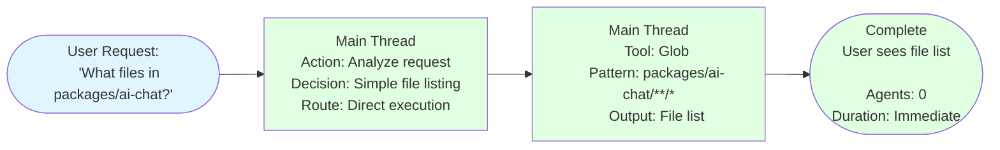

### Scenario 1b: Simple File Edit

**User:** "Fix the typo in the README - change 'intsall' to 'install'"


**Key:** Even 1-line typo fixes go through coding-agent (consistent separation)

---

## Pattern 2: Framework Question (Direct Agent)

**When to use:** Questions specifically about Theia or Electron frameworks that don't require implementation.

**User:** "How does Theia's dependency injection work?"

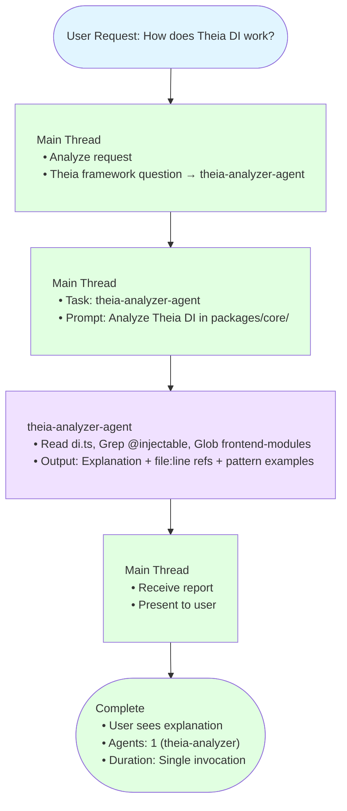

---

## Pattern 3: Vision Conflict Resolution

**When to use:** User requests feature that may conflict with established vision. PM evaluates against vision documents.

**Critical features:**
- **Multiple conversation turns** between PM and user to refine idea
- **2 decision points:** User Determination (implement later vs now) + User Approval (after impact report)
- **Vision Impact Report** before final approval
- **Document updates** only after user approval

### Scenario 3a: User Accepts PM's Alternative

**User:** "Should we add a floating AI assistant that follows the mouse cursor?"

```mermaid
flowchart TD
    classDef wideBox padding:12px 20px,text-align:left,white-space:pre;
    classDef wideDecision padding:12px 20px,text-align:left,white-space:pre;
    classDef invisible fill:none,stroke:none;
    classDef branchLabel fill:#e8f4f8,stroke:#0288d1,stroke-width:2px,text-align:left,white-space:pre;

    User(["User Request:
  Add floating AI assistant that follows cursor?"]):::wideBox

    --> MT1["Main Thread
  • EG-DESK feature → PM for strategic guide"]:::wideBox

    --> PM1["PM: Analyze Vision
  • Glob ideas/, Read Whitepaper/UX Solutions, Grep 'spatial'
  • REJECT: Floating UI breaks spatial affordances
  • Alternative: Proximity-based AI"]:::wideBox

    --> PMReturn["PM Returns:
  • REJECT floating | Alternative: Proximity-based AI
  • (appears near objects)
  • Vision-Aligned ✅"]:::wideBox

    --> MT2["Main Thread
  • Present to user"]:::wideBox

    --> ConvLoop["🔄 CONVERSATION TURNS
  • PM and user exchange messages
  • to refine approach (triggers, design, etc.)"]:::wideBox

    --> UserDec1{"User Determination:
  • 나중에 구현 (later)?
  • OR 바로 구현 (now)?"}:::wideDecision

    --> Label1["Branch: 나중에 (later)"]:::branchLabel

    subgraph SG1 [" "]
        direction LR
        Entry1[" "]:::invisible --> PMIdea["PM Agent: Document Idea
  • Write: ideas&external_references/
    eg-desk ideas/proximity-ai-idea.md
  • Saves concept, user rationale"]:::wideBox --> End1(["Stop
  • Idea saved for later
  • Agents: 1 (PM only)"]):::wideBox
    end

    Label1 --> Entry1

    End1 --> Label2["Branch: 바로 (now)"]:::branchLabel

    subgraph SG2 [" "]
        direction LR
        Entry2[" "]:::invisible --> PM2["PM: Create Impact Report
  • Read PRDs/vision docs
  • Affected: Spatial Canvas, AI Integration
  • Maintains: Spatial affordances"]:::wideBox --> MT3["Main Thread
  • Present Impact Report"]:::wideBox --> UserDec2{"User Approval?
  • A/B/C"}:::wideDecision
    end

    Label2 --> Entry2

    UserDec2 --> Label3["Sub-branch A: Approve"]:::branchLabel

    subgraph SG3 [" "]
        direction LR
        Entry3[" "]:::invisible --> PM3["PM: Finalize
  • Write proximity-based-ai-prd.md
  • APPROVE Proximity-based AI
  • Framework: Theia + Infinite Canvas"]:::wideBox --> MT4["Main Thread
  • Proceed to implementation
  • Next: Follow Pattern 4"]:::wideBox --> End3(["Complete
  • Proximity-based AI implemented
  • Agents: 2"]):::wideBox
    end

    Label3 --> Entry3

    End3 --> Label4["Sub-branch B: Modify"]:::branchLabel

    subgraph SG4 [" "]
        direction LR
        Entry4[" "]:::invisible --> BackToConv["Main Thread
  • Return to conversation loop
  • for refinement"]:::wideBox
    end

    Label4 --> Entry4

    BackToConv -.->|"Returns to"| ConvLoop

    BackToConv --> Label5["Sub-branch C: Cancel"]:::branchLabel

    subgraph SG5 [" "]
        direction LR
        Entry5[" "]:::invisible --> End2(["Stop
  • Feature canceled
  • Agents: 1 (PM only)"]):::wideBox
    end

    Label5 --> Entry5

    style User fill:#e1f5ff
    style UserDec1 fill:#ffe1e1,stroke:#ff0000,stroke-width:3px
    style UserDec2 fill:#ffe1e1,stroke:#ff0000,stroke-width:3px
    style ConvLoop fill:#fff4e1,stroke:#ffa500,stroke-width:2px
    style PM1 fill:#fff4e1
    style PM2 fill:#fff4e1
    style PM3 fill:#fff4e1
    style PMReturn fill:#fff4e1
    style PMIdea fill:#fff4e1
    style MT1 fill:#e1ffe1
    style MT2 fill:#e1ffe1
    style MT3 fill:#e1ffe1
    style MT4 fill:#e1ffe1
    style BackToConv fill:#e1ffe1
    style End1 fill:#f0f0f0
    style End2 fill:#f0f0f0
    style End3 fill:#e1ffe1
```

**Key Insight:** PM rejection is constructive - provides alternative + rationale

---

### Scenario 3b: User Insists on Original (Vision Evolution)

**User:** "I understand vision, but floating AI is more intuitive. Vision should evolve."

```mermaid
flowchart TD
    classDef wideBox padding:12px 20px,text-align:left,white-space:pre;
    classDef wideDecision padding:12px 20px,text-align:left,white-space:pre;
    classDef invisible fill:none,stroke:none;
    classDef branchLabel fill:#e8f4f8,stroke:#0288d1,stroke-width:2px,text-align:left,white-space:pre;

    Start(["From Scenario 3a:
  User insists on floating AI despite PM rejection"]):::wideBox

    --> PM2["PM: Re-evaluate
  • Read UX_Solutions.md
  • User: 'Floating more intuitive' vs Vision: 'Spatial affordances'
  • Both valid - STRATEGIC decision required"]:::wideBox

    --> PMReturn["PM Returns: Valid conflict - User must decide
  • A) Maintain vision (proximity-based)
  • OR B) Evolve vision (floating + update docs)"]:::wideBox

    --> MT1["Main Thread
  • Present choice to user"]:::wideBox

    --> ConvLoop["🔄 CONVERSATION TURNS
  • PM and user exchange messages to discuss vision evolution
  • implications (affected features, philosophy, tradeoffs)"]:::wideBox

    --> UserDec1{"User Determination:
  • 나중에 구현 (later)?
  • OR 바로 구현 (now)?"}:::wideDecision

    --> Label1["Branch: 나중에 (later)"]:::branchLabel

    subgraph SG1 [" "]
        direction LR
        Entry1[" "]:::invisible --> PMIdea["PM Agent: Document Evolution Idea
  • Write: ideas&external_references/eg-desk ideas/
    floating-ai-vision-evolution.md
  • Saves vision evolution concept, user rationale, affected features
  • Returns: Evolution idea documented"]:::wideBox --> End1(["Stop
  • Evolution idea saved for later
  • Agents: 1 (PM only)"]):::wideBox
    end

    Label1 --> Entry1

    End1 --> Label2["Branch: 바로 (now)"]:::branchLabel

    subgraph SG2 [" "]
        direction LR
        Entry2[" "]:::invisible --> UserChoice{"User Strategic Decision:
  • A) Maintain vision → proximity-based AI
  • B) Evolve vision → Update docs + floating AI"}:::wideDecision
    end

    Label2 --> Entry2

    UserChoice --> Label3A["Sub-branch A: Maintain Vision"]:::branchLabel

    subgraph SG3A [" "]
        direction LR
        Entry3A[" "]:::invisible --> PM3a["PM: Impact Report (Maintain)
  • Affected: AI Integration (proximity-based)
  • Maintains: Spatial Canvas (core vision preserved)
  • Docs: Create proximity-ai-prd.md"]:::wideBox --> MT3["Main Thread
  • Present Impact Report to user"]:::wideBox --> UserDec3{"User Approval?
  • A/B/C"}:::wideDecision
    end

    Label3A --> Entry3A

    UserDec3 --> Label4A["Sub-sub-branch A: Approve"]:::branchLabel

    subgraph SG4A [" "]
        direction LR
        Entry4A[" "]:::invisible --> PM5["PM: Finalize (Maintain)
  • Write proximity-based-ai-prd.md
  • Returns: Implementation guide"]:::wideBox --> End4(["Complete
  • Proximity-based AI
  • Agents: 2"]):::wideBox
    end

    Label4A --> Entry4A

    End4 --> Label5A["Sub-sub-branch B: Modify"]:::branchLabel

    subgraph SG5A [" "]
        direction LR
        Entry5A[" "]:::invisible --> BackLoop1["Main Thread
  • Return to conversation"]:::wideBox
    end

    Label5A --> Entry5A

    BackLoop1 -.->|Returns to| ConvLoop

    BackLoop1 --> Label6A["Sub-sub-branch C: Cancel"]:::branchLabel

    subgraph SG6A [" "]
        direction LR
        Entry6A[" "]:::invisible --> End3(["Stop
  • Feature canceled"]):::wideBox
    end

    Label6A --> Entry6A

    End3 --> Label3B["Sub-branch B: Evolve Vision"]:::branchLabel

    subgraph SG3B [" "]
        direction LR
        Entry3B[" "]:::invisible --> PM3b["PM: Impact Report (Evolution)
  • Affected: Spatial Canvas (philosophy evolves), AI Integration (floating)
  • Maintains: Ambient AI, Non-intrusive
  • Docs: Update UX_Solutions.md, Create floating-ai-prd.md"]:::wideBox --> MT2["Main Thread
  • Present Impact Report to user"]:::wideBox --> UserDec2{"User Approval?
  • A/B/C"}:::wideDecision
    end

    Label3B --> Entry3B

    UserDec2 --> Label4B["Sub-sub-branch A: Approve"]:::branchLabel

    subgraph SG4B [" "]
        direction LR
        Entry4B[" "]:::invisible --> PM4["PM: Finalize Evolution
  • Edit UX_Solutions.md (add Vision Evolution section)
  • Write floating-ai-prd.md
  • APPROVE (vision evolved)
  • Location: eg-desk_taehwa/ai/
  • Next: Pattern 4"]:::wideBox --> MT4["Main Thread
  • Proceed to implementation
  • Next: Follow Pattern 4"]:::wideBox --> End5(["Complete
  • Floating AI implemented
  • Vision evolution documented
  • Agents: 3"]):::wideBox
    end

    Label4B --> Entry4B

    End5 --> Label5B["Sub-sub-branch B: Modify"]:::branchLabel

    subgraph SG5B [" "]
        direction LR
        Entry5B[" "]:::invisible --> BackLoop2["Main Thread
  • Return to conversation"]:::wideBox
    end

    Label5B --> Entry5B

    BackLoop2 -.->|Returns to| ConvLoop

    BackLoop2 --> Label6B["Sub-sub-branch C: Cancel"]:::branchLabel

    subgraph SG6B [" "]
        direction LR
        Entry6B[" "]:::invisible --> End2(["Stop
  • Feature canceled
  • Agents: 1 (PM only)"]):::wideBox
    end

    Label6B --> Entry6B

    style Start fill:#e1f5ff
    style UserDec1 fill:#ffe1e1,stroke:#ff0000,stroke-width:3px
    style UserChoice fill:#ffe1e1,stroke:#ff0000,stroke-width:3px
    style UserDec2 fill:#ffe1e1,stroke:#ff0000,stroke-width:3px
    style UserDec3 fill:#ffe1e1,stroke:#ff0000,stroke-width:3px
    style ConvLoop fill:#fff4e1,stroke:#ffa500,stroke-width:2px
    style PM2 fill:#fff4e1
    style PM3a fill:#fff4e1
    style PM3b fill:#fff4e1
    style PM4 fill:#fff4e1
    style PM5 fill:#fff4e1
    style PMReturn fill:#fff4e1
    style PMIdea fill:#fff4e1
    style MT1 fill:#e1ffe1
    style MT2 fill:#e1ffe1
    style MT3 fill:#e1ffe1
    style MT4 fill:#e1ffe1
    style BackLoop1 fill:#e1ffe1
    style BackLoop2 fill:#e1ffe1
    style End1 fill:#f0f0f0
    style End2 fill:#f0f0f0
    style End3 fill:#f0f0f0
    style End4 fill:#e1ffe1
    style End5 fill:#e1ffe1
```

**Key:** Vision NOT immutable - user can evolve with documented rationale

---

### Scenario 3c: User Cancels at Any Decision Point

**Description:** User can cancel at any point during Pattern 3 workflows.

```mermaid
flowchart TD
    classDef wideBox padding:12px 20px,text-align:left,white-space:pre;
    classDef wideDecision padding:12px 20px,text-align:left,white-space:pre;
    classDef invisible fill:none,stroke:none;
    classDef branchLabel fill:#e8f4f8,stroke:#0288d1,stroke-width:2px,text-align:left,white-space:pre;

    Start(["User in Pattern 3 Workflow
  • Multiple decision points available"]):::wideBox

    --> Decision{"User Decision Point?"}:::wideDecision

    --> Label1["Branch: Cancel After PM Rejection"]:::branchLabel

    subgraph SG1 [" "]
        direction LR
        Entry1[" "]:::invisible --> PMReject["PM: Rejected feature
  • Provided alternative"]:::wideBox --> UserDec1{"Accept alternative?"}:::wideDecision --> CancelA["User: Cancel"]:::wideBox --> ResultA(["Stop
  • No documents created
  • Agents: 1 (PM only)"]):::wideBox
    end

    Label1 --> Entry1

    ResultA --> Label2["Branch: Cancel After Impact Report"]:::branchLabel

    subgraph SG2 [" "]
        direction LR
        Entry2[" "]:::invisible --> PMReport["PM: Created Impact Report
  • Presented to user"]:::wideBox --> UserDec2{"Approve impact?
  • A/B/C"}:::wideDecision --> CancelB["User: Option C - Cancel"]:::wideBox --> ResultB(["Stop
  • Impact Report discarded
  • No implementation
  • Agents: 1 (PM only)"]):::wideBox
    end

    Label2 --> Entry2

    ResultB --> Label3["Branch: Cancel During Conversation Refinement"]:::branchLabel

    subgraph SG3 [" "]
        direction LR
        Entry3[" "]:::invisible --> ConvLoop["🔄 Conversation Turns
  • PM and user refining approach"]:::wideBox --> UserDec3{"Continue or cancel?"}:::wideDecision --> CancelC["User: Cancel conversation"]:::wideBox --> ResultC(["Stop
  • Partial conversation only
  • No documents
  • Agents: 1 (PM only)"]):::wideBox
    end

    Label3 --> Entry3

    ResultC --> Label4["Branch: 'Implement Later' (Exception)"]:::branchLabel

    subgraph SG4 [" "]
        direction LR
        Entry4[" "]:::invisible --> Later{"User: 나중에 구현?"}:::wideDecision --> SaveIdea["PM: Document Idea
  • Write: ideas&external_references/
    eg-desk ideas/[feature]-idea.md
  • Saves concept, rationale"]:::wideBox --> ResultD(["Stop
  • Idea saved for later
  • Agents: 1 (PM)
  • Document: Feature idea preserved"]):::wideBox
    end

    Label4 --> Entry4

    style Start fill:#e1f5ff
    style Decision fill:#ffe1e1,stroke:#ff0000,stroke-width:3px
    style UserDec1 fill:#ffe1e1,stroke:#ff0000,stroke-width:3px
    style UserDec2 fill:#ffe1e1,stroke:#ff0000,stroke-width:3px
    style UserDec3 fill:#ffe1e1,stroke:#ff0000,stroke-width:3px
    style Later fill:#ffe1e1,stroke:#ff0000,stroke-width:3px
    style PMReject fill:#fff4e1
    style PMReport fill:#fff4e1
    style SaveIdea fill:#fff4e1
    style ConvLoop fill:#fff4e1,stroke:#ffa500,stroke-width:2px
    style CancelA fill:#e1f5ff
    style CancelB fill:#e1f5ff
    style CancelC fill:#e1f5ff
    style ResultA fill:#f0f0f0
    style ResultB fill:#f0f0f0
    style ResultC fill:#f0f0f0
    style ResultD fill:#f0f0f0
```

**Key Points:**
- User can cancel at ANY decision point (full authority)
- Result: Feature development stops, no documents created
- Exception: "Implement later" option saves idea for future reference

---

## Pattern 4: PM-Driven Development

**When to use:** Implementing new features for EG-DESK that require strategic planning, framework analysis, and code execution.

**Pattern includes 3 scenario branches:**
- **Scenario 4a:** Standard implementation (happy path)
- **Scenario 4b:** With conflict detection (EG-DESK custom code)
- **Scenario 4c:** With optional UX validation

### Scenario 4a: Standard Implementation

**User:** "Add a custom terminal theme that changes based on time of day"

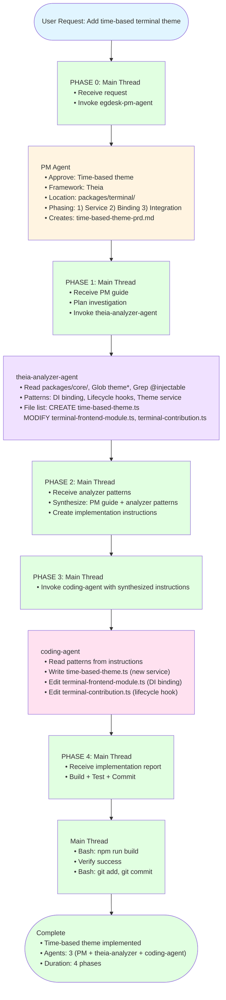

---

### Scenario 4b: With Conflict Detection (EG-DESK Custom Code)

**User:** "Bind Ctrl+K to the new QuickSearch feature"

```mermaid
flowchart TD
    classDef wideBox padding:12px 20px,text-align:left,white-space:pre;
    classDef wideDecision padding:12px 20px,text-align:left,white-space:pre;
    classDef invisible fill:none,stroke:none;
    classDef branchLabel fill:#e8f4f8,stroke:#0288d1,stroke-width:2px,text-align:left,white-space:pre;

    User(["User Request: Bind Ctrl+K to QuickSearch"]):::wideBox

    --> Phases["PHASES 0-2: Same as Scenario 4a (PM guide → Investigation)
  • Result: PM approved, Framework patterns collected"]:::wideBox

    --> MT3["PHASE 3: Main Thread Planning
  • Direction: Bind Ctrl+K to QuickSearch
  • CREATE search-contribution.ts in eg-desk_taehwa/search/
  • ⚠️ INSTRUCTION: Check CODEBASE_STRUCTURE.md BEFORE implementing"]:::wideBox

    --> Coding1["coding-agent: Conflict Check
  1) Glob eg-desk*/**/*.ts → Find eg-desk_taehwa/
  2) Glob CODEBASE_STRUCTURE.md → Find structure doc
  3) Read structure doc
  4) Grep 'Ctrl+K' in structure"]:::wideBox

    --> ConflictCheck{"coding-agent Check Result:
  • Ctrl+K conflict?"}:::wideDecision

    --> Label1["Branch: CONFLICT FOUND"]:::branchLabel

    subgraph SG1 [" "]
        direction LR
        Entry1[" "]:::invisible --> Stop["coding-agent: STOP - DO NOT create files
  • ❌ CONFLICT: Ctrl+K exists (DifferentFeature at search-old.ts:45)
  • Alternatives: Ctrl+Shift+K, Ctrl+Alt+K, Ctrl+J
  • User decision required"]:::wideBox --> MT4["Main Thread
  • Present conflict to user"]:::wideBox --> UserDec{"User Decision:
  • Choose alternative:
  • A/B/C/D/E"}:::wideDecision
    end

    Label1 --> Entry1

    UserDec --> Label2["User Choice: A/B/C/D/E - Resolved Key"]:::branchLabel

    subgraph SG2 [" "]
        direction LR
        Entry2[" "]:::invisible --> MT5["Main Thread: Retry
  • Task(coding-agent, 'Bind [resolved-key] to QuickSearch')"]:::wideBox --> Coding2["coding-agent: Retry
  • Check new key conflict → If OK, Implement → Update structure doc"]:::wideBox
    end

    Label2 --> Entry2

    Coding2 --> Label3["Branch: NO CONFLICT (initial or retry)"]:::branchLabel

    subgraph SG3 [" "]
        direction LR
        Entry3[" "]:::invisible --> Impl["coding-agent: Implement
  • Write search-contribution.ts ([resolved-key] binding)
  • Edit CODEBASE_STRUCTURE.md (Add [key]: QuickSearch)
  • ✅ Complete: Conflict check passed, Structure updated"]:::wideBox --> MT6["Main Thread: Build + Commit
  • Bash: npm run build
  • Bash: git add eg-desk_taehwa
  • Bash: git commit"]:::wideBox --> End(["Complete
  • QuickSearch bound to resolved key
  • Structure document updated
  • Agents: 3 (PM → analyzer → coding x1-2)
  • Duration: Multi-phase with user decision"]):::wideBox
    end

    Label3 --> Entry3

    style User fill:#e1f5ff
    style ConflictCheck fill:#ffe1e1,stroke:#ff0000,stroke-width:2px
    style UserDec fill:#ffe1e1,stroke:#ff0000,stroke-width:3px
    style Phases fill:#e1ffe1
    style MT3 fill:#e1ffe1
    style MT4 fill:#e1ffe1
    style MT5 fill:#e1ffe1
    style MT6 fill:#e1ffe1
    style Coding1 fill:#ffe1f0
    style Coding2 fill:#ffe1f0
    style Stop fill:#ffe1f0
    style Impl fill:#ffe1f0
    style End fill:#e1ffe1
```

**Key:** Conflict prevention - coding-agent checks BEFORE implementing

---

### Scenario 4c: With Optional UX Validation

**User:** "Add complex state management feature with async operations"

```mermaid
flowchart TD
    classDef wideBox padding:12px 20px,text-align:left,white-space:pre;
    classDef wideDecision padding:12px 20px,text-align:left,white-space:pre;
    classDef invisible fill:none,stroke:none;
    classDef branchLabel fill:#e8f4f8,stroke:#0288d1,stroke-width:2px,text-align:left,white-space:pre;

    User(["User: Complex feature with state management"]):::wideBox

    --> Phases["PHASES 0-3: Same as Scenario 4a (PM → Investigation → Implementation)
  • Result: coding-agent completed implementation"]:::wideBox

    --> Decision["PHASE 4.5: Main Thread Decision - Validate UX flow?
  • Consider: ✅ Complex flows? Race conditions? State mgmt? Async? Critical?
  • Skip: ❌ Simple CRUD? Pure styling? Obvious correctness?"]:::wideBox

    --> Decide{"Validate?
  • Complex/Critical?"}:::wideDecision

    --> Label1["Branch: No Validation (Skip)"]:::branchLabel

    subgraph SG1 [" "]
        direction LR
        Entry1[" "]:::invisible --> Build1["PHASE 5: Build+Commit
  • Bash: npm run build
  • Bash: git commit"]:::wideBox --> E1(["Complete
  • Agents: 3
  • Duration: Standard"]):::wideBox
    end

    Label1 --> Entry1

    E1 --> Label2["Branch: Yes - Run UX Validation"]:::branchLabel

    subgraph SG2 [" "]
        direction LR
        Entry2[" "]:::invisible --> Validation["Optional UX Flow Validation"]:::wideBox --> UXSim["ux-flow-simulator-agent
  • Read implemented files, Trace execution paths
  • Simulate user flow, predict runtime behavior
  • Returns: Report with ✅ No issues OR ⚠️ Issues"]:::wideBox --> MT5["PHASE 4.6: Main Thread
  • Receive UX simulator report
  • Analyze issue type"]:::wideBox --> Check{"UX Report:
  • Issues found?"}:::wideDecision
    end

    Label2 --> Entry2

    Check --> Label3["Sub-branch: No Issues Found"]:::branchLabel

    subgraph SG3 [" "]
        direction LR
        Entry3[" "]:::invisible --> Build2["PHASE 5: Build+Commit
  • Bash: npm run build
  • Bash: git commit"]:::wideBox --> E2(["Complete
  • Agents: 4
  • Validation passed"]):::wideBox
    end

    Label3 --> Entry3

    E2 --> Label4["Sub-branch: Issues Found"]:::branchLabel

    subgraph SG4 [" "]
        direction LR
        Entry4[" "]:::invisible --> MTAnalyze["Main Thread
  • Categorize issues
  • Decision: Simple bug fix? OR Vision/UX design conflict?"]:::wideBox --> IssueType{"Issue Type?"}:::wideDecision
    end

    Label4 --> Entry4

    IssueType --> Label5A["Issue Type A: Simple Bug"]:::branchLabel

    subgraph SG5A [" "]
        direction LR
        Entry5A[" "]:::invisible --> Fix1["Main Thread → coding-agent
  • Fix technical issues
  • coding-agent: Read report, Edit files, Re-test"]:::wideBox --> Revalidate1["Main Thread
  • Re-invoke ux-flow-simulator-agent to verify fix"]:::wideBox
    end

    Label5A --> Entry5A

    Revalidate1 -.->|Re-validate| UXSim

    Revalidate1 --> Label5B["Issue Type B: Vision Conflict"]:::branchLabel

    subgraph SG5B [" "]
        direction LR
        Entry5B[" "]:::invisible --> ConsultPM["Main Thread → PM
  • 'UX simulator found design issue: [details]. Vision impact?'
  • PM: Analyze vision alignment, recommend fix OR vision evolution"]:::wideBox --> UserDecPM{"User Decision:
  • Accept PM guidance?"}:::wideDecision
    end

    Label5B --> Entry5B

    UserDecPM --> Label6A["User: Yes - Accept PM Guidance"]:::branchLabel

    subgraph SG6A [" "]
        direction LR
        Entry6A[" "]:::invisible --> Fix2["Main Thread → coding-agent
  • Implement PM-recommended fix
  • coding-agent: Read report, Edit files"]:::wideBox --> Revalidate2["Main Thread
  • Re-invoke ux-flow-simulator-agent"]:::wideBox
    end

    Label6A --> Entry6A

    Revalidate2 -.->|Re-validate| UXSim

    Revalidate2 --> Label6B["User: No - Proceed Without Fix"]:::branchLabel

    subgraph SG6B [" "]
        direction LR
        Entry6B[" "]:::invisible --> Build3["PHASE 5: Build+Commit
  • Bash: npm run build
  • Bash: git commit
  • (User accepted risk)"]:::wideBox --> E3(["Complete
  • Agents: 4-5
  • User override"]):::wideBox
    end

    Label6B --> Entry6B

    style User fill:#e1f5ff
    style Decide fill:#ffe1e1,stroke:#ff0000,stroke-width:2px
    style Check fill:#ffe1e1,stroke:#ff0000,stroke-width:2px
    style IssueType fill:#ffe1e1,stroke:#ff0000,stroke-width:2px
    style UserDecPM fill:#ffe1e1,stroke:#ff0000,stroke-width:3px
    style Phases fill:#e1ffe1
    style Decision fill:#e1ffe1
    style MT5 fill:#e1ffe1
    style MTAnalyze fill:#e1ffe1
    style Revalidate1 fill:#e1ffe1
    style Revalidate2 fill:#e1ffe1
    style Build1 fill:#e1ffe1
    style Build2 fill:#e1ffe1
    style Build3 fill:#e1ffe1
    style UXSim fill:#f0e1ff
    style ConsultPM fill:#fff4e1
    style Fix1 fill:#ffe1f0
    style Fix2 fill:#ffe1f0
    style Validation fill:#e1ffe1
    style E1 fill:#e1ffe1
    style E2 fill:#e1ffe1
    style E3 fill:#e1ffe1
```

**Key:** UX validation is optional - Main Thread decides based on complexity

---

## Pattern 5: Technology Research & Evaluation

**When to use:** User needs capability that may require new technology not in current stack. PM diagnoses GAP, Main Thread orchestrates research, PM evaluates vision fit.

**Critical features:**
- **2 User Decision Points:** Approve research plan? / Accept recommendation?
- **Parallel execution:** Multiple research agents run simultaneously
- **Role separation:** PM diagnoses GAP (not technical scoring), Main Thread plans/executes research, PM evaluates vision alignment
- **PM waits for user approval** before updating technology-stack.md
- **Institutional memory:** Research docs preserved in ideas&external_references/

**User:** "캔버스에 3D visualization을 추가하고 싶어. 어떤 framework가 좋을까?"

```mermaid
flowchart TD
    classDef wideBox padding:12px 20px,text-align:left,white-space:pre;
    classDef wideDecision padding:12px 20px,text-align:left,white-space:pre;

    User(["User: 캔버스에 3D visualization을 추가하고 싶어
  어떤 framework가 좋을까?"]):::wideBox

    --> PM1["PHASE 0: PM GAP Diagnosis
  • Glob+Read tech-stack.md
  • Current: Konva.js (2D only)
  • Need: True 3D
  • DIAGNOSIS: 3D capability needed"]:::wideBox

    --> MT1["PHASE 1: MT Research Planning
  • Plan research scope
  • Targets: Three.js, Babylon.js, WebGL"]:::wideBox

    --> UD1{"USER DECISION 1
  Proceed with research?
  • A) Yes
  • B) Modify scope
  • C) No"}:::wideDecision

    UD1 -->|"C: No"| E1([Stop])
    UD1 -->|"B: Modify"| PM2["PM: Adjust scope"]:::wideBox
    PM2 --> MT1

    UD1 -->|"A: Yes"| MT2["PHASE 2: MT Spawn Research
  • Spawn 3 agents (parallel)"]:::wideBox

    --> R["PHASE 3: Parallel Research
  • Agent1: Three.js (600KB, mature)
  • Agent2: Babylon.js (1.2MB, full-featured)
  • Agent3: WebGL (lightweight, 2-3mo dev)"]:::wideBox

    --> Org["PHASE 4: MT Organize
  • Write 3 docs: ideas&external_references/
    - threejs-research.md
    - babylonjs-research.md
    - webgl-research.md"]:::wideBox

    --> MT3["PHASE 5: MT Invoke Analyzer
  • Invoke infinite-canvas-analyzer
  • 'Assess integration complexity'"]:::wideBox

    --> Analyzer["PHASE 6: Technical Analysis
  • infinite-canvas-analyzer
  • Read research docs
  • Integration complexity:
    - Three.js: Medium
    - Babylon: High
    - WebGL: Very High"]:::wideBox

    --> MT4["PHASE 7: MT to PM
  • Deliver to PM:
    - Research docs
    - Analyzer assessment"]:::wideBox

    --> PM3["PHASE 8: PM Vision Evaluation
  • Read research docs
  • Evaluate philosophy fit:
    - Three.js: Aligns (balance)
    - Babylon: Over-engineered
    - WebGL: Too custom
  • RECOMMEND: Three.js"]:::wideBox

    --> UD2{"USER DECISION 2
  Accept PM recommendation?
  • A) Three.js
  • B) Babylon.js
  • C) More research
  • D) No"}:::wideDecision

    UD2 -->|"D: No"| E2([Stop])
    UD2 -->|"C: More"| MT2

    UD2 -->|"A or B"| PM4["PHASE 9: PM Finalize
  • Edit: tech-stack.md
  • Write: threejs-prd.md (or babylonjs-prd.md)"]:::wideBox

    --> MT_Impl["PHASE 10: Implementation
  • MT invokes theia-analyzer + electron-analyzer
  • Analyzers return patterns
  • MT synthesizes → coding-agent
  • coding-agent implements"]:::wideBox

    --> E3(["Complete
  3D framework integrated
  Agents: 8+
  Decisions: 2"]):::wideBox

    style User fill:#e1f5ff
    style UD1 fill:#ffe1e1,stroke:#ff0000,stroke-width:3px
    style UD2 fill:#ffe1e1,stroke:#ff0000,stroke-width:3px
    style PM1 fill:#fff4e1
    style PM2 fill:#fff4e1
    style PM3 fill:#fff4e1
    style PM4 fill:#fff4e1
    style MT1 fill:#e1ffe1
    style MT2 fill:#e1ffe1
    style MT3 fill:#e1ffe1
    style MT4 fill:#e1ffe1
    style MT_Impl fill:#e1ffe1
    style Org fill:#e1ffe1
    style R fill:#f0e1ff
    style Analyzer fill:#f0e1ff
    style E1 fill:#f0f0f0
    style E2 fill:#f0f0f0
    style E3 fill:#e1ffe1
```

**Key:** PM diagnoses GAP, Main Thread plans/executes research, PM evaluates vision fit (not technical scores)

**Highlights:**
- **2 User Decision Points**: Approve research? / Accept recommendation?
- **Parallel execution**: 3 research agents + 2 framework agents (simultaneously)
- **PM waits for user approval** before updating technology-stack.md
- **Institutional memory**: Research docs preserved

### Scenario 5b: User Modifies Research Criteria

**Embedded in main diagram above - see UserDec1 → B: Modify option**

**Flow:** PM adjusts research plan per user modifications (add options, change criteria), user confirms, then proceed.

### Scenario 5c: User Rejects PM Recommendation

**Embedded in main diagram above - see UserDec2 → B: Choose Other option**

**Flow:** User chooses different option than PM recommended. PM re-evaluates user's choice, documents rationale, adjusts integration strategy, proceeds with user's selection.

---

## Pattern 6: Agent Creation

**When to use:** Need a new specialized agent for recurring analysis tasks.

**User:** "We need an agent that analyzes Konva.js integration patterns"

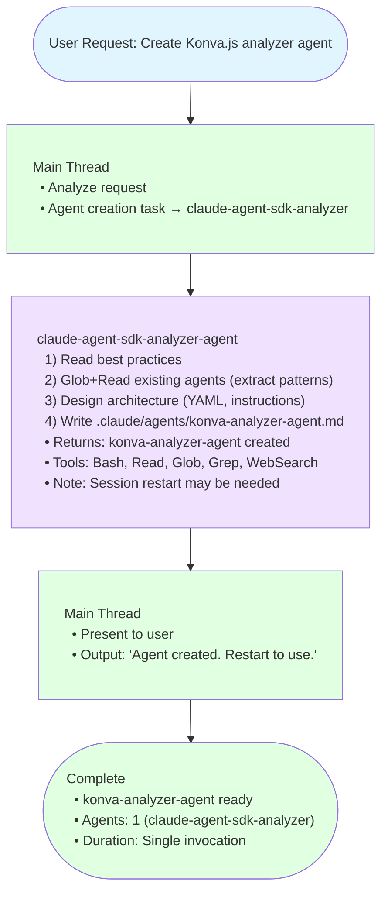

---

## Code Ownership Principle

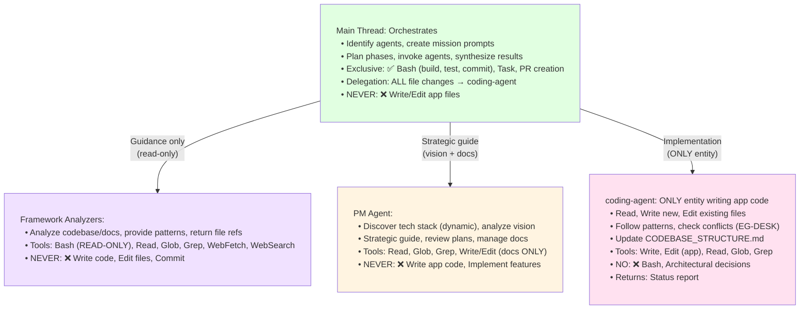

**Hierarchy:** PM guides → Main Thread orchestrates → Analyzers provide patterns → coding-agent implements

---

## Multi-turn Communication with PM

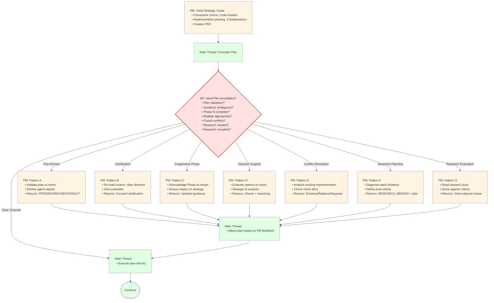

**7 Multi-turn Patterns:**
- 5 original + 2 NEW (Research Planning + Evaluation)
- PM is stateless - Main Thread includes full context each time

---

## Comparison Matrix (Request Routing)

```mermaid
flowchart TD
    classDef wideBox padding:12px 20px,text-align:left,white-space:pre;
    classDef wideDecision padding:12px 20px,text-align:left,white-space:pre;
    classDef branchLabel fill:#e8f4f8,stroke:#0288d1,stroke-width:2px,text-align:left,white-space:pre;

    Request{"User Request
  • Analyze type"}:::wideDecision

    --> Label1["Route 1: Simple Question"]:::branchLabel

    --> Route1["Direct Execution
  • MT: Glob, Read, Bash
  • Agents: 0 | Who codes: None
  • Ex: 'List files in packages/core'"]:::wideBox

    --> Label2["Route 2: File Edit"]:::branchLabel

    --> Route2["coding-agent Only
  • MT → coding-agent: Read + Edit
  • Agents: 1 | Who codes: coding-agent
  • Ex: 'Fix typo in README'"]:::wideBox

    --> Label3["Route 3: Framework Question"]:::branchLabel

    --> Route3["Direct to Framework Agent
  • MT → analyzer: Read + Grep
  • Agents: 1 | Who codes: None
  • Ex: 'How does Theia DI work?'"]:::wideBox

    --> Label4["Route 4: Strategic Vision"]:::branchLabel

    --> Route4["PM Agent Only
  • MT → PM: Vision check
  • Agents: 1 | Who codes: None
  • Ex: 'Should we add floating AI?'"]:::wideBox

    --> Label5["Route 5: Theia Implementation"]:::branchLabel

    --> Route5["PM → Analyzers → coding-agent
  • PM guide, Analyzers patterns
  • Agents: 2-3 | Who codes: coding-agent
  • Conflict: ❌ No (Theia packages/)
  • Ex: 'Modify Theia terminal'"]:::wideBox

    --> Label6["Route 6: EG-DESK Feature"]:::branchLabel

    --> Route6["PM → Analyzers → coding-agent
  • + conflict check (CODEBASE_STRUCTURE.md)
  • Agents: 2-3 | Who codes: coding-agent
  • Conflict: ✅ Yes
  • Ex: 'Add QuickSearch + Ctrl+K'"]:::wideBox

    --> Label7["Route 7: New Technology"]:::branchLabel

    --> Route7["PM → MT Investigates → PM
  • PM diagnose → USER DECISION
  • MT parallel investigation (3+)
  • PM evaluate → USER DECISION
  • Agents: 8+ | Decisions: 2
  • Ex: '3D viz - which framework?'"]:::wideBox

    --> Label8["Route 8: Multi-Feature"]:::branchLabel

    --> Route8["PM → Multiple Analyzers → coding
  • Multiple agents (parallel)
  • Agents: 3-4+ | Who codes: coding
  • Conflict: ✅ If EG-DESK custom
  • Ex: 'Implement dashboard'"]:::wideBox

    --> Label9["Route 9: New Agent Creation"]:::branchLabel

    --> Route9["claude-agent-sdk-analyzer
  • Read practices, Design agent
  • Agents: 1 | Who codes: claude-agent
  • Ex: 'Create Konva analyzer'"]:::wideBox

    style Request fill:#e1f5ff,stroke:#ff0000,stroke-width:2px
    style Route1 fill:#e1ffe1
    style Route2 fill:#ffe1f0
    style Route3 fill:#f0e1ff
    style Route4 fill:#fff4e1
    style Route5 fill:#fff4e1
    style Route6 fill:#fff4e1
    style Route7 fill:#fff4e1
    style Route8 fill:#fff4e1
    style Route9 fill:#f0e1ff
```

**Route Selection:** Analyze request type → Choose simplest effective approach

---

## Success Metrics Checklist

```mermaid
flowchart TD
    classDef wideBox padding:12px 20px,text-align:left,white-space:pre;
    classDef wideDecision padding:12px 20px,text-align:left,white-space:pre;

    Success["Effective Agent Swarm Flow
  • Has ALL these characteristics:"]:::wideBox

    --> M1["✅ Right Routing
  • Simple → Direct
  • Complex → Orchestrated
  • No over-orchestration"]:::wideBox

    --> M2["✅ Parallel Execution
  • Independent analyses simultaneous
  • Single message, multiple Tasks
  • 3x+ faster"]:::wideBox

    --> M3["✅ Evidence-Based
  • Recommendations backed by files
  • No assumptions
  • Read before recommend"]:::wideBox

    --> M4["✅ Clear Boundaries
  • Agents analyze (read-only)
  • coding-agent writes code
  • MT orchestrates + builds
  • PM guides strategy"]:::wideBox

    --> M5["✅ Strategic Alignment
  • Vision validated before implementation
  • PM checks all EG-DESK features
  • Institutional memory maintained"]:::wideBox

    --> M6["✅ User Decision Points
  • Research approval required
  • Recommendation approval required
  • Vision evolution needs user authority
  • User can override PM"]:::wideBox

    --> M7["✅ No Redundancy
  • Each agent unique value
  • No duplicate work
  • Clear role separation"]:::wideBox

    --> M8["✅ Conflict Prevention
  • Check CODEBASE_STRUCTURE.md first
  • Report conflicts, user decides
  • Update structure after"]:::wideBox

    --> M9["✅ Dynamic Discovery
  • No hardcoded paths
  • Glob everything
  • Tech stack discovered from doc
  • Structure-agnostic"]:::wideBox

    --> M10["✅ Institutional Memory
  • Research docs preserved
  • Decision rationales documented
  • CODEBASE_STRUCTURE.md maintained
  • Tech stack tracked"]:::wideBox

    style Success fill:#e1ffe1
    style M1 fill:#e1f5ff
    style M2 fill:#e1f5ff
    style M3 fill:#e1f5ff
    style M4 fill:#e1f5ff
    style M5 fill:#e1f5ff
    style M6 fill:#ffe1e1,stroke:#ff0000,stroke-width:2px
    style M7 fill:#e1f5ff
    style M8 fill:#e1f5ff
    style M9 fill:#e1f5ff
    style M10 fill:#e1f5ff
```

---

## Agent Ecosystem Hierarchy

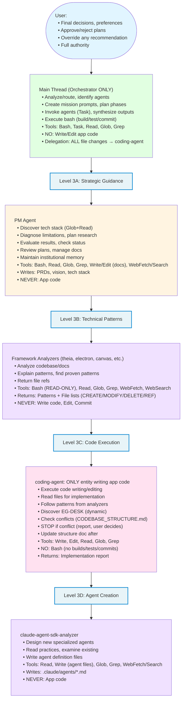

---

## Key Architectural Principles (Visual Summary)

```mermaid
flowchart TD
    P1["Principle 1:
    Metaphysical Separation

    Main Thread operates at META level:
    - Coordinates agents
    - Delegates domain reading
    - Preserves context

    Agents operate at DOMAIN level:
    - PM: Vision docs
    - Analyzers: Codebase
    - coding-agent: Writes code"]

    P2["Principle 2:
    Strict Code Delegation

    Main Thread NEVER writes code
    ALWAYS delegates to coding-agent

    Even 1-line typo fixes:
    MT → coding-agent → Edit

    Consistent separation of concerns"]

    P3["Principle 3:
    Dynamic Discovery

    NEVER hardcode paths:
    - PM: Glob tech stack (not hardcoded list)
    - Agents: Glob codebases
    - Structure-agnostic

    Always discover current state"]

    P4["Principle 4:
    User Authority

    PM guides, user decides:
    - Research approval required
    - Recommendation approval required
    - Can override PM
    - Can evolve vision

    2+ decision points in research workflow"]

    P5["Principle 5:
    Parallel Execution

    Independent tasks run simultaneously:
    - Single message, multiple Tasks
    - 3x+ faster runtime
    - Research agents in parallel
    - Framework agents in parallel"]

    P6["Principle 6:
    Institutional Memory

    Everything documented:
    - Research docs in ideas&external_references/
    - PRDs for features
    - Decision rationales preserved
    - CODEBASE_STRUCTURE.md maintained
    - Technology stack tracked"]

    P1 --> P2 --> P3 --> P4 --> P5 --> P6

    style P1 fill:#e1f5ff
    style P2 fill:#ffe1f0
    style P3 fill:#e1ffe1
    style P4 fill:#ffe1e1,stroke:#ff0000,stroke-width:2px
    style P5 fill:#f0e1ff
    style P6 fill:#fff4e1
```

---

## Key Execution Principles (Detailed)

### Principle 1: Tool Ownership (Contextual Restriction)

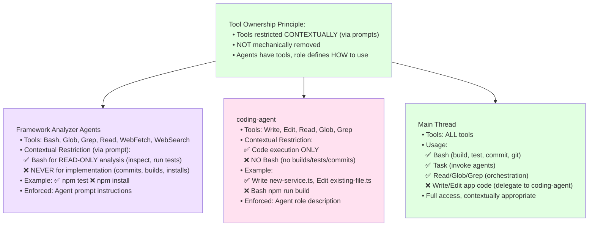

**Why Contextual Works:**
- Agents understand their role from prompts
- More flexible (agents can investigate runtime behavior)
- No artificial tool removal
- Trust agent instructions to enforce boundaries

---

### Principle 2: When to Spawn Subagent (Context Preservation)

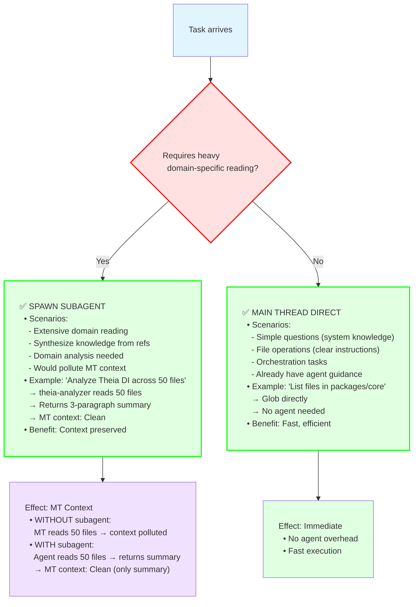

---

### Principle 3: Parallel vs Sequential Execution

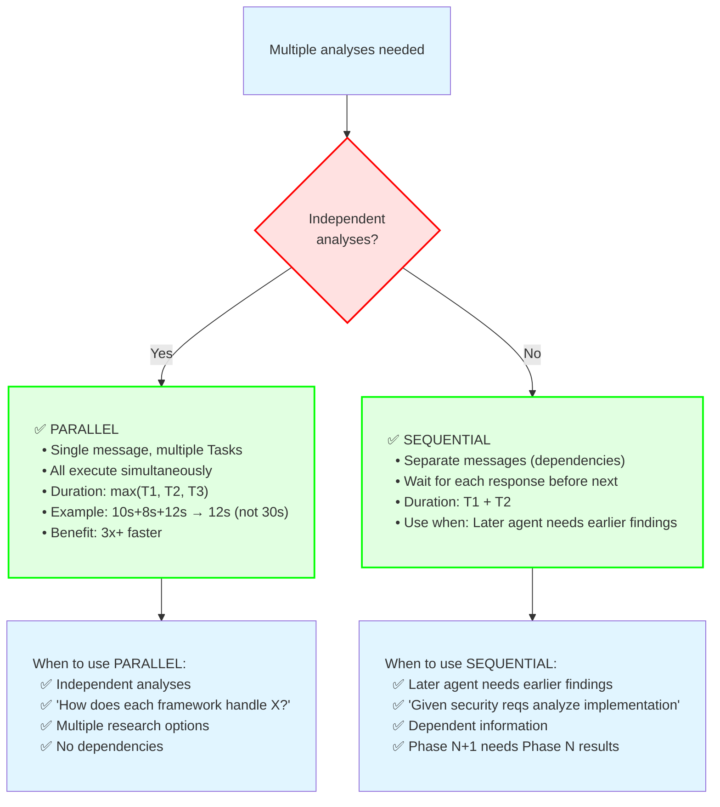

---

### Principle 4: Conversational Re-query Pattern

```mermaid
flowchart TD
    classDef wideBox padding:12px 20px,text-align:left,white-space:pre;
    classDef wideDecision padding:12px 20px,text-align:left,white-space:pre;

    Agent1["Agent returns report
  • Report:
    ✓ Summary Present
    ✓ Findings Present
    ✗ Files Analyzed MISSING"]:::wideBox

    --> MT1["Main Thread: Detect incomplete
  • Missing: Files Analyzed section (REQUIRED)"]:::wideBox

    --> Requery["Main Thread: Re-query Contextually
  • Task(agent: 'theia-analyzer-agent',
    prompt: 'You provided [REPORT].
    Files Analyzed section MISSING (REQUIRED).
    Please provide file list with file:line refs.
    No re-analysis - just add missing section.')
  • Key: Agent stateless BUT MT provides full context"]:::wideBox

    --> Agent2["Agent (stateless but with context)
  • Reads own previous report (from prompt)
  • Extracts file list from analysis
  • Completes missing section
  • Returns: Files Analyzed:
    terminal-theme-service.ts:45,
    terminal-frontend-module.ts:32,
    workspace-service.ts:89"]:::wideBox

    --> MT2["Main Thread: Now has complete report
  • Can proceed to next phase"]:::wideBox

    --> End(["Continue
  • Benefit: Flexible (not strict validation)
    Natural conversation, Agent can clarify/complete
  • When to use:
    Missing sections, Need clarification
    Want more detail, File list breakdown"]):::wideBox

    style Agent1 fill:#f0e1ff
    style MT1 fill:#e1ffe1
    style Requery fill:#e1ffe1
    style Agent2 fill:#f0e1ff
    style MT2 fill:#e1ffe1
    style End fill:#e1ffe1
```

---

### Principle 5: File List Format Enforcement

```mermaid
flowchart TD
    Agent["Framework analyzer
    returns file list"]

    --> Format["Required Format:

    1. CREATE:
       - path/to/new-file.ts (purpose)

    2. MODIFY:
       - path/to/existing.ts:45 (what to change)

    3. DELETE (if applicable):
       - path/to/deprecated.ts (why removing)

    4. REFERENCE (patterns, don't modify):
       - path/to/pattern-file.ts:89
         (Follow @injectable pattern)"]

    --> Benefit["Main Thread Benefits:

    - Extract exact action list
    - Know CREATE vs MODIFY vs DELETE
    - Identify pattern references separately
    - Precise coding-agent instructions:
      'CREATE 1, MODIFY 2, REF 1'"]

    --> CodingPrompt["coding-agent Prompt:

    From theia-analyzer:
    - Pattern: workspace-service.ts:89

    Tasks:
    1. CREATE packages/terminal/src/browser/switcher.ts:
       - Follow workspace-service.ts:89 @injectable pattern
       - Implement time-based logic

    2. MODIFY terminal-frontend-module.ts:36:
       - Add DI binding: bind(Switcher).toSelf()

    3. REFERENCE workspace-service.ts:89:
       - Pattern to follow (don't modify this file)"]

    style Agent fill:#f0e1ff
    style Format fill:#e1f5ff
    style Benefit fill:#e1ffe1
    style CodingPrompt fill:#ffe1f0
```

---

## Orchestration Guidelines Deep Dive

### How Main Thread Orchestrates (10-Step Process)

```mermaid
flowchart TD
    classDef wideBox padding:12px 20px,text-align:left,white-space:pre;
    classDef wideDecision padding:12px 20px,text-align:left,white-space:pre;

    Start(["Complex Development Task"]):::wideBox

    --> Step1["Step 1: Identify Agents
  • Source: System prompt (Task tool lists agents)
  • MT knows: egdesk-pm, theia-analyzer,
    electron-analyzer, infinite-canvas-analyzer,
    coding-agent, ux-flow-simulator, etc."]:::wideBox

    --> Step2["Step 2: Select Agents
  • Based on capabilities from descriptions
  • Ex: 'Add custom menu with OS integration':
    PM (vision), theia-analyzer (menu patterns),
    electron-analyzer (OS integration), coding (impl)"]:::wideBox

    --> Step3["Step 3: Analyze Task Requirements
  • From user request:
    What does user want? Frameworks involved?
    Complexity level? Vision validation needed?"]:::wideBox

    --> Step4["Step 4: (Optional) Read Agent Details
  • If needs specific examples:
    Read .claude/agents/[agent].md
  • Usually NOT needed:
    Agent descriptions in system prompt sufficient"]:::wideBox

    --> Step5["Step 5: Create Mission Prompts
  • For each agent, create detailed prompt
  • egdesk-pm-agent:
    'Validate custom menu vs ambient AI vision'
  • theia-analyzer-agent:
    'Analyze menu system at packages/core/.../menu/'"]:::wideBox

    --> Step6["Step 6: Plan Execution Phases
  • Identify parallel vs sequential
  • Phase 1 (Parallel): PM validation, Theia analysis
  • Phase 2 (Sequential, after P1):
    Electron OS integration (needs P1 patterns)"]:::wideBox

    --> Step7["Step 7: Identify Decision Points
  • Where user input needed:
    After PM evaluation? Conflict resolution?
    Multiple options to choose?
  • 분기점 (Decision gates)"]:::wideBox

    --> Step8["Step 8: Invoke Agents
  • Tool: Task
  • Phase 1 (single message, 2 Tasks):
    Task(pm), Task(theia-analyzer) → Wait for both
  • Phase 2 (after P1):
    Task(electron-analyzer, prompt includes P1 findings)"]:::wideBox

    --> Step9["Step 9: Synthesize Agent Results
  • Collect: PM (APPROVE + considerations),
    theia-analyzer (Menu patterns), electron (OS integration)
  • Synthesize:
    Implementation direction, File list (CREATE/MODIFY/REF)"]:::wideBox

    --> Step10["Step 10: Delegate Implementation
  • Tool: Task(coding-agent, prompt: synthesized)
    OR (if simple): MT handles directly
  • Then: Bash: npm run build, Bash: git commit"]:::wideBox

    --> End(["Complete | Orchestration Done"]):::wideBox

    style Start fill:#e1f5ff
    style Step1 fill:#e1ffe1
    style Step2 fill:#e1ffe1
    style Step3 fill:#e1ffe1
    style Step4 fill:#e1ffe1
    style Step5 fill:#e1ffe1
    style Step6 fill:#e1ffe1
    style Step7 fill:#ffe1e1,stroke:#ff0000,stroke-width:2px
    style Step8 fill:#e1ffe1
    style Step9 fill:#e1ffe1
    style Step10 fill:#e1ffe1
    style End fill:#e1ffe1
```

---

### File Reading Scope (Critical for Context Preservation)

```mermaid
flowchart TD
    classDef wideBox padding:12px 20px,text-align:left,white-space:pre;
    classDef wideDecision padding:12px 20px,text-align:left,white-space:pre;

    MT["Main Thread (When Orchestrating)"]:::wideBox

    MT --> Can["✅ CAN Read: Meta-level files
  • .claude/prompts/agent-orchestration.md
  • .claude/agents/*.md (OPTIONAL - only when needs examples,
    agent discovery already in system prompt)
  • Purpose: Orchestration guidance only"]:::wideBox

    MT --> Cannot["❌ CANNOT Read (When Orchestrating): Domain files
  • ideas&external_references/ (PM domain)
  • packages/ (framework analyzer domain)
  • App/framework code (Delegate to preserve context)
  • Vision/strategy docs (PM reads these)
  • Why: Preserve MT context
  • Agents synthesize → return summary"]:::wideBox

    Cannot --> Effect["Effect of Context Preservation
  • WITHOUT delegation:
    MT reads 50 vision docs → context polluted
  • WITH delegation:
    PM reads 50 docs → returns 3-paragraph summary
    → MT context: CLEAN (only summary)
  • Benefit:
    MT available for continued orchestration
    Doesn't load unnecessary refs
    Gets synthesized conclusions only"]:::wideBox

    Can --> Exception["Exception: MT CAN read domain files when:
  • ✅ Directly implementing (after agent guidance)
  • ✅ Handling simple tasks (no orchestration)
  • Ex: 'Fix typo' - may read README before delegating"]:::wideBox

    style MT fill:#e1ffe1
    style Can fill:#e1ffe1,stroke:#00ff00,stroke-width:2px
    style Cannot fill:#ffe1e1,stroke:#ff0000,stroke-width:2px
    style Effect fill:#f0e1ff
    style Exception fill:#fff4e1
```

---

## Anti-Patterns to Avoid (BAD vs GOOD)

### ❌ Anti-Pattern 1: Over-Orchestration

```mermaid
flowchart TD
    classDef wideBox padding:12px 20px,text-align:left,white-space:pre;
    classDef wideDecision padding:12px 20px,text-align:left,white-space:pre;

    Q["User: 'What files are in packages/core?'"]:::wideBox

    Q --> Bad["❌ BAD: Over-Orchestration
  • MT: Creates elaborate plan, Invokes agents
  • Problem:
    Wastes time, Unnecessary complexity
    Agent overhead for simple task"]:::wideBox

    Q --> Good["✅ GOOD: Direct Execution
  • MT: Tool: Glob packages/core/**/*
    → Returns: File list immediately
  • Benefit: Fast, Simple, No overhead"]:::wideBox

    Bad --> BadEnd([Slow, complex]):::wideBox
    Good --> GoodEnd([Fast, simple]):::wideBox

    style Q fill:#e1f5ff
    style Bad fill:#ffe1e1,stroke:#ff0000,stroke-width:2px
    style Good fill:#e1ffe1,stroke:#00ff00,stroke-width:2px
    style BadEnd fill:#f0f0f0
    style GoodEnd fill:#e1ffe1
```

---

### ❌ Anti-Pattern 2: Sequential When Parallel Possible

```mermaid
flowchart TD
    classDef wideBox padding:12px 20px,text-align:left,white-space:pre;
    classDef wideDecision padding:12px 20px,text-align:left,white-space:pre;

    Task["Task: Analyze menus in Theia AND Electron"]:::wideBox

    Task --> Bad["❌ BAD: Sequential
  • Phase 1: theia-analyzer (Wait)
  • Phase 2: electron-analyzer (Wait)
  • Problem:
    INDEPENDENT analyses
    No dependency between them
    2x slower"]:::wideBox

    Task --> Good["✅ GOOD: Parallel
  • Phase 1 (Single message, 2 Tasks):
    Task 1: theia-analyzer, Task 2: electron-analyzer
  • Both run SIMULTANEOUSLY
  • Benefit:
    2x faster runtime
    Efficient resources"]:::wideBox

    Bad --> BadTime["Duration: T1 + T2 (slower)"]:::wideBox

    Good --> GoodTime["Duration: max(T1, T2) (faster)"]:::wideBox

    style Task fill:#e1f5ff
    style Bad fill:#ffe1e1,stroke:#ff0000,stroke-width:2px
    style Good fill:#e1ffe1,stroke:#00ff00,stroke-width:2px
    style BadTime fill:#f0f0f0
    style GoodTime fill:#e1ffe1
```

---

### ❌ Anti-Pattern 3: Agent Writing Code

```mermaid
flowchart TD
    Task["Analyzer agent
    analyzing codebase"]

    Task --> Bad["❌ BAD: Agent Writes Code

    Agent returns:
    'Here's the code:
    class Foo {
      bar() { ... }
    }'

    Problem:
    - Agents should analyze, not implement
    - Violates role separation
    - Main Thread can't review/adjust"]

    Task --> Good["✅ GOOD: Agent Provides Patterns

    Agent returns:
    'Pattern at packages/core/foo.ts:45
    shows @injectable decorator usage.
    Follow this pattern for FooService.

    File List:
    - CREATE: foo-service.ts
    - REFERENCE: foo.ts:45'

    Benefit:
    - Clear role: agent analyzes
    - Main Thread decides implementation
    - coding-agent implements"]

    style Task fill:#f0e1ff
    style Bad fill:#ffe1e1,stroke:#ff0000,stroke-width:2px
    style Good fill:#f0e1ff,stroke:#00ff00,stroke-width:2px
```

---

### ❌ Anti-Pattern 4: Assumption-Based Guidance

```mermaid
flowchart TD
    Agent["Analyzer agent"]

    Agent --> Bad["❌ BAD: Assumptions

    'Theia probably uses
    dependency injection like Angular'

    Problem:
    - Not evidence-based
    - May be wrong
    - No file references
    - Guessing framework patterns"]

    Agent --> Good["✅ GOOD: Evidence-Based

    Tools Used:
    - Read: packages/core/src/common/di.ts

    Analysis:
    'Theia uses InversifyJS for DI.
    Example at di.ts:89 shows
    @injectable decorator usage.'

    Benefit:
    - Backed by actual file analysis
    - File:line references
    - Accurate guidance"]

    style Agent fill:#f0e1ff
    style Bad fill:#ffe1e1,stroke:#ff0000,stroke-width:2px
    style Good fill:#f0e1ff,stroke:#00ff00,stroke-width:2px
```

---

### ❌ Anti-Pattern 5: Main Thread Writing Code Directly

```mermaid
flowchart TD
    classDef wideBox padding:12px 20px,text-align:left,white-space:pre;
    classDef wideDecision padding:12px 20px,text-align:left,white-space:pre;

    Task["User: 'Fix typo in README'"]:::wideBox

    Task --> Bad["❌ BAD: MT Direct Edit
  • MT: Tool: Edit README.md directly
  • Problem:
    Breaks separation of concerns
    Inconsistent (sometimes MT sometimes coding)
    MT context polluted
    NOT orchestrator behavior"]:::wideBox

    Task --> Good["✅ GOOD: Delegate to coding-agent
  • MT: Task(coding-agent, 'Fix typo: intsall → install')
  • coding-agent: Read, Edit, Return: Fixed
  • MT: Bash: git commit
  • Benefit:
    Consistent delegation (ALWAYS)
    MT stays clean
    Single responsibility principle
    Even 1-line fixes via coding-agent"]:::wideBox

    Bad --> BadEnd([Inconsistent, polluted]):::wideBox
    Good --> GoodEnd([Consistent, clean]):::wideBox

    style Task fill:#e1f5ff
    style Bad fill:#ffe1e1,stroke:#ff0000,stroke-width:2px
    style Good fill:#e1ffe1,stroke:#00ff00,stroke-width:2px
    style BadEnd fill:#f0f0f0
    style GoodEnd fill:#e1ffe1
```

---

### ❌ Anti-Pattern 6: Hardcoding Paths

```mermaid
flowchart TD
    Agent["PM or coding-agent"]

    Agent --> Bad["❌ BAD: Hardcoded Paths

    PM: 'Implement in packages/terminal/src/browser/'
    coding-agent: Read('packages/terminal/src/browser/file.ts')

    Problem:
    - Assumes fixed structure
    - Breaks when directory renamed
    - Not structure-agnostic
    - Hard to refactor"]

    Agent --> Good["✅ GOOD: Dynamic Discovery

    PM:
    - Glob: eg-desk*/**/*.ts
    - Discovers: eg-desk_taehwa/
    - Recommends: 'eg-desk_taehwa/terminal/'

    coding-agent:
    - Glob: eg-desk*/CODEBASE_STRUCTURE.md
    - Discovers structure dynamically

    Benefit:
    - Structure-agnostic
    - Flexible (handles renames)
    - Always discovers current state"]

    style Agent fill:#fff4e1
    style Bad fill:#ffe1e1,stroke:#ff0000,stroke-width:2px
    style Good fill:#fff4e1,stroke:#00ff00,stroke-width:2px
```

---

### ❌ Anti-Pattern 7: Not Checking Conflicts (EG-DESK Features)

```mermaid
flowchart TD
    classDef wideBox padding:12px 20px,text-align:left,white-space:pre;
    classDef wideDecision padding:12px 20px,text-align:left,white-space:pre;

    Task["User: 'Bind Ctrl+K to QuickSearch'"]:::wideBox

    Task --> Bad["❌ BAD: No Conflict Check
  • coding-agent: Implements immediately
  • Write search-contribution.ts (Ctrl+K), NO check
  • Result:
    ❌ Ctrl+K already used → User confusion
    → Discovered only after deployment
    → Hard to debug 'which feature uses Ctrl+K?'"]:::wideBox

    Task --> Good["✅ GOOD: Conflict Check FIRST
  • coding-agent:
    Step 1 BEFORE: Read CODEBASE_STRUCTURE.md, Grep 'Ctrl+K'
    Step 2 If conflict: STOP, Report with alternatives
    User chooses: Ctrl+Shift+K
    Step 3 Implement:
    Write search-contribution.ts (Ctrl+Shift+K)
    Edit CODEBASE_STRUCTURE.md (update registry)
  • Benefit:
    Prevents duplicate keybindings
    User decides before implementation
    Registry up-to-date"]:::wideBox

    Bad --> BadEnd([Duplicate keybinding
  User confusion
  Wasted time]):::wideBox

    Good --> GoodEnd([No conflicts
  Clean registry
  Prevented early]):::wideBox

    style Task fill:#e1f5ff
    style Bad fill:#ffe1e1,stroke:#ff0000,stroke-width:2px
    style Good fill:#ffe1f0,stroke:#00ff00,stroke-width:2px
    style BadEnd fill:#f0f0f0
    style GoodEnd fill:#e1ffe1
```

---

## Conclusion

This visual guide provides **self-documenting Mermaid diagrams** where each node contains complete information:
- **Tools used** (Bash, Read, Write, etc.)
- **Specific actions** (what the entity does)
- **Outputs** (what it returns)
- **Decisions** (APPROVE/REJECT/RESEARCH_NEEDED)

**You don't need to read external explanations** - the diagrams are self-contained.

**Key Takeaways:**
1. **Pattern-first organization** - each pattern shows all scenario branches with decision points
2. **User Decision Points** (red borders) are critical gates - user has control
3. **Multiple conversation turns** between PM and user to refine ideas (Pattern 3)
4. **Vision Impact Report** required before final approval (Pattern 3)
5. **Parallel execution** (shown as simultaneous branches) = faster runtime
6. **PM guides, user decides** - all strategic decisions require user approval
7. **Main Thread never writes code** - always delegates to coding-agent
8. **Each node is self-documenting** - includes tools, actions, outputs

For detailed prose explanations and comprehensive context, see [AGENT_SWARM_FLOW.md](./AGENT_SWARM_FLOW.md).
