# Agent Swarm Flow: Visual Guide (Self-Documenting Mermaid Diagrams)

This document provides **self-contained visual representations** where each Mermaid node includes complete information (tools used, actions, outputs). The diagrams are self-documenting - you don't need external explanations.

For the original table-based version, see [AGENT_SWARM_FLOW.md](./AGENT_SWARM_FLOW.md).

## Color Legend

- 🔵 **Light Blue**: User actions / Start
- 🔴 **Red border (thick)**: **User Decision Points** (critical gates)
- 🟡 **Yellow**: PM agent
- 🟢 **Green**: Main Thread
- 🟣 **Purple**: Analyzer/Research agents
- 🔴 **Pink**: coding-agent
- ⚪ **Gray**: End states

---

## Scenario 1: Simple Question (No Agents)

**User:** "What files are in the packages/ai-chat directory?"

---

## Scenario 2: Framework Question (Direct Agent)

**User:** "How does Theia's dependency injection work?"

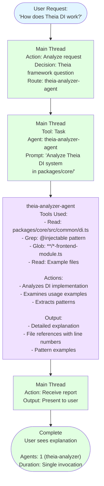

---

## Scenario 3a: Vision Conflict → User Accepts Alternative

**User:** "Should we add a floating AI assistant that follows the mouse cursor?"

**Key Insight:** PM rejection is constructive - provides alternative + rationale

---

## Scenario 3b: User Insists on Original Despite Vision Conflict

**User:** "I understand vision, but floating AI is more intuitive. Vision should evolve."

**Key:** Vision NOT immutable - user can evolve with documented rationale

---

## Scenario 4: Development with PM Strategic Guide

**User:** "Add a custom terminal theme that changes based on time of day"

```mermaid
flowchart TD
    User(["User Request:
    'Add time-based terminal theme'"])

    --> MT1["Main Thread
    Action: Analyze request
    Decision: Development task
    Route: PM for strategic guide"]

    --> PM1["PHASE 0: PM Strategic Guide

    Tools:
    - Glob: ideas&external_references/eg-desk ideas/**/*.md
    - Glob: packages/*/package.json
    - Read: EG-DESK_Whitepaper.md
    - Read: packages/terminal/package.json
    - Read: packages/terminal/src/browser/terminal-theme-service.ts
    - Grep: 'theme', 'terminal'

    Analysis:
    ✅ Vision aligned (ambient AI principles)
    ✅ Framework: Theia (terminal = Theia domain)
    ✅ No duplicates found
    ✅ Existing: terminal-theme-service.ts

    Actions:
    - Creates PRD

    Returns:
    Decision: APPROVE
    Framework: Theia
    Location: packages/terminal/src/browser/
    Phasing: Phase 1 - analyze, Phase 2 - design, Phase 3 - implement
    Considerations: Manual override, preference persistence
    PRD: time-based-terminal-theme-prd.md"]

    --> MT2["PHASE 1: Main Thread
    Investigation Planning

    Action: Plan framework investigation
    Based on: PM's Phase 1 guidance

    Plan:
    - Query theia-analyzer for theme patterns
    - Query theia-analyzer for DI registration"]

    --> FW1["PHASE 2: theia-analyzer-agent
    Framework Investigation

    Tools:
    - Read: packages/terminal/src/browser/terminal-theme-service.ts
    - Read: packages/terminal/src/browser/terminal-frontend-module.ts
    - Grep: @injectable

    Analysis:
    - Theme registration pattern found
    - DI binding pattern identified

    Returns:
    Files Analyzed:
    - terminal-theme-service.ts:45
    - terminal-frontend-module.ts:32
    Pattern: ThemeService.register() with DI
    File List:
    - CREATE: time-based-theme-switcher.ts
    - MODIFY: terminal-frontend-module.ts:36
    - REFERENCE: workspace-service.ts:89
      (for @injectable pattern)"]

    --> MT3["PHASE 3: Main Thread
    Implementation Planning

    Action: Synthesize PM guide + framework patterns

    Implementation Plan:
    Direction: Create TimeBasedThemeSwitcher
    following Theia DI pattern

    File List:
    - CREATE: time-based-theme-switcher.ts
    - MODIFY: terminal-frontend-module.ts:36
    - MODIFY: terminal-contribution.ts:89
    - REFERENCE: workspace-service.ts:89
      (for @injectable pattern)"]

    --> MT4["Main Thread
    Action: Delegate to coding-agent

    Tool: Task
    Prompt includes:
    - Direction (what to implement)
    - File list (CREATE/MODIFY/REF)
    - Pattern references
    - 'You will read files for details'"]

    --> Coding1["PHASE 4: coding-agent
    Implementation Execution

    Tools:
    - Read: workspace-service.ts:89 (pattern)
    - Write: time-based-theme-switcher.ts
      (with @injectable, DI pattern)
    - Read: terminal-frontend-module.ts
    - Edit: Add DI binding
      (bind(TimeBasedThemeSwitcher)...)
    - Read: terminal-contribution.ts
    - Edit: Inject service
      (@inject(TimeBasedThemeSwitcher))

    Returns:
    Implementation complete: 1 CREATE, 2 MODIFY
    Following workspace-service.ts pattern"]

    --> MTDecide{"PHASE 4.5: Main Thread Decision

    Validate UX flow?

    Consider:
    ✅ Complex user flows?
    ✅ Race conditions?
    ✅ State management?
    ✅ Critical feature?

    ❌ Simple CRUD?
    ❌ Pure styling?"}

    MTDecide -->|"Validate<br/>(Complex)"| UXSim["ux-flow-simulator-agent

    Tools:
    - Read: time-based-theme-switcher.ts
    - Read: terminal-contribution.ts
    - Read: terminal-frontend-module.ts

    Actions:
    - Trace execution flow
    - Check: User opens terminal → theme switches
    - Predict: Race conditions, runtime errors

    Returns:
    ✅ No race conditions found
    ✅ Expected behavior correct
    OR
    ⚠️ Issues: [list] → Fix needed"]

    MTDecide -->|"Skip<br/>(Simple)"| MT5

    UXSim --> UXCheck{"Issues found?"}

    UXCheck -->|Yes| Fix["coding-agent
    Action: Fix issues
    Re-validate needed"]

    Fix --> UXSim

    UXCheck -->|No| MT5["PHASE 5: Main Thread
    Build & Commit

    Tools:
    - Bash: npm run build
    - Bash: git add .
    - Bash: git commit -m 'feat(terminal): ...'

    Output: Committed"]

    --> End(["Complete
    Feature implemented and committed

    Total Agents: 3-4
    - PM strategic guide
    - theia-analyzer
    - coding-agent
    - (optional) ux-flow-simulator

    Who Coded: coding-agent
    Duration: Multi-phase"])

    style User fill:#e1f5ff
    style MTDecide fill:#ffe1e1,stroke:#ff0000,stroke-width:2px
    style UXCheck fill:#ffe1e1,stroke:#ff0000,stroke-width:2px
    style PM1 fill:#fff4e1
    style FW1 fill:#f0e1ff
    style UXSim fill:#f0e1ff
    style Coding1 fill:#ffe1f0
    style Fix fill:#ffe1f0
    style MT1 fill:#e1ffe1
    style MT2 fill:#e1ffe1
    style MT3 fill:#e1ffe1
    style MT4 fill:#e1ffe1
    style MT5 fill:#e1ffe1
    style End fill:#e1ffe1
```

---

## Scenario 4c: Conflict Detection (EG-DESK Custom Code)

**User:** "Bind Ctrl+K to the new QuickSearch feature"

```mermaid
flowchart TD
    User(["User Request:
    'Bind Ctrl+K to QuickSearch'"])

    --> Phases["PHASES 0-2: Same as Scenario 4
    (PM guide → Investigation)

    Result:
    - PM approved
    - Framework patterns collected"]

    --> MT3["PHASE 3: Main Thread
    Implementation Planning

    Plan:
    Direction: Bind Ctrl+K to QuickSearch
    File List: CREATE search-contribution.ts
    in eg-desk_taehwa/search/

    ⚠️ INSTRUCTION: Check CODEBASE_STRUCTURE.md
    for conflicts BEFORE implementing"]

    --> Coding1["coding-agent: Conflict Check

    Step 1 - Discover codebase:
    - Tool: Glob eg-desk*/**/*.ts
    - Found: eg-desk_taehwa/ (custom codebase root)

    Step 2 - Find structure doc:
    - Tool: Glob eg-desk*/CODEBASE_STRUCTURE.md
    - Found: eg-desk_taehwa/CODEBASE_STRUCTURE.md

    Step 3 - Read registry:
    - Tool: Read CODEBASE_STRUCTURE.md

    Step 4 - Check conflict:
    - Tool: Grep 'Ctrl+K' in structure doc"]

    --> ConflictCheck{"coding-agent Check Result:

    Ctrl+K conflict?"}

    ConflictCheck -->|"CONFLICT<br/>FOUND"| Stop["coding-agent: STOP

    Action: DO NOT create any files

    Returns:
    ❌ CONFLICT DETECTED
    Type: Keybinding conflict
    Requested: Ctrl+K for QuickSearch
    Existing: Ctrl+K for DifferentFeature
    Location: search-old.ts:45
    Severity: BLOCKER
    Alternatives: Ctrl+Shift+K, Ctrl+Alt+K, Ctrl+J
    User decision required"]

    ConflictCheck -->|"NO<br/>CONFLICT"| Impl["coding-agent: Implement

    Tools:
    - Write: search-contribution.ts
      (with Ctrl+K binding)
    - Edit: CODEBASE_STRUCTURE.md
      (Add 'Ctrl+K: QuickSearch')

    Returns:
    ✅ Implementation Complete
    Conflict check: Passed
    Structure updated"]

    Stop --> MT4["Main Thread
    Action: Present conflict to user"]

    --> UserDec{"User Decision:

    Choose alternative:
    A) Ctrl+Shift+K
    B) Ctrl+Alt+K
    C) Ctrl+J
    D) Override existing
    E) Different key"}

    UserDec --> MT5["Main Thread
    Action: Retry with user's choice

    Tool: Task(coding-agent,
    'Bind [resolved-key] to QuickSearch')"]

    --> Coding2["coding-agent: Retry

    Step 1: Check new key conflict
    Step 2: If OK → Implement
    Step 3: Update structure doc"]

    Coding2 --> Impl

    Impl --> MT6["Main Thread
    Tools:
    - Bash: npm run build
    - Bash: git add eg-desk_taehwa
    - Bash: git commit"]

    --> End(["Complete
    QuickSearch bound to resolved key
    Structure document updated

    Agents: 3 (PM → analyzer → coding x2)
    Duration: Multi-phase with user decision"])

    style User fill:#e1f5ff
    style ConflictCheck fill:#ffe1e1,stroke:#ff0000,stroke-width:2px
    style UserDec fill:#ffe1e1,stroke:#ff0000,stroke-width:3px
    style Coding1 fill:#ffe1f0
    style Coding2 fill:#ffe1f0
    style Stop fill:#ffe1f0
    style Impl fill:#ffe1f0
    style MT3 fill:#e1ffe1
    style MT4 fill:#e1ffe1
    style MT5 fill:#e1ffe1
    style MT6 fill:#e1ffe1
    style End fill:#e1ffe1
```

**Key:** Conflict prevention - coding-agent checks BEFORE implementing

---

## Scenario 5: Agent Creation

**User:** "We need an agent that analyzes Konva.js integration patterns"

---

## Scenario 6: Simple File Edit

**User:** "Fix the typo in the README - change 'intsall' to 'install'"

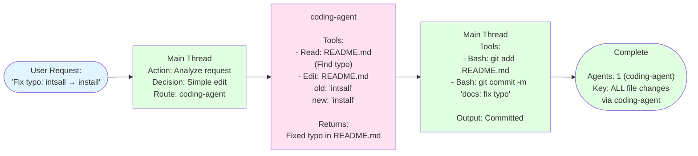

**Key:** Even 1-line typo fixes go through coding-agent (consistent separation)

---

## Scenario 7a: Technology Research (Happy Path with 2 User Decisions)

**User:** "캔버스에 3D visualization을 추가하고 싶어. 어떤 framework가 좋을까?"

```mermaid
flowchart TD
    User(["User Request:
    'Add 3D visualization
    Which framework?'"])

    --> MT1["Main Thread
    Action: Analyze request
    Decision: New capability, may need new tech
    Route: PM for gap assessment"]

    --> PM1["PHASE 0: PM Diagnosis

    Tools:
    - Glob: ideas*/**/eg-desk*ideas*/*tech*.md
    - Read: technology-stack.md
    - Glob: ideas*/**/eg-desk*ideas*/**/*.md
    - Read: EG-DESK_Whitepaper.md

    Analysis:
    Current Stack:
    - Konva.js = 2D canvas library
    - Infinite Canvas = viewport transforms

    User Needs: True 3D rendering
    (lighting, shadows, depth)

    GAP FOUND:
    Konva.js limited to 2D shapes
    Pseudo-3D insufficient for complex 3D

    Vision Check: ✅ 3D viz aligns with
    spatial canvas principles

    Research Plan Created:
    Options: Three.js, Babylon.js, Custom WebGL
    Criteria:
    - Bundle size < 500KB
    - Integration complexity (w/ Infinite Canvas)
    - Performance: 1000 obj @ 60fps
    - Compatibility w/ existing stack

    Parallel Design:
    All 3 independent → run simultaneously

    Returns:
    Decision: RESEARCH_NEEDED
    Limitation: Konva.js is 2D-only
    Why: User needs true 3D w/ lighting
    Investigation Scope: 3 parallel
    Expected: MT returns with findings"]

    --> MT2["Main Thread
    Action: Present research plan to user"]

    --> UserDec1{"USER DECISION 1:
    Proceed with research?

    PM diagnosed:
    - Konva.js cannot do true 3D
    - Recommends investigating:
      Three.js, Babylon.js, Custom WebGL
    - Criteria: bundle, integration, perf

    Options:
    A) Approve → Proceed
    B) Modify → Adjust criteria/options
    C) Reject → Use current stack"}

    UserDec1 -->|A: Approve| MT3["Main Thread
    Action: Execute parallel research"]

    UserDec1 -->|B: Modify| PM2["PM: Adjust Plan
    (See Scenario 7c)"]

    UserDec1 -->|C: Reject| End1(["Stop
    Use current stack workaround"])

    PM2 --> UserConfirm{User: OK?}
    UserConfirm -->|Yes| MT3
    UserConfirm -->|No| End1

    MT3 --> Parallel["PHASE 2: Parallel Research

    Main Thread executes:
    Single message, 3 Tasks

    Task 1: general-purpose
    'Research Three.js: bundle, 3D caps,
    IC integration, performance'

    Task 2: general-purpose
    'Research Babylon.js: bundle, 3D caps,
    IC integration, performance'

    Task 3: general-purpose
    'Research Custom WebGL: feasibility,
    dev time, maintenance'

    → All 3 run SIMULTANEOUSLY"]

    --> Research["3 general-purpose agents

    Agent 1 - Three.js:
    - WebSearch: 'Three.js bundle size'
    - WebSearch: 'Three.js IC integration'
    - WebFetch: threejs.org/docs
    Returns: ~600KB, mature, good docs

    Agent 2 - Babylon.js:
    - WebSearch: 'Babylon.js bundle'
    - WebFetch: babylonjs.com/docs
    Returns: ~1.2MB, game-focused, complex

    Agent 3 - Custom WebGL:
    - WebSearch: 'WebGL integration'
    Returns: Feasible, 2-3 months dev time"]

    --> MT4["PHASE 3: Main Thread
    Research Organization

    Tools:
    - Write: ideas&external_references/
             threejs-research.md
             (Three.js findings)
    - Write: babylonjs-research.md
             (Babylon.js findings)
    - Write: custom-webgl-research.md
             (Custom WebGL findings)

    Output: 3 research docs created
    Institutional memory preserved"]

    --> MT5["Main Thread
    Action: Query analyzer for
    technical integration assessment"]

    --> Analyzer["PHASE 4: infinite-canvas-analyzer

    Tools:
    - Read: threejs-research.md
    - Read: babylonjs-research.md
    - Read: infinite-canvas/[integration code]

    Analysis:
    - Three.js: Camera sync with IC viewport
      Complexity: MEDIUM
    - Babylon.js: Scene graph conflicts
      Complexity: HIGH

    Returns:
    Three.js: Medium integration complexity
    Babylon.js: High complexity"]

    --> MT6["Main Thread
    Action: Return to PM with research results

    Provides:
    - Research docs: threejs, babylonjs, webgl
    - Analyzer findings: integration complexity"]

    --> PM3["PHASE 5: PM Evaluation

    Tools:
    - Read: threejs-research.md
    - Read: babylonjs-research.md
    - Read: custom-webgl-research.md

    Evaluation Against Criteria:

    Three.js:
    - Bundle: 600KB (vs 500KB target = minor over)
    - Integration: Medium
    - Performance: Excellent
    - Score: 4.2/5

    Babylon.js:
    - Bundle: 1.2MB (2x over target)
    - Integration: High complexity
    - Score: 3.1/5

    Custom WebGL:
    - Dev time: 2-3 months
    - Maintenance: High burden
    - Score: 2.5/5

    Vision Alignment:
    Three.js: Best fit (lightweight, proven)

    Returns (WITHOUT updating stack yet):
    Recommended: Three.js
    Rationale: Best balance
    Scoring: [detailed breakdown]
    Why not Babylon: Bundle too large
    Why not Custom: Too much dev time
    Integration Strategy: 3 phases"]

    --> MT7["Main Thread
    Action: Present PM recommendation"]

    --> UserDec2{"USER DECISION 2:
    Accept Three.js?

    PM evaluated 3 options:
    - Three.js: 4.2/5 (recommended)
    - Babylon.js: 3.1/5 (bundle large)
    - Custom: 2.5/5 (dev time)

    Options:
    A) Approve Three.js
    B) Choose Babylon.js
    C) More research
    D) Reject all"}

    UserDec2 -->|A: Approve| PM4["PM: Finalize Adoption

    Tools:
    - Edit: technology-stack.md
      (Add Three.js to 3D Rendering category
       Status: Approved for Integration
       Bundle: ~600KB
       Integration: Layers with IC)
    - Write: 3d-visualization-with-threejs-prd.md
      (Research summary + decision rationale
       + integration phases)

    Returns:
    Technology Stack Updated: Three.js added
    PRD Created: Integration plan
    Next Steps: Query framework agents"]

    UserDec2 -->|B: Choose Other| PM4b["PM: Re-evaluate
    (See Scenario 7b)"]

    UserDec2 -->|C: More| MT3

    UserDec2 -->|D: Reject| End2(["Stop
    No new tech added"])

    PM4 --> MT8["Main Thread
    Action: Proceed to implementation

    Next: Query theia-analyzer + electron-analyzer
    for integration patterns"]

    PM4b --> MT8

    --> FW["Framework Agents (Parallel)

    theia-analyzer:
    - Analyze webview integration
      for Three.js canvas

    electron-analyzer:
    - Electron security for Three.js
      in renderer process

    Both run simultaneously"]

    --> MT9["Main Thread
    Action: Synthesize + spawn coding-agent"]

    --> Coding["coding-agent
    Action: Implement Three.js integration
    Direction: From PM guide
    Files: From analyzer agents"]

    --> End3(["Complete
    3D visualization integrated

    Total Agents: 8
    - PM planning
    - 3 research (parallel)
    - 1 analyzer
    - PM evaluation
    - PM finalization
    - 2 framework (parallel)
    - coding-agent

    Duration: Multi-phase
    User Decisions: 2"])

    style User fill:#e1f5ff
    style UserDec1 fill:#ffe1e1,stroke:#ff0000,stroke-width:3px
    style UserDec2 fill:#ffe1e1,stroke:#ff0000,stroke-width:3px
    style UserConfirm fill:#ffe1e1,stroke:#ff0000,stroke-width:3px
    style PM1 fill:#fff4e1
    style PM2 fill:#fff4e1
    style PM3 fill:#fff4e1
    style PM4 fill:#fff4e1
    style PM4b fill:#fff4e1
    style MT3 fill:#e1ffe1
    style MT4 fill:#e1ffe1
    style MT5 fill:#e1ffe1
    style MT6 fill:#e1ffe1
    style MT7 fill:#e1ffe1
    style MT8 fill:#e1ffe1
    style MT9 fill:#e1ffe1
    style Parallel fill:#f0e1ff
    style Research fill:#f0e1ff
    style Analyzer fill:#f0e1ff
    style FW fill:#f0e1ff
    style Coding fill:#ffe1f0
    style End1 fill:#f0f0f0
    style End2 fill:#f0f0f0
    style End3 fill:#e1ffe1
```

**Highlights:**
- **2 User Decision Points**: Approve research? / Accept recommendation?
- **Parallel execution**: 3 research agents + 2 framework agents (simultaneously)
- **PM waits for user approval** before updating technology-stack.md
- **Institutional memory**: Research docs preserved

---

## Scenario 7b: User Rejects PM Recommendation

(Embedded in Scenario 7a diagram - see UserDec2 → B: Choose Other option)

Flow continues with PM re-evaluating user's choice, documenting rationale, adjusting integration strategy.

---

## Scenario 7c: User Modifies Research Criteria

(Embedded in Scenario 7a diagram - see UserDec1 → B: Modify option)

PM adjusts research plan per user modifications (add options, change criteria), user confirms, then proceed.

---

## Common Patterns (Self-Documenting)

### Pattern 2: PM-Driven Development (Complete)

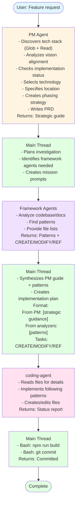

---

### Pattern 8: Technology Research (With User Control)

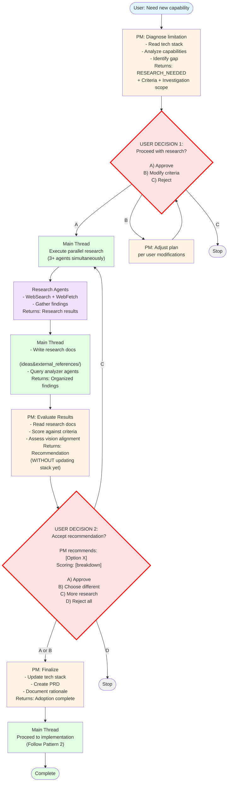

---

## Code Ownership Principle

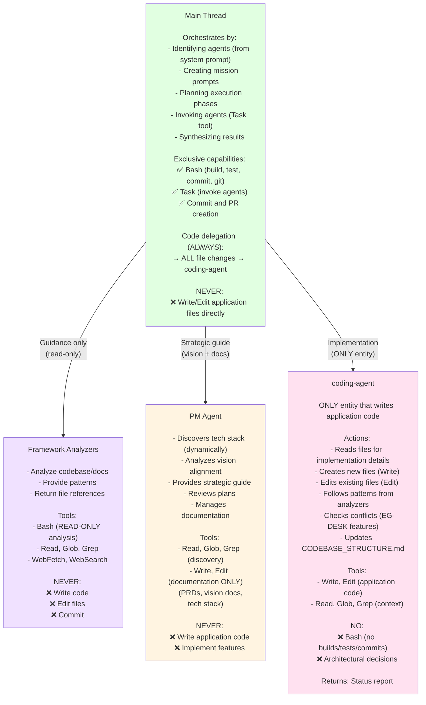

**Hierarchy:** PM guides → Main Thread orchestrates → Analyzers provide patterns → coding-agent implements

---

## Multi-turn Communication with PM

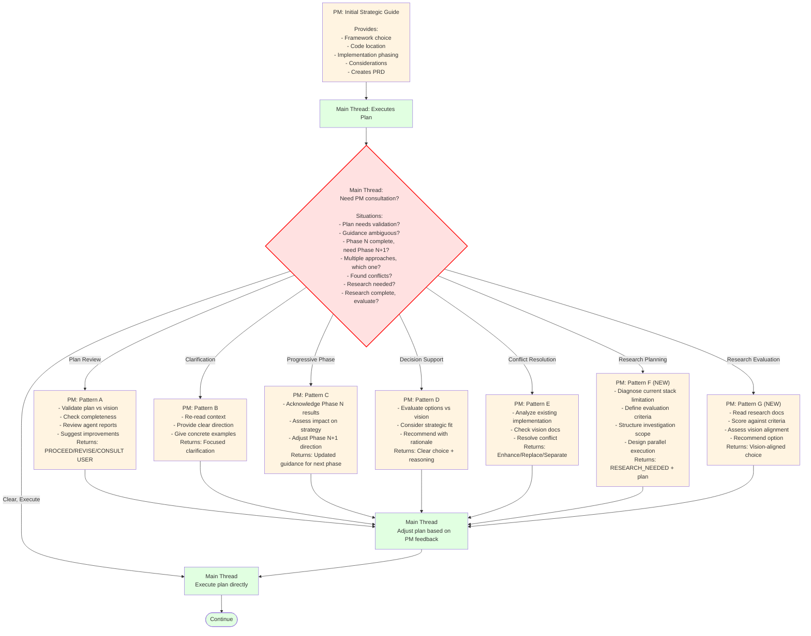

**7 Multi-turn Patterns:**
- 5 original + 2 NEW (Research Planning + Evaluation)
- PM is stateless - Main Thread includes full context each time

---

## Comparison Matrix (Request Routing)

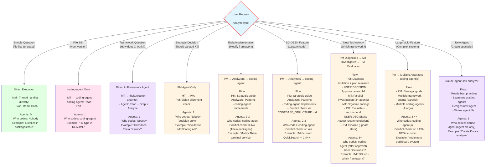

**Route Selection:** Analyze request type → Choose simplest effective approach

---

## Success Metrics Checklist

```mermaid
flowchart TD
    Success["Effective Agent Swarm Flow

    Has ALL these characteristics:"]

    Success --> M1["✅ Right Routing

    - Simple questions → Direct execution
    - Complex tasks → Orchestrated
    - No over-orchestration"]

    Success --> M2["✅ Parallel Execution

    - Independent analyses run simultaneously
    - Single message, multiple Tasks
    - 3x+ faster runtime"]

    Success --> M3["✅ Evidence-Based

    - All recommendations backed by file analysis
    - No assumptions
    - Read before recommend"]

    Success --> M4["✅ Clear Boundaries

    - Agents analyze (read-only)
    - coding-agent implements (writes code)
    - Main Thread orchestrates + builds
    - PM guides strategy"]

    Success --> M5["✅ Strategic Alignment

    - Vision validated before implementation
    - PM checks all EG-DESK features
    - Institutional memory maintained"]

    Success --> M6["✅ User Decision Points

    - Research approval required
    - Recommendation approval required
    - Vision evolution requires user authority
    - User can override PM"]

    Success --> M7["✅ No Redundancy

    - Each agent contributes unique value
    - No duplicate work
    - Clear role separation"]

    Success --> M8["✅ Conflict Prevention

    - coding-agent checks CODEBASE_STRUCTURE.md
    - BEFORE implementing EG-DESK features
    - Reports conflicts, user decides
    - Updates structure after implementation"]

    Success --> M9["✅ Dynamic Discovery

    - No hardcoded paths
    - Glob everything
    - Tech stack discovered from doc
    - Structure-agnostic"]

    Success --> M10["✅ Institutional Memory

    - Research docs preserved
    - Decision rationales documented
    - CODEBASE_STRUCTURE.md maintained
    - Technology stack tracked"]

    style Success fill:#e1ffe1
    style M1 fill:#e1f5ff
    style M2 fill:#e1f5ff
    style M3 fill:#e1f5ff
    style M4 fill:#e1f5ff
    style M5 fill:#e1f5ff
    style M6 fill:#ffe1e1,stroke:#ff0000,stroke-width:2px
    style M7 fill:#e1f5ff
    style M8 fill:#e1f5ff
    style M9 fill:#e1f5ff
    style M10 fill:#e1f5ff
```

---

## Agent Ecosystem Hierarchy

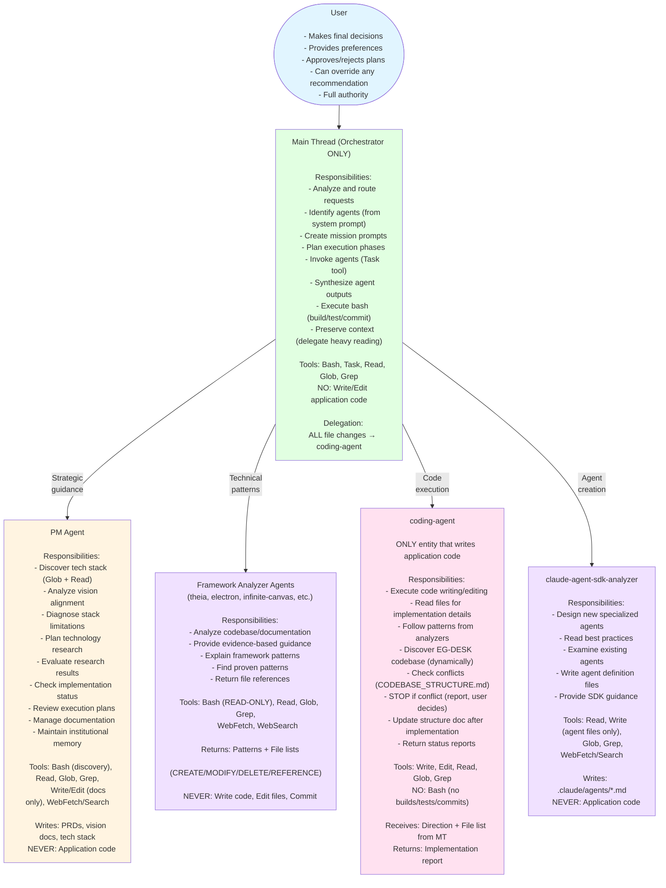

---

## Key Architectural Principles (Visual Summary)

```mermaid
flowchart LR
    P1["Principle 1:
    Metaphysical Separation

    Main Thread operates at META level:
    - Coordinates agents
    - Delegates domain reading
    - Preserves context

    Agents operate at DOMAIN level:
    - PM: Vision docs
    - Analyzers: Codebase
    - coding-agent: Writes code"]

    P2["Principle 2:
    Strict Code Delegation

    Main Thread NEVER writes code
    ALWAYS delegates to coding-agent

    Even 1-line typo fixes:
    MT → coding-agent → Edit

    Consistent separation of concerns"]

    P3["Principle 3:
    Dynamic Discovery

    NEVER hardcode paths:
    - PM: Glob tech stack (not hardcoded list)
    - Agents: Glob codebases
    - Structure-agnostic

    Always discover current state"]

    P4["Principle 4:
    User Authority

    PM guides, user decides:
    - Research approval required
    - Recommendation approval required
    - Can override PM
    - Can evolve vision

    2+ decision points in research workflow"]

    P5["Principle 5:
    Parallel Execution

    Independent tasks run simultaneously:
    - Single message, multiple Tasks
    - 3x+ faster runtime
    - Research agents in parallel
    - Framework agents in parallel"]

    P6["Principle 6:
    Institutional Memory

    Everything documented:
    - Research docs in ideas&external_references/
    - PRDs for features
    - Decision rationales preserved
    - CODEBASE_STRUCTURE.md maintained
    - Technology stack tracked"]

    style P1 fill:#e1f5ff
    style P2 fill:#ffe1f0
    style P3 fill:#e1ffe1
    style P4 fill:#ffe1e1,stroke:#ff0000,stroke-width:2px
    style P5 fill:#f0e1ff
    style P6 fill:#fff4e1
```

---

## Conclusion

This visual guide provides **self-documenting Mermaid diagrams** where each node contains complete information:
- **Tools used** (Bash, Read, Write, etc.)
- **Specific actions** (what the entity does)
- **Outputs** (what it returns)
- **Decisions** (APPROVE/REJECT/RESEARCH_NEEDED)

**You don't need to read external explanations** - the diagrams are self-contained.

**Key Takeaways:**
1. **User Decision Points** (red borders) are critical gates - user has control
2. **Parallel execution** (shown as simultaneous branches) = faster runtime
3. **PM guides, user decides** - all strategic decisions require user approval
4. **Main Thread never writes code** - always delegates to coding-agent
5. **Each node is self-documenting** - includes tools, actions, outputs
6. **Diagrams tell the complete story** - no need for separate documentation

For detailed prose explanations and comprehensive context, see [AGENT_SWARM_FLOW.md](./AGENT_SWARM_FLOW.md).
